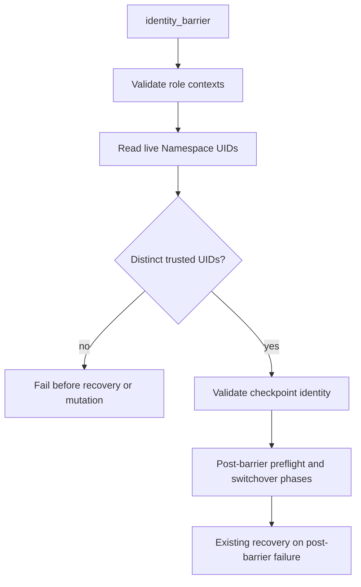

# Collection Architecture

## Foundations

- collection-first migration
- controller-side execution for both CLI and AAP
- explicit phases as operator-facing boundaries
- stock `kubernetes.core` first
- thin custom plugins for report artifacts, checkpoints, validation, restore planning, RBAC, and safe paths

## Current Boundaries

The collection defines:

- collection layout
- variable contract
- playbook entrypoints
- role boundaries
- schema-versioned report artifacts
- optional checkpoint contract
- RBAC bootstrap and validation contracts
- decommission observability autodetection
- release parity guardrails for report, checkpoint, decommission, restore-only, switchover, and RBAC/bootstrap artifacts

The collection deliberately does not implement full kubeconfig/context enumeration. Use `scripts/discover-hub.sh` for that bridge workflow during coexistence.

## Trusted identity barrier

The preflight `identity_barrier` is owned by the `checkpoint_phase` action
plugin. It validates required role contexts, reads the live `kube-system`
Namespace UID with `kubernetes.core.k8s_info`, checks that normal two-hub UIDs
differ, and passes the trusted result to checkpoint identity handling. The UID
evidence stays action-local; public facts, registered values, cached data, and
caller-supplied `cluster_uid` fields do not authorize this decision.

`validate` and `dry_run` may use the explicit test-only non-live override.
`execute`, including native check mode, still reads live UIDs. Restore-only
requires only a secondary UID. `reset` and `reset_from` behavior remains owned
by the checkpoint contract and is unchanged by this barrier.

## Parity Notes

- Preflight, activation, post-activation, finalization, RBAC validation, Argo CD management, discovery classification, decommission, reports, and checkpoint behavior are dual-supported.
- `kubernetes.core` tasks plus Ansible `until` loops replace Python's `KubeClient` and waiter helpers where they preserve the same operator-facing behavior.
- Constants live in `plugins/module_utils/constants.py`; the collection cannot import Python CLI constants.
