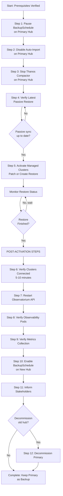
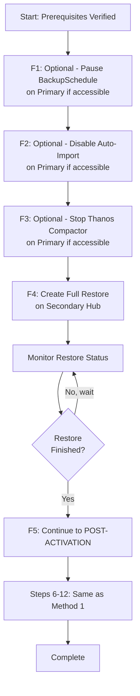

# ACM 2.11+ Switchover Runbook

**Passive (Continuous) and One-Time Full Restore**

**Last Updated:** 2025-12-02

---

## Table of Contents

- [Restore Methods Overview](#restore-methods-overview)
- [Common Prerequisites](#common-prerequisites)
- [Step 0: Verify Prerequisites](#step-0-verify-prerequisites-before-starting-switchover)
- [Method 1: Continuous Passive Restore](#method-1-continuous-passive-restore-activation-path)
- [Method 2: One-Time Full Restore](#method-2-one-time-full-restore-no-prior-passive-sync)
- [Post-Activation Common Steps](#post-activation-common-steps-applies-to-both-methods)
- [Rollback Procedure](#rollback-procedure-if-needed)
- [Troubleshooting](#troubleshooting-common-issues)
- [Resources](#good-resources)

---

## ⚠️ CRITICAL SAFETY WARNINGS

> [!CAUTION]
> **BEFORE YOU BEGIN - READ THIS CAREFULLY**
>
> 1. **preserveOnDelete MUST be `true` on ALL ClusterDeployments**
>    - Without this, deleting ManagedClusters will DESTROY your underlying cluster infrastructure
>    - Verify with: `oc get clusterdeployment --all-namespaces -o custom-columns=NAME:.metadata.name,PRESERVE:.spec.preserveOnDelete`
>    - **ALL must show "true"** - if any show "false" or "<none>", STOP and fix them first!
>
> 2. **Test in non-production environment first**
>    - This procedure affects ALL managed clusters simultaneously
>    - Practice the complete workflow in a test environment before production
>    - Verify rollback procedures work in your test environment
>
> 3. **Have a rollback plan ready**
>    - Know how to rollback (see [Rollback Procedure](#rollback-procedure-if-needed))
>    - **Do NOT decommission primary hub** until secondary is fully validated
>    - Keep primary hub accessible for at least 24 hours after switchover
>
> 4. **Coordinate with stakeholders**
>    - Managed clusters will show as "Unknown" during switchover (5-10 minutes)
>    - Plan for a 30-60 minute maintenance window
>    - Notify all teams that depend on ACM observability and cluster management
>
> 5. **Estimated timeline**
>    - Method 1 (Passive Restore): 20-30 minutes
>    - Method 2 (Full Restore): 40-60 minutes
>    - Add 15-20 minutes for validation and verification

---

## Restore Methods Overview

This runbook supports two restore strategies. Choose based on your DR design:

### Method 1 — Continuous Passive Restore *(Recommended)*

Secondary hub continuously restores backups; during switchover you "activate" managed clusters by patching the passive restore to use the latest managed-cluster backup. Fast and minimal data movement.

**Use when:** Passive sync is already running on secondary hub.

### Method 2 — One-Time Full Restore

Perform a single restore of credentials, resources, and managed clusters from the latest backup.

**Use when:** Passive sync is not running or bringing up a new hub.

> **Tip:** Steps 6–12 are POST-ACTIVATION COMMON STEPS for BOTH methods.

### Workflow Diagrams

#### Method 1: Passive Restore Activation Flow



#### Method 2: Full Restore Flow



---

## Common Prerequisites

### Required for Both Methods

- ✅ Most recent backup completed successfully and accessible (shared S3/object storage)
- ✅ Secondary hub ACM version matches the primary hub
- ✅ OADP operator installed and DataProtectionApplication configured on both hubs
- ✅ Both hubs can access the same backup storage backend
- ✅ Required operators/addons mirrored on secondary hub
- ✅ Network connectivity from managed clusters to the secondary hub
- ✅ **ALL Hive ClusterDeployments have `spec.preserveOnDelete=true` BEFORE switchover** (mandatory safety)
- ✅ Shell: commands assume bash/POSIX. On Windows use WSL/Git Bash for loops & JSONPath quoting
- ✅ GitOps and ACM Observability on secondary hub need proper secrets/configuration before switchover
  - Use external syncing mechanisms (e.g., GitOps) to ensure ArgoCD and Observability have correct access details post-switchover
  - Or label those objects with `cluster.open-cluster-management.io/backup: cluster-activation` so they are included in the activation restore
- ✅ **(ACM 2.14+)** Verify `autoImportStrategy` is set to the default `ImportOnly` unless there's a documented reason for `ImportAndSync`
  - If changed to `ImportAndSync`, ensure this is intentional and temporary (e.g., for recovery scenarios)
  - Check with: `oc get configmap import-controller-config -n multicluster-engine -o yaml` (if configmap doesn't exist, default `ImportOnly` is in use)
  - See [Customizing the automatic import strategy](https://docs.redhat.com/en/documentation/red_hat_advanced_cluster_management_for_kubernetes/2.14/html-single/clusters/index#custom-auto-import-strat) for details

### Additional Prerequisites for Method 1

- ✅ Secondary hub is already running continuous passive restore (`restore-acm-passive-sync`)
- ✅ Passive sync shows `Phase="Enabled"` and is up-to-date with recent backups

---

## Step 0: Verify Prerequisites Before Starting Switchover

> **💡 Automated Validation Available**
> 
> Use the automated pre-flight validation script to check all prerequisites:
> ```bash
> ./scripts/preflight-check.sh \
>   --primary-context <primary> \
>   --secondary-context <secondary> \
>   --method passive
> ```
> This script will verify all items below and provide a detailed report.

### Pre-Switchover Verification

- [ ] Most recent backup completed successfully
  ```bash
  oc get backup.velero.io -n open-cluster-management-backup
  ```
- [ ] Confirm no backups are in "InProgress" state
- [ ] Verify secondary hub has same ACM version as primary
- [ ] Confirm OADP operator installed on both hubs
- [ ] Verify DataProtectionApplication configured on both hubs
- [ ] Check access to same S3 storage location from both hubs
- [ ] BackupStorageLocation shows "Available" on both hubs
  ```bash
  oc get backupstoragelocation.velero.io -n open-cluster-management-backup \
    -o custom-columns=NAME:.metadata.name,PHASE:.status.phase
  ```
- [ ] DataProtectionApplication reports Ready/Available
  ```bash
  oc get dataprotectionapplication.oadp.openshift.io -n open-cluster-management-backup \
    -o custom-columns=NAME:.metadata.name,CONDITION:.status.conditions[-1:].type,STATUS:.status.conditions[-1:].status
  ```
- [ ] Validate all operators from primary are installed on secondary
- [ ] Ensure network connectivity between managed clusters and new hub
- [ ] Nodes should be in ready state and cluster should be healthy
- [ ] **If using Method 1:** Verify passive sync restore is running and up-to-date on secondary hub:
  ```bash
  oc get restore.cluster.open-cluster-management.io restore-acm-passive-sync -n open-cluster-management-backup
  # Expected: Phase="Enabled", Message="Velero restores have run to completion..."
  ```
- [ ] **(ACM 2.14+)** Verify `autoImportStrategy` is default `ImportOnly` (if configmap doesn't exist, default is in use):
  ```bash
  oc get configmap import-controller-config -n multicluster-engine -o yaml 2>/dev/null || echo "ConfigMap not found - using default ImportOnly"
  ```
- [ ] Inform stakeholders of planned switchover and expected downtime

### ⚠️ MANDATORY: Set preserveOnDelete on ALL Hive ClusterDeployments

> **CRITICAL:** This MUST be done BEFORE switchover to prevent accidental cluster destruction!

**Check current status:**
```bash
oc get clusterdeployment.hive.openshift.io --all-namespaces \
  -o custom-columns=NAME:.metadata.name,NAMESPACE:.metadata.namespace,PRESERVE:.spec.preserveOnDelete
```

**For ANY ClusterDeployment showing "false" or "<none>", patch it immediately:**
```bash
# Example: Patch a single ClusterDeployment
oc patch clusterdeployment.hive.openshift.io <cluster-deployment-name> -n <namespace> \
  --type='merge' -p '{"spec":{"preserveOnDelete":true}}'

# Example: Batch update all ClusterDeployments with preserveOnDelete set to false or missing
for cd in $(oc get clusterdeployment.hive.openshift.io --all-namespaces \
  -o json | jq -r '.items[] | select(.spec.preserveOnDelete != true) | 
  "\(.metadata.namespace)/\(.metadata.name)"'); do
  namespace=$(echo "$cd" | cut -d/ -f1)
  name=$(echo "$cd" | cut -d/ -f2)
  echo "Patching ClusterDeployment $name in namespace $namespace"
  oc patch clusterdeployment.hive.openshift.io "$name" -n "$namespace" \
    --type='merge' -p '{"spec":{"preserveOnDelete":true}}'
done
```

**Verify all show "true" before proceeding with switchover.**

> **WITHOUT THIS:** Deleting ManagedClusters from old hub will DESTROY the underlying cluster infrastructure!

---

## Method 1: Continuous Passive Restore (Activation Path)

> **Note on Step Numbering:** Method 1 uses sequential numbering (Step 1, 2, 3...) for the main switchover path. Method 2 uses "F" prefixed numbering (F1, F2, F3...) to distinguish its full-restore approach from the continuous passive restore path.

### Step 1: Pause BackupSchedule on Primary Hub

Pause the BackupSchedule resources on the current primary hub to prevent new backups during switchover.

**Find the BackupSchedule:**
```bash
# Use full API group to avoid ambiguity
oc get backupschedule.cluster.open-cluster-management.io -n open-cluster-management-backup

# Get the BackupSchedule name (common names: schedule-rhacm, acm-backup-schedule)
BACKUP_SCHEDULE_NAME=$(oc get backupschedule.cluster.open-cluster-management.io \
  -n open-cluster-management-backup -o jsonpath='{.items[0].metadata.name}')

echo "BackupSchedule name: $BACKUP_SCHEDULE_NAME"
```

#### For ACM 2.12+:
```bash
# Use the variable set above or replace $BACKUP_SCHEDULE_NAME with actual name
oc patch backupschedule.cluster.open-cluster-management.io "$BACKUP_SCHEDULE_NAME" \
  -n open-cluster-management-backup --type='merge' -p '{"spec":{"paused":true}}'
```

**Verify:**
```bash
oc get backupschedule.cluster.open-cluster-management.io "$BACKUP_SCHEDULE_NAME" \
  -n open-cluster-management-backup -o jsonpath='{.spec.paused}'
# Should return: true
```

#### For ACM 2.11:

Save the BackupSchedule first:
```bash
# Use the variable set above or replace $BACKUP_SCHEDULE_NAME with actual name
oc get backupschedule.cluster.open-cluster-management.io "$BACKUP_SCHEDULE_NAME" \
  -n open-cluster-management-backup -o yaml > "${BACKUP_SCHEDULE_NAME}.yaml"
```

Delete it:
```bash
oc delete backupschedule.cluster.open-cluster-management.io "$BACKUP_SCHEDULE_NAME" \
  -n open-cluster-management-backup
```

**To restore later:** Clean up status and certain metadata fields (uid, resourceVersion, managedFields, status), then re-apply. Example:
```bash
yq 'del(.metadata.uid, .metadata.resourceVersion, .metadata.managedFields, .status)' \
  "${BACKUP_SCHEDULE_NAME}.yaml" | oc apply -f -
```

---

### Step 2: Prevent Auto-Import on Primary Hub

Add the `disable-auto-import` annotation to ALL ManagedCluster objects on the primary hub. This ensures the old hub won't try to recover clusters after they move to the new hub.

**Single cluster:**
```bash
oc annotate managedcluster.cluster.open-cluster-management.io <managed-cluster-name> \
  import.open-cluster-management.io/disable-auto-import=''
```

**Batch command (all except local-cluster):**
```bash
for cluster in $(oc get managedcluster.cluster.open-cluster-management.io -o name | grep -v local-cluster); do
  oc annotate $cluster import.open-cluster-management.io/disable-auto-import=''
done
```

**Verify:**
```bash
oc get managedcluster.cluster.open-cluster-management.io \
  -o custom-columns=NAME:.metadata.name,DISABLE-IMPORT:.metadata.annotations.import\\.open-cluster-management\\.io/disable-auto-import
```

---

### Step 3: Shut Down Thanos Compactor on Primary Hub

Stop the Thanos compactor to prevent write conflicts on shared object storage while the secondary hub is being activated.

```bash
oc scale statefulset observability-thanos-compact \
  -n open-cluster-management-observability --replicas=0
```

**Verify compactor is stopped:**
```bash
oc get pods -n open-cluster-management-observability | grep thanos-compact
# Should show no resources
```

**Optional (to avoid write contention): Pause Observatorium API on OLD hub during the switchover window. Re-enable only if you roll back.**
```bash
oc scale deployment observability-observatorium-api \
  -n open-cluster-management-observability --replicas=0
```

---

### Step 4: Verify Latest Passive Restore on Secondary Hub

Before activation, ensure the secondary hub has received and restored the latest backup data from the primary hub.

> **💡 Tip:** If your passive restore has a different name, discover it with:
> ```bash
> oc get restore.cluster.open-cluster-management.io -n open-cluster-management-backup
> ```
> Look for a restore with `syncRestoreWithNewBackups: true` in its spec.

**On SECONDARY HUB, verify passive sync status:**
```bash
oc get restore.cluster.open-cluster-management.io restore-acm-passive-sync -n open-cluster-management-backup
```

**Expected output:**
```
NAME                        PHASE     MESSAGE
restore-acm-passive-sync    Enabled   Velero restores have run to completion, restore will continue to sync with new backups
```

**Check the timestamp of the last restored backup:**
```bash
oc get restore.cluster.open-cluster-management.io restore-acm-passive-sync -n open-cluster-management-backup \
  -o jsonpath='{.status.veleroCredentialsRestoreName}'
  
oc get restore.cluster.open-cluster-management.io restore-acm-passive-sync -n open-cluster-management-backup \
  -o jsonpath='{.status.veleroResourcesRestoreName}'
```

**Verify these match recent backups from primary:**
```bash
for s in $(oc get backup.velero.io -n open-cluster-management-backup --context <primary> -o json \
  | jq -r '.items[].metadata.labels["velero.io/schedule-name"]' | sort -u); do
  echo -n "$s: "
  oc get backup.velero.io -n open-cluster-management-backup --context <primary> \
    -l velero.io/schedule-name="$s" \
    --sort-by=.metadata.creationTimestamp --no-headers | tail -n1 | awk '{print $1 " (" $2 ")"}'
done
```

> **IMPORTANT:** Do not proceed until passive sync shows latest data has been restored.

---

### Step 4b: Set Auto-Import Strategy to ImportAndSync (ACM 2.14+ with Existing Clusters)

> **Perform this step on your destination hub if it has any non-local-cluster managed clusters and if you plan to switch back to the primary hub in the future.**
>
> **NOTE:** Starting with ACM 2.14, the auto-import strategy was changed to `ImportOnly`. With this option, once a managed cluster joins the hub, the import-controller stops applying the manifests and auto-import operations are skipped. This change was introduced to support situations when the primary hub goes down uncontrolled and comes back again after the clusters have moved to another hub—the default strategy prevents the primary hub from trying to recover the managed clusters. What this means for you is that after the restore of managed clusters to the new hub, those clusters will be imported once but will not be continuously synced unless you change the strategy to `ImportAndSync`.

**On the destination hub**, update the import strategy to `ImportAndSync` by creating this ConfigMap:

```yaml
apiVersion: v1
kind: ConfigMap
metadata:
  name: import-controller-config
  namespace: multicluster-engine
data:
  autoImportStrategy: ImportAndSync
```

**Apply the ConfigMap:**
```bash
oc apply -f - <<EOF
apiVersion: v1
kind: ConfigMap
metadata:
  name: import-controller-config
  namespace: multicluster-engine
data:
  autoImportStrategy: ImportAndSync
EOF
```

**Verify:**
```bash
oc get configmap import-controller-config -n multicluster-engine -o yaml
```

> **Cross-reference:** This ConfigMap will be removed in [Step 7](#step-7-reset-auto-import-strategy-to-default-acm-214-if-set-on-new-primary-hub) after activation to restore the default `ImportOnly` behavior.
>
> Clarification: The ConfigMap affects only the hub where you create it. Use `ImportAndSync` only when you intentionally need continuous re-application on the hub you are promoting (typically for temporary switchback scenarios), and remove it after activation (see Step 7). If the ConfigMap does not exist, the hub uses the default `ImportOnly` behavior.
> **IMPORTANT:** Do not perform this step if your destination hub has no existing managed clusters, as it is unnecessary.

---

### Step 5: Activate Managed Clusters on Secondary Hub

> **CRITICAL:** Since you're using continuous passive restore, you must either DELETE the existing `restore-acm-passive-sync` and create an activation restore, OR patch the existing restore to trigger activation.

**CHOOSE ONE OF THE FOLLOWING OPTIONS:** Option A is preferred.

#### Option A: Patch Existing Restore *(Simpler - In-place activation)*

Activate by patching `veleroManagedClustersBackupName` to `'latest'`:

```bash
oc patch restore.cluster.open-cluster-management.io restore-acm-passive-sync \
  -n open-cluster-management-backup \
  --type='merge' \
  -p '{"spec":{"veleroManagedClustersBackupName":"latest"}}'
```

**Monitor status:**
```bash
# Watch for transition to Finished state
oc get restore.cluster.open-cluster-management.io restore-acm-passive-sync -n open-cluster-management-backup -w
```

**Expected output:**
```
NAME                       PHASE      MESSAGE
restore-acm-passive-sync   Finished   All Velero restores have run successfully
```

**Verify activation completed:**
```bash
oc describe restore.cluster.open-cluster-management.io restore-acm-passive-sync -n open-cluster-management-backup
```

> **NOTE:** When `veleroManagedClustersBackupName` changes to `'latest'`, managed clusters are activated and the restore transitions to "Finished" status. The continuous sync (`syncRestoreWithNewBackups`) is automatically disabled upon activation.

#### Option B: Delete & Create Activation Restore

**Step 5a:** Verify current passive sync restore status:
```bash
oc get restore.cluster.open-cluster-management.io restore-acm-passive-sync -n open-cluster-management-backup
```

**Step 5b:** Delete the existing passive sync restore:
```bash
oc delete restore.cluster.open-cluster-management.io restore-acm-passive-sync -n open-cluster-management-backup
```

**Step 5c:** Create activation restore manifest (`restore-acm-activate.yaml`):
```yaml
apiVersion: cluster.open-cluster-management.io/v1beta1
kind: Restore
metadata:
  name: restore-acm-activate
  namespace: open-cluster-management-backup
spec:
  cleanupBeforeRestore: CleanupRestored
  veleroManagedClustersBackupName: latest  # This activates managed clusters
  veleroCredentialsBackupName: skip        # Already restored by passive sync
  veleroResourcesBackupName: skip          # Already restored by passive sync
```

**Step 5d:** Apply the activation restore:
```bash
oc apply -f restore-acm-activate.yaml
```

**Step 5e:** Monitor activation progress:
```bash
# Watch restore status (Ctrl+C to exit)
oc get restore.cluster.open-cluster-management.io restore-acm-activate -n open-cluster-management-backup -w

# Check for completion
oc get restore.cluster.open-cluster-management.io restore-acm-activate -n open-cluster-management-backup
# Expected: Phase should transition to "Finished"

# Check for any errors
oc describe restore.cluster.open-cluster-management.io restore-acm-activate -n open-cluster-management-backup
# Review Events section for any issues
```

---

## Method 2: One-Time Full Restore (No Prior Passive Sync)

Use when passive sync was NOT running. If the primary hub is still accessible, you may still perform steps 1–3 on the primary (pause backups, disable auto-import, stop Thanos compactor) as pre-restore safety measures.

### F1. (Optional, primary reachable) Pause BackupSchedule on primary hub
- **2.12+:** Use variable-based approach from Step 1 to pause BackupSchedule
- **2.11:** Save YAML then delete BackupSchedule (same commands as step 1)

### F2. (Optional) Prevent auto-import on primary hub
Same as [Step 2](#step-2-prevent-auto-import-on-primary-hub)

### F3. (Optional) Shut down Thanos compactor on primary hub
Same as [Step 3](#step-3-shut-down-thanos-compactor-on-primary-hub)

### F4. (Optional) Set Auto-Import Strategy to ImportAndSync on destination hub (ACM 2.14+)
Same as [Step 4b](#step-4b-set-auto-import-strategy-to-importandsync-acm-214-with-existing-clusters)

### F5. Create full restore on SECONDARY hub

Create `restore-acm-full.yaml`:
```yaml
apiVersion: cluster.open-cluster-management.io/v1beta1
kind: Restore
metadata:
  name: restore-acm-full
  namespace: open-cluster-management-backup
spec:
  cleanupBeforeRestore: CleanupRestored
  veleroManagedClustersBackupName: latest
  veleroCredentialsBackupName: latest
  veleroResourcesBackupName: latest
```

**Apply & monitor:**
```bash
oc apply -f restore-acm-full.yaml
oc get restore.cluster.open-cluster-management.io restore-acm-full -n open-cluster-management-backup -w
oc describe restore.cluster.open-cluster-management.io restore-acm-full -n open-cluster-management-backup
```

**Proceed ONLY when `Phase=Finished`.**

### F6. Continue with POST-ACTIVATION COMMON STEPS below

---

## Post-Activation Common Steps (Applies to Both Methods)

### Step 6: Verify ManagedClusters Are Connected

After activation completes, verify that ManagedClusters are connecting to the new hub.

**Check ManagedCluster status:**
```bash
oc get managedcluster.cluster.open-cluster-management.io \
  -o custom-columns='NAME:.metadata.name,AVAILABLE:.status.conditions[?(@.type=="ManagedClusterConditionAvailable")].status'
```

**Check for clusters in Pending Import state:**
```bash
oc get managedcluster.cluster.open-cluster-management.io | grep "Pending Import"
# Hive-provisioned clusters should auto-connect
# Manually imported clusters may require reimport
```

**For clusters stuck in Pending Import (if any):**
```bash
# The auto-import mechanism should handle this automatically
# If issues persist after 10-15 minutes, check cluster import secrets:
oc get secrets -n <cluster-namespace> | grep import
```

**Verify cluster join status:**
```bash
oc get managedcluster.cluster.open-cluster-management.io \
  -o custom-columns='NAME:.metadata.name,JOINED:.status.conditions[?(@.type=="ManagedClusterJoined")].status'
```

**All clusters should show `AVAILABLE=True` and `JOINED=True` within 5-10 minutes.**

---

### Step 7: Reset Auto-Import Strategy to Default (ACM 2.14+) if set on New Primary Hub

After a successful restore with managed clusters properly attached, check if the `import-controller-config` ConfigMap exists on this hub. If this hub previously had `ImportAndSync` set (for example from a prior Step 4b), remove it to restore the default `ImportOnly` behavior:

**On the NEW PRIMARY hub**, check and remove the ConfigMap if present:
```bash
# Check if ConfigMap exists
oc get configmap import-controller-config -n multicluster-engine 2>/dev/null

# If it exists, remove it to restore default ImportOnly behavior
oc delete configmap import-controller-config -n multicluster-engine --ignore-not-found
```

> **NOTE:** This step removes the ConfigMap created in [Step 4b](#step-4b-set-auto-import-strategy-to-importandsync-acm-214-with-existing-clusters) and prevents unintended continuous sync from this hub in the future. Only perform it if you previously set `ImportAndSync` on this hub. If the ConfigMap is absent, the default `ImportOnly` is already in effect.

---

### Step 8: Restart Observatorium API Gateway Pods

> **Version Note:** This fix addresses a known issue in ACM 2.12 where Observatorium API gateway pods contain stale tenant data after restore. While this issue was identified in ACM 2.12, the fix (restarting the pods) is recommended for all ACM versions to ensure proper metrics collection after switchover, as Kubernetes doesn't automatically refresh mounted ConfigMaps.

The Observatorium API gateway pods contain stale tenant data after restore because Kubernetes doesn't automatically refresh mounted ConfigMaps. This causes metrics to be rejected and Grafana dashboards to show no data.

```bash
oc rollout restart deployment observability-observatorium-api \
  -n open-cluster-management-observability
```

**Verify pods are restarting:**
```bash
oc get pods -n open-cluster-management-observability | grep observatorium-api
```

**Wait for pods to be Ready (1/1):**
```bash
oc wait --for=condition=Ready pod \
  -l app.kubernetes.io/name=observatorium-api \
  -n open-cluster-management-observability --timeout=5m
```

> **IMPORTANT:** After this restart, wait 5-10 minutes for metrics collection to resume and data to start appearing in Grafana dashboards.

---

### Step 9: Verify Observability Pods Are Running

Check all Observability components are deployed and running:

```bash
oc get pods -n open-cluster-management-observability
```

**Expected pods (all should be Running/Ready):**
- `observability-alertmanager-*`
- `observability-grafana-*`
- `observability-observatorium-api-*`
- `observability-observatorium-operator-*`
- `observability-rbac-query-proxy-*`
- `observability-thanos-compact-*`
- `observability-thanos-query-*`
- `observability-thanos-query-frontend-*`
- `observability-thanos-receive-default-*`
- `observability-thanos-rule-*`
- `observability-thanos-store-shard-*`

**Check for any pods in Error or CrashLoopBackOff state:**
```bash
oc get pods -n open-cluster-management-observability | grep -v Running | grep -v Completed
```

---

### Step 10: Verify Metrics Collection from Managed Clusters

Validate that metrics are flowing from managed clusters to the new hub.

**Access Grafana:**
```bash
# From ACM console, navigate to: Overview > Grafana
# Or get Grafana route:
oc get route grafana -n open-cluster-management-observability -o jsonpath='{.spec.host}'
```

**In Grafana:**
1. Navigate to "ACM - Clusters Overview" dashboard
2. Verify data is visible for all expected clusters
3. Check that metrics are recent (within last 5 minutes)
4. Verify multiple cluster metrics are populating

**Query metrics from OpenShift console (alternative verification):**
- Navigate to: **Observe > Metrics**
- Query: `acm_managed_cluster_info`
- Should show entries for all managed clusters

**SUCCESS CRITERIA:** Recent metrics (within 5-10 minutes) are visible for all expected managed clusters in Grafana dashboards.

**TROUBLESHOOTING:** If no metrics appear after 10 minutes:
- Verify observatorium-api pods were restarted (Step 7)
- Check metrics-collector pods on managed clusters are running
- Verify network connectivity from managed clusters to hub

---

### Step 11: Enable BackupSchedule on New Active Hub

Now that the secondary hub is the active primary, enable the BackupSchedule to resume regular backups.

> **NOTE:** This step applies to ACM 2.12+ when using the patch method. For ACM 2.11, see note below.

```bash
# Use the BackupSchedule name from Step 1, or find it dynamically
BACKUP_SCHEDULE_NAME=$(oc get backupschedule.cluster.open-cluster-management.io \
  -n open-cluster-management-backup -o jsonpath='{.items[0].metadata.name}')

oc patch backupschedule.cluster.open-cluster-management.io "$BACKUP_SCHEDULE_NAME" \
  -n open-cluster-management-backup --type='merge' -p '{"spec":{"paused":false}}'
```

> **Note (ACM 2.11):** If you deleted the BackupSchedule in step 1, re-apply the saved YAML (after cleaning metadata) instead of patching:
> ```bash
> oc apply -f "${BACKUP_SCHEDULE_NAME}.yaml"
> ```

**If BackupSchedule does not exist on the new hub**, create one. Here's an example BackupSchedule configuration with `useManagedServiceAccount` option:

```yaml
apiVersion: cluster.open-cluster-management.io/v1beta1
kind: BackupSchedule
metadata:
  name: schedule-rhacm
  namespace: open-cluster-management-backup
spec:
  # Schedule in cron format (this example: every 4 hours)
  veleroSchedule: "0 */4 * * *"
  
  # Retention policy - keep backups for 7 days
  veleroTtl: 168h
  
  # Use managed service account for backup operations (ACM 2.11+)
  useManagedServiceAccount: true
```

Apply the BackupSchedule:
```bash
oc apply -f backupschedule.yaml
```

**Verify backups resume:**
```bash
oc get backupschedule.cluster.open-cluster-management.io "$BACKUP_SCHEDULE_NAME" \
  -n open-cluster-management-backup
# Phase should be "Enabled"
```

**Check that new backups are being created:**
```bash
# Wait 5-10 minutes, then check newest entries:
oc get backup.velero.io -n open-cluster-management-backup \
  --sort-by=.metadata.creationTimestamp | tail -n10
# Should show new backups with recent timestamps
```

> **⚠️ CRITICAL - OLD HUB THANOS/OBSERVATORIUM GUIDANCE:**
>
> **DO NOT re-enable Thanos Compactor or Observatorium API on the old hub after switchover!**
>
> Both hubs share the same object storage backend. Re-enabling these components on the old hub while the new hub is active will cause:
> - **Data corruption** - Two Thanos Compactors writing to the same storage
> - **Write conflicts** - Both hubs attempting to manage the same metrics data
> - **Split-brain scenarios** - Inconsistent state between hubs
>
> **Correct sequence for re-enablement:**
> 1. **Only re-enable when switching back** to that hub as the primary
> 2. **Before re-enabling:** Shut down Thanos Compactor on the current active hub (Step 3)
> 3. **Then perform restore** on the target hub to make it the new primary
> 4. **Only after restore completes:** Re-enable Thanos Compactor and Observatorium API on the newly activated hub
>
> **Exception:** If you paused the Observatorium API on the old hub in Step 3 and are **decommissioning** it (Step 14), you can leave it scaled to 0 - it will be removed during decommissioning.
>
> **For rollback scenarios:** See the [Rollback Procedure](#rollback-procedure-if-needed) which includes the correct sequence for re-enabling components.

---
### Step 12: Verify Backup Integrity

Before decommissioning the old hub, verify the backup integrity.

```bash
# Get the newest backup name by creationTimestamp
BACKUP_NAME=$(oc get backup.velero.io -n open-cluster-management-backup \
  --sort-by=.metadata.creationTimestamp -o name | tail -n1 | cut -d/ -f2)

# Verify backup status:
oc get backup.velero.io "$BACKUP_NAME" -n open-cluster-management-backup -o yaml | grep -A 5 "status:"

# Check backup logs:
oc logs -n open-cluster-management-backup deployment/velero -c velero | grep "$BACKUP_NAME"
```

**SUCCESS CRITERIA:**
- Backup status shows "Completed" with no errors
- No errors in backup logs
- Backup timestamp is recent (within last 10 minutes)

> **WARNING:** Do NOT decommission the old hub if backup integrity validation fails.
>
> Proceed only after you have a recent, successful backup.

**Remediation steps:**
1. Check Velero pod logs for specific error messages.
   ```bash
   # Recent logs
   oc logs -n open-cluster-management-backup deployment/velero -c velero --since=10m
   # Filter for the failing backup (uses BACKUP_NAME set above)
   oc logs -n open-cluster-management-backup deployment/velero -c velero | grep "$BACKUP_NAME"
   ```
2. Attempt a fresh backup and verify its status.
   - Create an on-demand backup using your standard process (e.g., Velero Backup CR) targeting the same storage location.
   - Monitor until it completes successfully:
   ```bash
   oc get backup.velero.io -n open-cluster-management-backup -w
   ```
3. Inspect storage backend connectivity and authentication.
   ```bash
   # BackupStorageLocation phase and messages
   oc get backupstoragelocation.velero.io -n open-cluster-management-backup -o yaml | grep -E "phase:|message:"
   ```
4. Check capacity and quotas; free space or adjust quotas if needed.
   ```bash
   oc get resourcequota -n open-cluster-management-backup 2>/dev/null || true
   ```
5. Repeat verification until a successful backup with a recent timestamp exists. Only then proceed to decommission the old hub.
---

### Step 13: Inform Stakeholders

Notify stakeholders that:
- ✅ Switchover is complete
- ✅ New hub is: `<secondary-hub-name>`
- ✅ All managed clusters are connected and operational
- ✅ Observability is operational (Grafana dashboards showing data)
- ✅ Backup schedule is active on new hub
- ✅ Normal operations can resume

Provide new hub cluster details and any relevant access information.

> **💡 Automated Validation Available**
> 
> Use the automated post-flight validation script to verify switchover success:
> ```bash
> ./scripts/postflight-check.sh \
>   --new-hub-context <new-hub> \
>   --old-hub-context <old-hub>
> ```
> This script will verify all critical components and provide a detailed report.

---

### Step 14: Decommission Old Primary Hub *(Optional but Recommended)*

If the old primary hub will no longer be used, remove ACM components to free resources and prevent confusion.

> **CRITICAL WARNING:** Step 14.3 requires that ALL Hive ClusterDeployments have `spec.preserveOnDelete=true` (which should have been done in Prerequisites). Without this, deleting ManagedClusters can DESTROY your production clusters.

#### Step 14.1: Delete MultiClusterObservability resource

```bash
# Find MCO resource:
oc get multiclusterobservability.observability.open-cluster-management.io -A

# Delete it:
oc delete multiclusterobservability.observability.open-cluster-management.io observability -n open-cluster-management-observability

# Wait for Observability pods to terminate (may take 2-5 minutes):
oc get pods -n open-cluster-management-observability
```

#### Step 14.2: Verify no Observability pods remain

```bash
oc get pods -n open-cluster-management-observability
# Should show: No resources found (or only terminating pods)
```

#### Step 14.3: Delete ManagedClusters from old hub ⚠️ CRITICAL

**PREREQUISITE CHECK:** Verify ALL ClusterDeployments have `preserveOnDelete=true`
```bash
oc get clusterdeployment.hive.openshift.io --all-namespaces \
  -o custom-columns=NAME:.metadata.name,PRESERVE:.spec.preserveOnDelete
# ALL must show "true" - if any show "false" or "<none>", STOP and fix them first!
```

**SAFETY CHECK:** Verify clusters are already managed by NEW hub
```bash
# On NEW HUB:
oc get managedcluster.cluster.open-cluster-management.io \
  -o custom-columns='NAME:.metadata.name,AVAILABLE:.status.conditions[?(@.type=="ManagedClusterConditionAvailable")].status'
# All should show AVAILABLE=True on new hub before proceeding
```

**On OLD HUB, check cluster status:**
```bash
oc get managedcluster.cluster.open-cluster-management.io
# Clusters should be in "Unknown" state since they're connected to new hub
```

**Delete ManagedClusters (keep local-cluster):**
```bash
for cluster in $(oc get managedcluster.cluster.open-cluster-management.io -o name | grep -v local-cluster); do
  echo "Deleting $cluster"
  oc delete $cluster
done
```

> **IMPORTANT:** If clusters are still showing "Available" on old hub, STOP. This means they haven't fully moved to new hub. Wait and verify Step 6 succeeded.

#### Step 14.4: Delete MultiClusterHub resource

```bash
# Find MCH resource:
oc get multiclusterhub.operator.open-cluster-management.io -A

# Delete it:
oc delete multiclusterhub.operator.open-cluster-management.io multiclusterhub -n open-cluster-management

# This process can take up to 20 minutes
# Monitor deletion:
oc get multiclusterhub.operator.open-cluster-management.io -A
```

#### Step 14.5: Verify ACM instance pods are removed

```bash
oc get pods -n open-cluster-management
# Operator pods may remain until operator is uninstalled
# Application/controller pods should be gone
```

> **Note:** This decommissioning does NOT delete backup data in object storage, which is now being used by the new hub for continued backups.

---

## Rollback Procedure (If Needed)

If issues occur during switchover and you need to rollback to the primary hub:

### 1. On SECONDARY hub (attempted new primary):

Delete or pause the activation restore:
```bash
oc delete restore.cluster.open-cluster-management.io restore-acm-activate -n open-cluster-management-backup
# OR
oc delete restore.cluster.open-cluster-management.io restore-acm-passive-sync -n open-cluster-management-backup
```

> **Note:** If you used METHOD 2 (one-time full restore), there is no passive sync restore to delete. Proceed to step 2 on the PRIMARY hub to allow clusters to reconnect there.

### 2. On PRIMARY hub (original):

**Remove disable-auto-import annotations from ManagedClusters:**
```bash
for cluster in $(oc get managedcluster.cluster.open-cluster-management.io -o name | grep -v local-cluster); do
  oc annotate $cluster import.open-cluster-management.io/disable-auto-import-
done
```

**Restart Thanos compactor:**
```bash
oc scale statefulset observability-thanos-compact \
  -n open-cluster-management-observability --replicas=1
```

**Re-enable Observatorium API (only if you paused it in Step 3):**
```bash
oc scale deployment observability-observatorium-api \
  -n open-cluster-management-observability --replicas=1
```

**Unpause BackupSchedule:**
```bash
# Find the BackupSchedule name dynamically
BACKUP_SCHEDULE_NAME=$(oc get backupschedule.cluster.open-cluster-management.io \
  -n open-cluster-management-backup -o jsonpath='{.items[0].metadata.name}')

oc patch backupschedule.cluster.open-cluster-management.io "$BACKUP_SCHEDULE_NAME" \
  -n open-cluster-management-backup --type='merge' -p '{"spec":{"paused":false}}'
```

### 3. Wait for managed clusters to reconnect to primary hub (5-10 minutes)

### 4. Verify all clusters show Available status on primary hub

### 5. (Optional) Recreate Passive Sync Restore on SECONDARY Hub for Future DR Readiness

If you want to maintain disaster recovery capability and keep the secondary hub ready for future switchover, recreate the passive sync restore:

**On SECONDARY hub:**
```bash
# Create restore-acm-passive-sync.yaml
cat > restore-acm-passive-sync.yaml <<EOF
apiVersion: cluster.open-cluster-management.io/v1beta1
kind: Restore
metadata:
  name: restore-acm-passive-sync
  namespace: open-cluster-management-backup
spec:
  cleanupBeforeRestore: CleanupRestored
  syncRestoreWithNewBackups: true
  veleroManagedClustersBackupName: skip  # Skip managed clusters in passive mode
  veleroCredentialsBackupName: latest
  veleroResourcesBackupName: latest
EOF

# Apply the passive restore
oc apply -f restore-acm-passive-sync.yaml

# Monitor status - should reach Phase="Enabled"
oc get restore.cluster.open-cluster-management.io restore-acm-passive-sync -n open-cluster-management-backup -w
```

**Verify passive sync is running:**
```bash
oc get restore.cluster.open-cluster-management.io restore-acm-passive-sync -n open-cluster-management-backup
# Expected: Phase="Enabled", Message="Velero restores have run to completion..."
```

> **Note:** This restores the secondary hub to its original passive sync state, continuously receiving and applying backups from the primary hub (except managed clusters) for future switchover readiness.

---

## Troubleshooting Common Issues

### Issue: Managed clusters stuck in "Pending Import"

**Solution:** Check if auto-import secrets exist:
```bash
oc get secrets -n <cluster-namespace> | grep import
```
If missing, clusters may need manual reimport.

---

### Issue: Grafana shows no data after 15 minutes

**Solution:**
1. Verify the "RESTART OBSERVATORIUM API GATEWAY PODS" step was completed (restart observatorium-api pods)
2. Check observatorium-api pod logs:
   ```bash
   oc logs -n open-cluster-management-observability \
     deployment/observability-observatorium-api
   ```
3. Check metrics-collector on managed clusters:
   ```bash
   oc get pods -n open-cluster-management-addon-observability
   ```

---

### Issue: Restore stuck in "Running" state

**Solution:** Check Velero restore logs:
```bash
oc get restore.cluster.open-cluster-management.io -n open-cluster-management-backup
oc describe restore.cluster.open-cluster-management.io <restore-name> -n open-cluster-management-backup
# Check Events section for errors
```

---

### Issue: Clusters showing "Unknown" on both hubs

**Solution:** This indicates clusters haven't connected to either hub
- Check network connectivity from managed clusters
- Verify klusterlet pods are running on managed clusters
- Check for certificate issues in klusterlet logs

---

## Good Resources

- **Official Red Hat Documentation on ACM Custom Auto-Import Strategy:**  
  <https://docs.redhat.com/en/documentation/red_hat_advanced_cluster_management_for_kubernetes/2.14/html-single/clusters/index#custom-auto-import-strat>

- **Official Red Hat Documentation on ACM Uninstallation:**  
  https://docs.redhat.com/en/documentation/red_hat_advanced_cluster_management_for_kubernetes/2.11/html/install/installing#uninstalling

- **Official Red Hat Documentation on ACM Backup and Restore:**  
  https://docs.redhat.com/en/documentation/red_hat_advanced_cluster_management_for_kubernetes/2.11/html/business_continuity/business-cont-overview#backup-intro

- **Official Red Hat Documentation on ACM 2.11 Troubleshooting:**  
  https://docs.redhat.com/en/documentation/red_hat_advanced_cluster_management_for_kubernetes/2.11/html/troubleshooting/index

- **Red Hat Blog - ACM HA and DR Part 3 (Active-Passive Configuration):**  
  https://www.redhat.com/en/blog/rhacm-high-availability-and-disaster-recovery-part-3

- **ACM 2.12 Release Notes (Known Issues - Observatorium stale tenant data):**  
  https://docs.redhat.com/en/documentation/red_hat_advanced_cluster_management_for_kubernetes/2.12/html/release_notes/acm-release-notes

- **GitHub - Cluster Backup Operator:**  
  https://github.com/stolostron/cluster-backup-operator

- **GitHub - Managed Cluster Auto Import Strategy:**  
  <https://github.com/stolostron/managedcluster-import-controller/blob/main/docs/managedcluster_auto_import.md#auto-import-strategy>

---

## Validation Notes

This runbook has been validated against:

- Red Hat ACM official documentation
- Red Hat official HA/DR blog posts
- stolostron/cluster-backup-operator source code and documentation
- OpenShift Hive documentation

