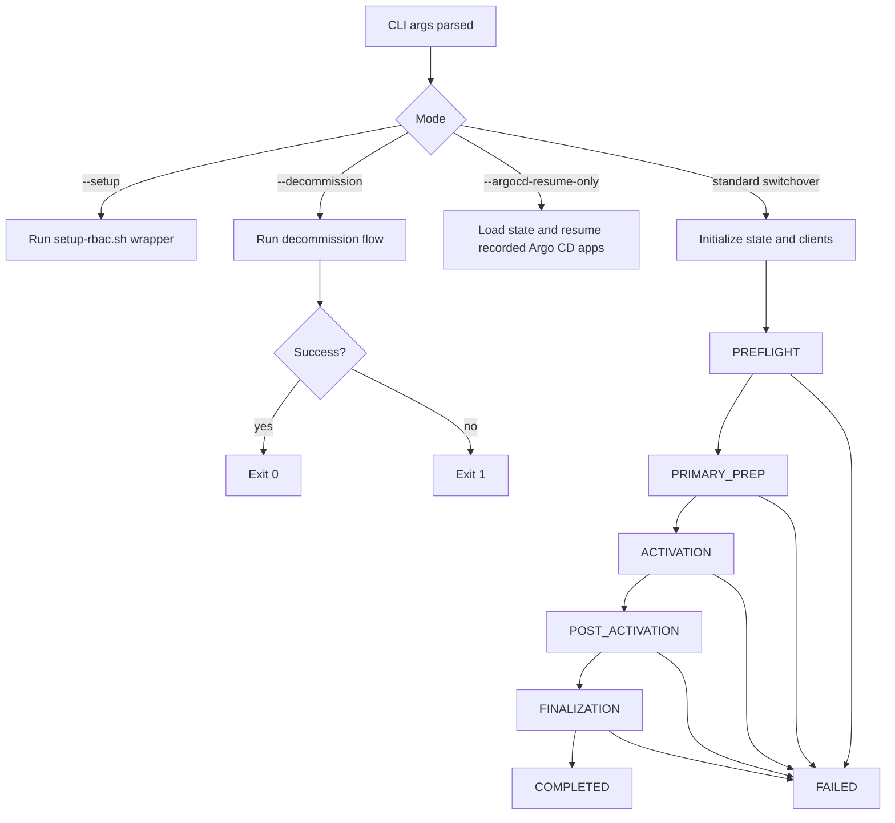
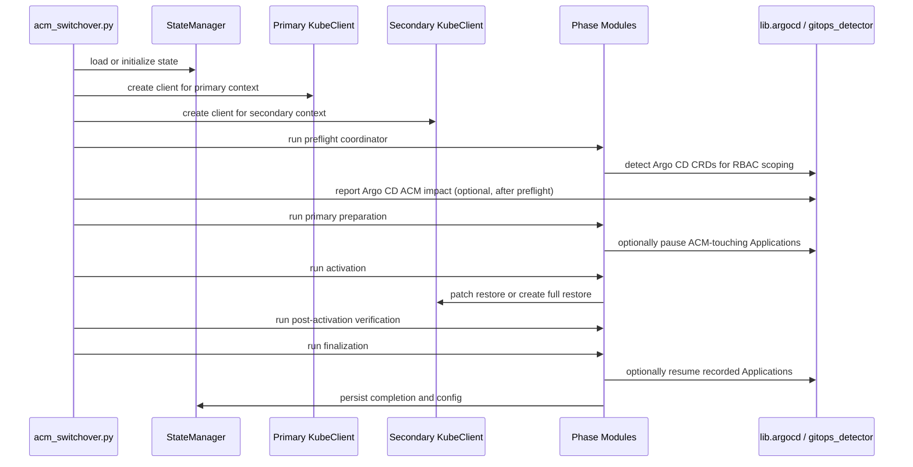

# ACM Switchover - Architecture & Design

**Version**: 1.5.10  
**Last Updated**: 2026-03-09

## Overview

`rh-acm-switchover` is a Python-first operational CLI for orchestrating ACM hub switchover between a primary and secondary hub. The design favors explicit phases, resumable state, strong validation, and operator-visible safety checks over hidden automation.

The codebase also includes shell helpers for discovery, validation, RBAC bootstrap, kubeconfig generation, and Argo CD auto-sync management. The Python CLI is the main control plane; the shell scripts are focused operational companions.

## Current Project Structure

```text
rh-acm-switchover/
├── acm_switchover.py              # Main CLI entrypoint and phase orchestrator
├── check_rbac.py                  # RBAC validation CLI
├── show_state.py                  # State file inspection helper
├── run_tests.sh                   # Test wrapper
├── lib/
│   ├── __init__.py
│   ├── argocd.py                  # Argo CD discovery, pause, and resume helpers
│   ├── constants.py               # Shared constants and timeouts
│   ├── exceptions.py              # Switchover exception hierarchy
│   ├── gitops_detector.py         # GitOps marker collection and reporting
│   ├── kube_client.py             # Kubernetes API wrapper with retries/dry-run support
│   ├── rbac_validator.py          # Permission validation helpers
│   ├── utils.py                   # StateManager, Phase enum, logging, helpers
│   ├── validation.py              # CLI and input validation
│   └── waiter.py                  # Polling and wait utilities
├── modules/
│   ├── activation.py              # Secondary hub activation logic
│   ├── backup_schedule.py         # BackupSchedule helpers
│   ├── decommission.py            # Old-hub teardown workflow
│   ├── finalization.py            # New-primary finalization and old-hub handling
│   ├── post_activation.py         # ManagedCluster and Observability verification
│   ├── preflight/
│   │   ├── backup_validators.py
│   │   ├── base_validator.py
│   │   ├── cluster_validators.py
│   │   ├── namespace_validators.py
│   │   ├── reporter.py
│   │   └── version_validators.py
│   ├── preflight_coordinator.py   # Modular preflight orchestration
│   ├── preflight_validators.py    # Deprecated compatibility shim
│   └── primary_prep.py            # Old-primary preparation logic
├── scripts/
│   ├── argocd-manage.sh           # Standalone Argo CD pause/resume helper
│   ├── discover-hub.sh            # Hub discovery and preflight launcher
│   ├── generate-merged-kubeconfig.sh
│   ├── generate-sa-kubeconfig.sh
│   ├── postflight-check.sh
│   ├── preflight-check.sh
│   ├── setup-rbac.sh
│   └── lib-common.sh
├── deploy/                        # RBAC, kustomize, Helm, ACM policies
├── tests/                         # Unit, integration, and E2E-oriented pytest coverage
└── docs/
```

## Runtime Branches

The entrypoint exposes four distinct execution branches:

1. **Standard switchover path**
   - Uses state tracking, two `KubeClient` instances, phased execution, and optional Argo CD management.
2. **Setup path (`--setup`)**
   - Bypasses switchover state/phases and shells out to `scripts/setup-rbac.sh`.
3. **Decommission path (`--decommission`)**
   - Bypasses the phased switchover workflow and runs the old-hub teardown flow directly.
4. **Argo CD resume-only path (`--argocd-resume-only`)**
   - Loads recorded pause state and resumes Application auto-sync without running switchover phases.



## Core Design Principles

### Idempotency

Every mutating workflow step is designed to be re-runnable.

- State tracks completed steps by name
- Each step checks state before running
- Re-runs skip work already completed
- Phase transitions are explicit and persisted immediately

### Fail fast with clear errors

The architecture distinguishes validation failures, recoverable API issues, and fatal workflow errors.

- Critical preflight failures stop before mutation
- Terminal restore states fail explicitly
- State captures phase and error context for reruns and debugging

### Explicit over implicit

- CLI flags choose major workflow branches
- Old-hub disposition is always explicit via `--old-hub-action`
- GitOps handling is opt-in for mutation and explicit for detection
- Decommission is a separate mode rather than an automatic side effect

### Minimize hidden side effects

- `--dry-run` logs intended operations instead of mutating cluster resources
- `--validate-only` runs checks without entering mutation phases
- Setup mode and resume-only mode are isolated from the main switchover control flow

## Main Components

### `acm_switchover.py`

The entrypoint owns:

- CLI argument parsing
- Cross-mode branching
- logger setup
- state initialization
- primary and secondary `KubeClient` construction
- phase orchestration
- final GitOps report emission

It is intentionally thin on resource-specific logic; phase modules own most workflow behavior.

### `lib/utils.py`

Provides the operational scaffolding:

- `Phase` enum
- `StateManager`
- `dry_run_skip`
- logging setup
- version helpers and utility functions

`StateManager` is the backbone for resumability. It persists:

- current phase
- completed steps
- config discovered during execution
- Argo CD pause metadata
- error history

Critical checkpoints call `flush_state()`. Non-critical changes call `save_state()`.

### `lib/kube_client.py`

Wraps Kubernetes API operations with:

- per-context client loading
- dry-run-aware mutators
- retry behavior for transient failures
- common helpers for Deployments, StatefulSets, Pods, and custom resources

This layer centralizes Kubernetes interaction so workflow modules can stay focused on ACM behavior.

### `lib/validation.py`

Enforces CLI and input safety:

- context and filesystem path validation
- cross-argument validation
- guardrails for setup, decommission, activation, and Argo CD flags

This prevents invalid mode combinations from reaching workflow execution.

### `lib/argocd.py` and `lib/gitops_detector.py`

These modules separate two related but different concerns:

- `gitops_detector.py`: generic GitOps ownership marker collection and reporting
- `argocd.py`: Argo CD-specific discovery, ACM-impact analysis, pause, and resume operations

This split keeps generic “warn about drift risk” logic separate from “mutate Argo CD Applications” logic.

## Phase Modules

### Preflight

`modules/preflight_coordinator.py` orchestrates the modular validators in `modules/preflight/`.

Checks include:

- required namespaces and ACM resources
- ACM version detection and compatibility
- OADP and DataProtectionApplication health
- backup readiness and passive restore readiness
- ClusterDeployment protection
- RBAC validation
- optional GitOps and Argo CD impact reporting

`modules/preflight_validators.py` remains only as a deprecated compatibility shim.

### Primary preparation

`modules/primary_prep.py` prepares the old primary hub by:

- pausing `BackupSchedule`
- disabling cluster auto-import
- scaling down Thanos compactor when needed
- pausing ACM-touching Argo CD Applications when requested

### Activation

`modules/activation.py` promotes the secondary hub.

It supports:

- passive method activation
- full restore creation
- restore deletion propagation handling for `--activation-method restore`
- managed-cluster-count enforcement
- temporary auto-import strategy handling for newer ACM versions

Important activation-related flags:

- `--activation-method`
- `--min-managed-clusters`
- `--manage-auto-import-strategy`

### Post-activation

`modules/post_activation.py` verifies the promoted hub by checking:

- `ManagedCluster` join and availability conditions
- observability component health and restarts
- follow-up guidance for operator verification

### Finalization

`modules/finalization.py` completes switchover by:

- re-enabling or recreating `BackupSchedule`
- verifying new backups after promotion
- handling old-hub-as-secondary or old-hub decommission prep
- optionally resuming Argo CD auto-sync

Important finalization-related flags:

- `--old-hub-action`
- `--disable-observability-on-secondary`
- `--argocd-resume-after-switchover`

### Decommission

`modules/decommission.py` performs the separate old-hub teardown flow with explicit confirmation and verification.

## Switchover Interaction Model



## GitOps and Argo CD Architecture

GitOps support is intentionally layered:

- **Detection layer**: resource labels/annotations are scanned for GitOps markers so operators know where drift is likely.
- **Argo CD discovery layer**: the tool can inspect Argo CD installations and Applications that touch ACM resources.
- **Pause/resume layer**: when requested, the tool records exactly which Applications it paused and can later resume only those Applications.

Key design properties:

- Marker detection can be disabled with `--skip-gitops-check`
- `--argocd-check` is read-only
- `--argocd-manage` is mutating and therefore disallowed with `--validate-only`
- Resume is idempotent for already-resumed Applications when the same run owns the pause marker
- Git remains the source of truth; the tool only coordinates around temporary drift risk

## State Model

State is stored in JSON and keyed by switchover context pair unless an explicit `--state-file` is provided.

Important state categories:

- `current_phase`
- `completed_steps`
- detected config such as ACM version and observability presence
- saved resources needed for version-specific restore/unpause behavior
- Argo CD pause metadata such as `argocd_run_id` and `argocd_paused_apps`
- error history

Operational guarantees:

- atomic writes reduce corruption risk
- locking protects against concurrent modification
- signal and exit handlers flush dirty state
- completed-state reruns remain safe, including validate-only behavior

## Validation and Safety Model

The architecture treats validation as a first-class subsystem rather than a convenience layer.

- CLI validation rejects bad mode combinations up front
- preflight validation blocks unsafe execution
- module-level checks validate assumptions again before critical mutations
- decommission remains isolated from normal switchover
- old-hub outcomes stay explicit through `--old-hub-action`

## Shell Script Companion Architecture

The shell scripts are not alternate implementations of the full Python workflow. They are companion tools.

- `discover-hub.sh`: hub discovery and smart preflight launcher
- `preflight-check.sh` / `postflight-check.sh`: standalone operational checks
- `setup-rbac.sh`: RBAC deployment and kubeconfig generation wrapper
- `generate-sa-kubeconfig.sh` / `generate-merged-kubeconfig.sh`: credential packaging helpers
- `argocd-manage.sh`: standalone pause/resume control for Argo CD Applications

This split keeps the Python CLI focused on orchestration while leaving smaller operator tasks available as composable shell utilities.

## Setup Architecture

Setup mode is intentionally separate from the switchover phase machine.

- `--setup` calls the shell-based RBAC bootstrap workflow
- `--admin-kubeconfig` is required for privileged deployment
- `--role` controls whether operator, validator, or both RBAC sets are installed
- `--include-decommission` extends setup for teardown-capable operator workflows
- kubeconfig generation remains optional and script-driven

## Testing Architecture

The repository uses layered coverage:

- unit tests for modules and library helpers
- integration-style tests for scripts and RBAC behavior
- E2E-oriented pytest coverage under `tests/e2e/`

Important test themes include:

- state persistence and resume behavior
- activation and finalization edge cases
- Argo CD pause/resume and GitOps reporting
- CLI validation rules
- script integration

## Known Constraints

- Normal switchover assumes the old primary hub is reachable
- The runbook remains the authoritative manual/operational fallback
- GitOps support is advisory plus targeted Argo CD coordination, not full drift reconciliation
- `modules/preflight_validators.py` remains in the tree for compatibility and should not be treated as the main implementation
