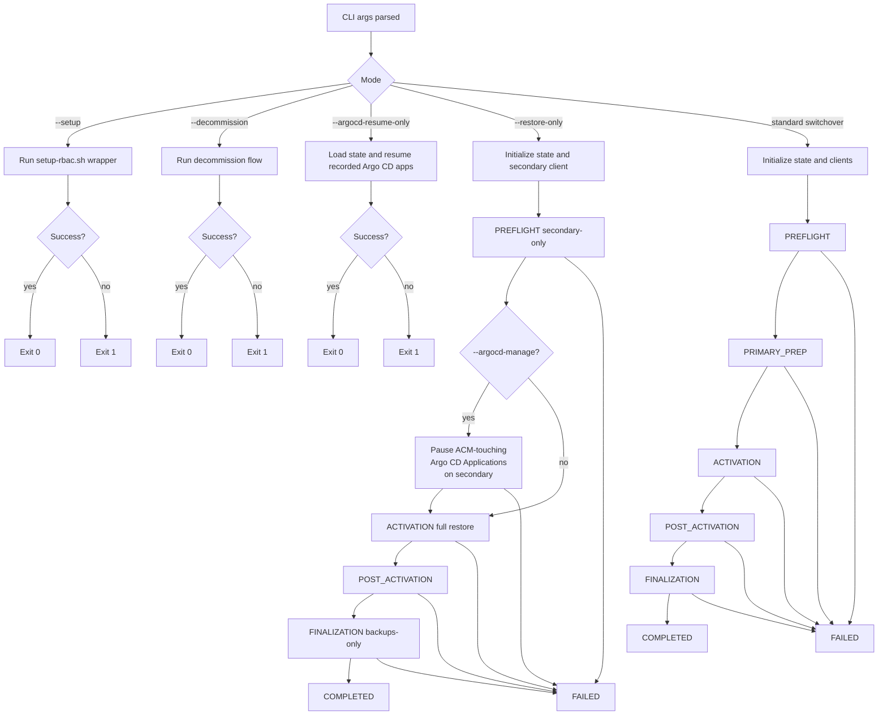
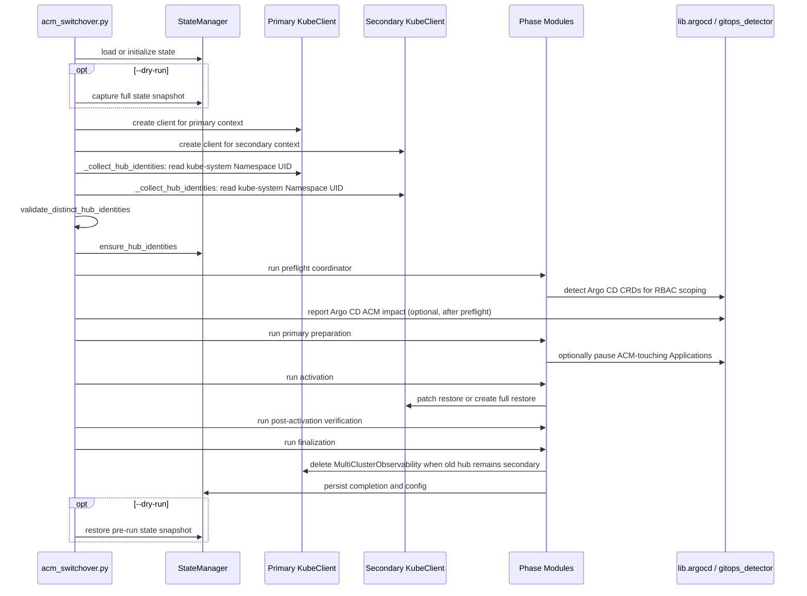

# ACM Switchover - Architecture & Design

**Last Updated**: 2026-08-12

## Overview

`rh-acm-switchover` is a Python-first operational CLI for orchestrating ACM hub switchover between a primary and secondary hub. The design favors explicit phases, resumable state, strong validation, and operator-visible safety checks over hidden automation.

The codebase also includes shell helpers for discovery, validation, RBAC bootstrap, and kubeconfig generation. Argo CD auto-sync *management* is not among them: the shell layer only detects ACM-touching Argo CD Applications and reports the drift risk, directing the operator to the Python `--argocd-manage` feature (`scripts/lib-common.sh:1069`). The Python CLI is the main control plane; the shell scripts are focused operational companions.

## Current Project Structure

```text
rh-acm-switchover/
├── acm_switchover.py              # Main CLI entrypoint; dispatches to operation runners
├── check_rbac.py                  # RBAC validation CLI
├── show_state.py                  # State file inspection helper
├── run_tests.sh                   # Test wrapper
├── lib/
│   ├── __init__.py
│   ├── argocd.py                  # Argo CD discovery, pause, and resume helpers
│   ├── argocd_register.py         # ArgocdPauseRegister: pause register (ADR-0001)
│   ├── argocd_register_store.py   # PauseRegisterStore: register durable-state codec
│   ├── argocd_resume.py           # --argocd-resume-only flow
│   ├── cli_outcomes.py            # CLI exit paths and phase report assembly
│   ├── constants.py               # Shared constants and timeouts
│   ├── exceptions.py              # Switchover exception hierarchy
│   ├── gitops_detector.py         # GitOps marker collection and reporting
│   ├── kube_client.py             # Kubernetes API wrapper with retries/dry-run support
│   ├── operation_runners.py       # Switchover/restore-only operation runners
│   ├── path_safety.py             # Filesystem path safety validation
│   ├── rbac_validator.py          # Permission validation helpers
│   ├── report_artifacts.py        # Machine-readable report artifacts
│   ├── run_record.py              # RunRecord facade: cross-phase run facts; RunSummary
│   ├── runtime_bootstrap.py       # Client/state-file/state-dir resolution (env posture)
│   ├── utils.py                   # StateManager, Phase enum, logging, helpers
│   ├── validation.py              # CLI and input validation
│   ├── waiter.py                  # Polling and wait utilities
│   └── workflow.py                # Phase-flow execution engine
├── modules/
│   ├── activation.py              # Secondary hub activation logic
│   ├── backup_schedule.py         # BackupSchedule helpers
│   ├── decommission.py            # Old-hub teardown workflow
│   ├── finalization.py            # New-primary finalization and old-hub handling
│   ├── post_activation.py         # ManagedCluster and Observability verification
│   ├── preflight/
│   │   ├── backup_validators.py
│   │   ├── base_validator.py
│   │   ├── cluster_validators.py
│   │   ├── namespace_validators.py
│   │   ├── reporter.py
│   │   └── version_validators.py
│   ├── preflight_coordinator.py   # Modular preflight orchestration
│   └── primary_prep.py            # Old-primary preparation logic
├── scripts/
│   ├── discover-hub.sh            # Hub discovery and preflight launcher
│   ├── generate-merged-kubeconfig.sh
│   ├── generate-sa-kubeconfig.sh
│   ├── postflight-check.sh
│   ├── preflight-check.sh
│   ├── setup-rbac.sh
│   └── lib-common.sh
├── deploy/                        # RBAC, kustomize, Helm, ACM policies
├── tests/                         # Unit, integration, and E2E-oriented pytest coverage
├── ansible_collections/tomazb/acm_switchover/  # Ansible Collection (second form factor)
│   ├── playbooks/                 # Operator entrypoints (switchover, preflight, decommission, …)
│   ├── roles/                     # Phase modules (preflight, primary_prep, activation, …)
│   ├── plugins/
│   │   ├── modules/               # Custom Ansible modules
│   │   ├── module_utils/          # Shared utilities (constants, argocd, gitops, …)
│   │   └── action/                # Action plugins (checkpoint_phase)
│   └── tests/unit/                # pytest-based unit tests for the collection
└── docs/
```

## Runtime Branches

The entrypoint exposes five distinct execution branches:

1. **Standard switchover path**
   - Uses state tracking, two `KubeClient` instances, phased execution, and optional Argo CD management.
2. **Setup path (`--setup`)**
   - Bypasses switchover state/phases and shells out to `scripts/setup-rbac.sh`.
3. **Decommission path (`--decommission`)**
   - Bypasses the phased switchover workflow and runs the old-hub teardown flow directly.
4. **Argo CD resume-only path (`--argocd-resume-only`)**
   - Loads recorded pause state and resumes Application auto-sync without running switchover phases.
5. **Restore-only path (`--restore-only`)**
   - Single-hub restore from S3 backups. No primary hub needed. Skips PRIMARY_PREP, runs secondary-only preflight, and can optionally pause Argo CD apps on the secondary hub before activation.


```mermaid
flowchart TD
    A[CLI args parsed] --> B{Mode}
    B -->|--setup| C[Run setup-rbac.sh wrapper]
    B -->|--decommission| D[Run decommission flow]
    B -->|--argocd-resume-only| E[Load state and resume recorded Argo CD apps]
    B -->|--restore-only| R[Initialize state and secondary client]
    B -->|standard switchover| F[Initialize state and clients]
    C --> C1{Success?}
    C1 -->|yes| C2[Exit 0]
    C1 -->|no| C3[Exit 1]
    D --> D1{Success?}
    D1 -->|yes| D2[Exit 0]
    D1 -->|no| D3[Exit 1]
    E --> E1{Success?}
    E1 -->|yes| E2[Exit 0]
    E1 -->|no| E3[Exit 1]
    R --> RG[PREFLIGHT secondary-only]
    RG --> RP{--argocd-manage?}
    RP -->|yes| RQ[Pause ACM-touching<br/>Argo CD Applications<br/>on secondary]
    RP -->|no| RI[ACTIVATION full restore]
    RQ --> RI
    RI --> RJ[POST_ACTIVATION]
    RJ --> RM[FINALIZATION backups-only]
    RM --> RK[COMPLETED]
    RG --> RL[FAILED]
    RQ --> RL
    RI --> RL
    RJ --> RL
    RM --> RL
    F --> G[PREFLIGHT]
    G --> H[PRIMARY_PREP]
    H --> I[ACTIVATION]
    I --> J[POST_ACTIVATION]
    J --> M[FINALIZATION]
    M --> K[COMPLETED]
    G --> L[FAILED]
    H --> L
    I --> L
    J --> L
    M --> L
```

## Core Design Principles

### Idempotency

Every mutating workflow step is designed to be re-runnable.

- State tracks completed steps by name
- Each step checks state before running
- Re-runs skip work already completed
- Phase transitions are explicit and persisted immediately

### Fail fast with clear errors

The architecture distinguishes validation failures, recoverable API issues, and fatal workflow errors.

- Critical preflight failures stop before mutation
- Terminal restore states fail explicitly
- State captures phase and error context for reruns and debugging
- The orchestrator only reports `COMPLETED` after each successful phase handler leaves durable state in the expected resulting phase; mismatches are recorded against the expected phase and transition the run to `FAILED`

### Explicit over implicit

- CLI flags choose major workflow branches
- Old-hub disposition is always explicit via `--old-hub-action`
- GitOps handling is opt-in for mutation and explicit for detection
- Decommission is a separate mode rather than an automatic side effect

### Minimize hidden side effects

- `--dry-run` logs intended operations instead of mutating cluster resources
- `--dry-run` restores the pre-run state file after rehearsal so resume/checkpoint state is not advanced
- `--validate-only` runs checks without entering mutation phases
- Setup mode and resume-only mode are isolated from the main switchover control flow

## Main Components

### `acm_switchover.py`

The entrypoint owns:

- CLI argument parsing and cross-argument validation entry (`parse_args`, `validate_args`)
- logger setup
- runtime bootstrap (client, state-file, and state-directory resolution)
- construction of the runner hook dataclasses (`_build_switchover_runner_hooks`,
  `_build_restore_only_runner_hooks`, `_build_operation_dispatch_hooks`, `acm_switchover.py:390`)
- the dry-run snapshot/restore wrappers around each operation (`run_switchover`,
  `run_restore_only`, `acm_switchover.py:424`)
- the concrete phase adapters the hooks point at — `_run_phase_preflight`,
  `_run_phase_primary_prep`, `_run_phase_activation`, `_run_phase_post_activation`,
  `_run_phase_finalization` — all five defined in `acm_switchover.py`, at lines 616, 773, 801,
  831, and 886 respectively
- the setup-mode branch, which is taken before state and clients are created
  (`acm_switchover.py:1231`)
- dispatch into the operation runners

What was genuinely extracted is the *ordered phase flow* and the completed/failed-state entry
decisions, now in `lib/workflow.py`, and operation dispatch, now in `lib/operation_runners.py`.
The three hook dataclasses are a real seam: the runners can be exercised without a live client.
The entrypoint is not, however, reduced to parsing and dispatch — it still supplies every phase
adapter behind those hooks and owns dry-run state rollback. Resume-only branching is not in the
entrypoint either; `lib/cli_outcomes.py:196` chooses between the Argo CD resume-only path and
`execute_operation`. Phase modules own resource-specific behaviour.

### `lib/operation_runners.py`

Owns operation dispatch and the two runner implementations:

- `execute_operation` — the shared dispatch path
- `run_switchover_impl` — the standard switchover operation
- `run_restore_only_impl` — the single-hub restore-only operation

The seam between dispatch and each operation is a set of hook dataclasses —
`OperationDispatchHooks`, `SwitchoverRunnerHooks`, and `RestoreOnlyRunnerHooks` — so the runners
can be exercised without a live client.

### `lib/workflow.py`

Owns phase-flow execution and state-driven entry decisions:

- `run_phase_flow` — drives the ordered phase handlers
- `handle_completed_state` — handles reruns against a recently completed state
- `handle_failed_state` — prepares a failed state for retry, or exits when the retry phase is unknown
- `run_validate_only_preflight` — the validate-only path

`CompletedStateConfig`, `FailedStateConfig`, and `CompletionLogConfig` carry the parameters for
these decisions, keeping the banners and exit behaviour consistent across operations.

### `lib/utils.py`

Provides the operational scaffolding:

- `Phase` enum
- `StateManager`
- `dry_run_skip`
- logging setup
- version helpers and utility functions

`StateManager` is the backbone for resumability. It owns the durable file and persists:

- current phase
- completed steps
- cross-phase run facts, reached only through the `RunRecord` facade (see below)
- Argo CD pause metadata
- error history

Critical checkpoints call `flush_state()`. Non-critical changes call `save_state()`.
Dry-run orchestration captures and restores a full `StateManager` snapshot after the run; this is separate from
validate-only runtime checkpoints, which intentionally preserve discovered run facts while restoring phase and error
state.

The main switchover and restore-only phase loops assert the expected durable phase
after each handler that returns success. This keeps resume and completion
criteria tied to `StateManager.current_phase`, not just a handler return value,
and prevents a stale or invalid phase from falling through to `COMPLETED`.

### `lib/run_record.py`

`RunRecord` is the facade for cross-phase run facts — what preflight discovered, and what each
phase recorded for later phases or reports. It exposes only named, typed operations
(`HubFacts`, `ManagedClusterExpectation`, `StepRecord`, `ErrorRecord`, `RunSummary`).

The split matters: the durable file behind the run belongs to `StateManager`, but the vocabulary
of the cross-phase fact keys belongs to `RunRecord` alone. Reaching those `RunRecord`-owned
persisted keys directly, outside the facade, is a contract violation — see the Run record entry
in [`CONTEXT.md`](../../CONTEXT.md).

The prohibition is scoped to those keys, not to the whole durable file. The pause-register
modules (`lib/argocd_register.py`, `lib/argocd_register_store.py`) hold a documented allowance
(issue #208) to reach their own persisted pause-register keys through `StateManager`'s private
storage accessors, which `lib/utils.py:570` records explicitly. Those keys are the pause
register's, not `RunRecord`'s, so no facade is bypassed.

### `lib/kube_client.py`

Wraps Kubernetes API operations with:

- per-context client loading
- dry-run-aware mutators
- retry behavior for transient failures
- explicit per-request timeouts for read, list, create, patch, scale, and log calls
- common helpers for Deployments, StatefulSets, Pods, and custom resources

This layer centralizes Kubernetes interaction so workflow modules can stay focused on ACM behavior. The default
request timeout is 30 seconds. Tenacity remains the retry layer for wrapped helpers, while urllib3 client retries stay
disabled to avoid multiplying retry attempts below the workflow code.

### `lib/strict_read.py` and the strict read surface on `lib/kube_client.py`

`lib/strict_read.py` owns one small outcome algebra shared, by mirrored implementation rather than
by import, with the Ansible Collection. A `StrictReadOutcome` carries exactly one
`StrictReadStatus` — `ITEMS`, `CRD_ABSENT`, `NAMESPACE_ABSENT`, `OBJECT_ABSENT`, or `ERROR` — and
the value type itself enforces the rules the decommission and migration-evidence slices depend on:

- an error is never an absence proof, and an absence proof is never an error;
- neither an error nor an absence proof may carry an inventory;
- neither may carry a `resourceVersion`, so no producer can synthesize provenance.

`lib/kube_client.py` keeps its existing readers unchanged and adds six strict producers beside
them: `list_custom_resources_strict`, `get_custom_resource_strict`, `get_namespace_strict`,
`list_pods_strict`, `get_deployment_strict`, and `get_replicaset_strict`. They are a closed
surface — no caller composes its own strict read — and each one either publishes a real revision
or does not succeed. A strict list drains every page under a fixed page size and a page budget,
requires every page of one read to be served at the revision its first page established, and
restarts the whole read exactly once when a continuation expires, discarding both the accumulated
prefix and the abandoned revision. A partial prefix never escapes; an incomplete read is an error.

**Kind absence needs its own proof.** The dynamic client's discovery cache substitutes an empty
resource list for some discovery-fetch failures, and the substituted set is not stable across the
supported client range, so a lookup miss cannot distinguish an unserved kind from an unreachable
API server. `KubeClient._discovery_serves` therefore issues its own bounded discovery request and
returns `CRD_ABSENT` only for a successful, decoded, structurally valid `APIResourceList` that
lacks the requested resource. Every other discovery outcome is an error.

**The canonical resource name flows from the caller.** Both form factors take the exact canonical
Kubernetes APIResource name (for example `multiclusterobservabilities`) as an explicit input and
never derive it from `kind`. There is no inflector, no suffix rule, and no fallback, because a
synthesized plural would miss a discovery entry and turn a served kind into a false absence.

**Both form factors, one contract.** The Collection's `acm_k8s_read_outcome` module implements the
same algebra independently: `kind_not_served` maps to `CRD_ABSENT`, a complete `resources` list to
`ITEMS`, and its `resource_version` result key to `StrictReadOutcome.resource_version` with
identical semantics on every outcome. The two runtimes share no code; `tests/test_strict_read_parity.py`
drives one declared vector set through both implementations and is what keeps them equal.

### `lib/waiter.py`

Provides explicit polling contracts through `WaitConditionResult`. Polling sleeps are capped to the remaining timeout
budget, including fast-poll intervals, so wait loops do not exceed their configured deadline because of a final
oversized sleep.

### `lib/validation.py`

Enforces CLI and input safety:

- context and filesystem path validation
- cross-argument validation
- guardrails for setup, decommission, activation, and Argo CD flags

This prevents invalid mode combinations from reaching workflow execution.

### `lib/argocd.py` and `lib/gitops_detector.py`

These modules separate two related but different concerns:

- `gitops_detector.py`: generic GitOps ownership marker collection and reporting
- `argocd.py`: Argo CD-specific discovery, ACM-impact analysis, pause, and resume operations

This split keeps generic “warn about drift risk” logic separate from “mutate Argo CD Applications” logic.

## Phase Modules

### Preflight

`modules/preflight_coordinator.py` orchestrates the modular validators in `modules/preflight/`.

Checks include:

- required namespaces and ACM resources
- ACM version detection and compatibility
- OADP and DataProtectionApplication health
- backup readiness and passive restore readiness
- ClusterDeployment protection
- RBAC validation
- optional GitOps and Argo CD impact reporting

The deprecated `modules/preflight_validators.py` compatibility shim has been removed; import validators from `modules.preflight` directly.

### Primary preparation

`modules/primary_prep.py` prepares the old primary hub by:

- pausing `BackupSchedule`
- disabling cluster auto-import
- scaling down Thanos compactor when needed
- pausing ACM-touching Argo CD Applications when requested

### Activation

`modules/activation.py` promotes the secondary hub.

It supports:

- passive method activation
- full restore creation
- restore deletion propagation handling for `--activation-method restore`
- managed-cluster-count enforcement
- temporary auto-import strategy handling for newer ACM versions

Important activation-related flags:

- `--activation-method`
- `--min-managed-clusters`
- `--manage-auto-import-strategy`

### Post-activation

`modules/post_activation.py` verifies the promoted hub by checking:

- `ManagedCluster` join and availability conditions
- observability component health and restarts
- follow-up guidance for operator verification

### Finalization

`modules/finalization.py` completes switchover by:

- re-enabling or recreating `BackupSchedule`
- verifying new backups after promotion
- handling the old hub according to `--old-hub-action`

The old-hub dispositions are not equivalent in blast radius. `secondary` sets up passive sync
for failback. `none` leaves the hub untouched. `decommission` is **destructive**: finalization
calls `_decommission_old_hub` (`modules/finalization.py:1115`, inside `_handle_old_hub` at
`modules/finalization.py:1090`), which runs the full
`Decommission.decommission(interactive=False)` teardown (`modules/finalization.py:1141`) and
removes ACM components — Observability resources, non-local `ManagedCluster` resources, and the
`MultiClusterHub` — from the old primary. It is a real teardown performed inside the switchover
run without a further prompt, not a preparation step.

BackupSchedule collision repair deletes and recreates the schedule to refresh backup ownership. After delete, it polls
for schedule absence with a 30-second timeout and 2-second interval before recreating the schedule, preserving UID
change safety checks without relying on a fixed sleep.

Important finalization-related flags:

- `--old-hub-action`
- `--disable-observability-on-secondary` (deprecated compatibility flag)

### Decommission

`modules/decommission.py` performs the separate old-hub teardown flow with explicit confirmation and verification.

## Switchover Interaction Model


```mermaid
sequenceDiagram
    participant CLI as acm_switchover.py
    participant State as StateManager
    participant P as Primary KubeClient
    participant S as Secondary KubeClient
    participant Mods as Phase Modules
    participant Argo as lib.argocd / gitops_detector

    CLI->>State: load or initialize state
    opt --dry-run
        CLI->>State: capture full state snapshot
    end
    CLI->>P: create client for primary context
    CLI->>S: create client for secondary context
    CLI->>P: _collect_hub_identities: read kube-system Namespace UID
    CLI->>S: _collect_hub_identities: read kube-system Namespace UID
    CLI->>CLI: validate_distinct_hub_identities
    CLI->>State: ensure_hub_identities
    CLI->>Mods: run preflight coordinator
    Mods->>Argo: detect Argo CD CRDs for RBAC scoping
    CLI->>Argo: report Argo CD ACM impact (optional, after preflight)
    CLI->>Mods: run primary preparation
    Mods->>Argo: optionally pause ACM-touching Applications
    CLI->>Mods: run activation
    Mods->>S: patch restore or create full restore
    CLI->>Mods: run post-activation verification
    CLI->>Mods: run finalization
    Mods->>P: delete MultiClusterObservability when old hub remains secondary
    Mods->>State: persist completion and config
    opt --dry-run
        CLI->>State: restore pre-run state snapshot
    end
```

For a normal two-hub flow, `_bind_runtime_hub_identities` keeps the identity
order explicit: `_collect_hub_identities`, then
`validate_distinct_hub_identities`, then `StateManager.ensure_hub_identities`.
The cross-role comparison uses fresh live `kube-system` Namespace UIDs and is
additive to stored-versus-current identity binding on resume. Restore-only
collects only the secondary identity. Decommission does not enter this binder.

## GitOps and Argo CD Architecture

GitOps support is intentionally layered:

- **Detection layer**: resource labels/annotations are scanned for GitOps markers so operators know where drift is likely.
- **Argo CD discovery layer**: the tool can inspect Argo CD installations and Applications that touch ACM resources.
- **Pause/resume layer**: when requested, the tool records exactly which Applications it paused and can later resume only those Applications.

Key design properties:

- Marker detection can be disabled with `--skip-gitops-check`
- ArgoCD detection runs automatically (read-only) when Applications CRD is detected
- `--argocd-manage` is mutating, so `--validate-only` downgrades it to read-only rather than
  rejecting it: the CLI accepts the combination and warns that management has no effect
  (`acm_switchover.py:379`), then preflight computes effective management as off
  (`acm_switchover.py:628`) and the run continues
- Resume is idempotent for already-resumed Applications when the same run owns the pause marker
- Git remains the source of truth; the tool only coordinates around temporary drift risk

## State Model

State is stored in JSON and keyed by switchover context pair unless an explicit `--state-file` is provided.

Important state categories:

- `current_phase`
- `completed_steps`
- `hub_identities` — per-role `{context, cluster_uid}` recorded from each hub's `kube-system` namespace UID; resume re-reads live UIDs and fails closed before mutation if a recorded UID no longer matches the cluster behind the same context name, if hub identities are missing for an in-progress switchover, or if the live UID is unreadable. Operators must use `--reset-state` (different cluster on purpose) or `--force` (legacy state, after manual verification) to recover.
- detected run facts such as ACM version and observability presence, read and written through
  the `RunRecord` facade (`lib/run_record.py`) rather than as raw persisted keys
- saved resources needed for version-specific restore/unpause behavior
- Argo CD pause metadata such as `argocd_run_id` and `argocd_paused_apps`
- error history
- optional schema-versioned report artifacts written through `--report-dir`

Operational guarantees:

- atomic writes reduce corruption risk
- locking protects against concurrent modification
- signal and exit handlers flush dirty state
- completed-state reruns remain safe, including validate-only behavior
- report artifact writes validate controller-side paths before creating JSON files, reject destinations whose resolved parent escapes the configured workspace roots via symlinks, and route optional collection summaries through the shared `path_type: artifact` writer in `lib/report_artifacts.py` / `acm_report_artifact`
- Thanos compactor scale-down uses bounded polling against the remaining timeout budget; post-activation re-raises programming errors instead of downgrading them to retryable failures; `KubeClient` does not fall back to the global kubeconfig when its explicit kubeconfig/context cannot be loaded

## Validation and Safety Model

The architecture treats validation as a first-class subsystem rather than a convenience layer.

- CLI validation rejects bad mode combinations up front
- preflight validation blocks unsafe execution
- module-level checks validate assumptions again before critical mutations
- decommission remains isolated from normal switchover
- old-hub outcomes stay explicit through `--old-hub-action`

## Shell Script Companion Architecture

The shell scripts are not alternate implementations of the full Python workflow. They are companion tools.

- `discover-hub.sh`: hub discovery and smart preflight launcher
- `preflight-check.sh` / `postflight-check.sh`: standalone operational checks
- `setup-rbac.sh`: RBAC deployment and kubeconfig generation wrapper
- `generate-sa-kubeconfig.sh` / `generate-merged-kubeconfig.sh`: credential packaging helpers
- `lib-common.sh`: shared helpers, including Argo CD risk **detection and advisory reporting** — it counts ACM-touching Applications and points the operator at `--argocd-manage`; it never pauses or resumes anything

This split keeps the Python CLI focused on orchestration while leaving smaller operator tasks available as composable shell utilities. Every mutation of Argo CD Applications lives in the Python control plane.

## Setup Architecture

Setup mode is intentionally separate from the switchover phase machine.

- `--setup` calls the shell-based RBAC bootstrap workflow
- `--admin-kubeconfig` is required for privileged deployment
- `--role` controls whether operator, validator, or both RBAC sets are installed
- `--include-decommission` extends setup for teardown-capable operator workflows
- kubeconfig generation remains optional and script-driven

## Testing Architecture

The repository uses layered coverage:

- unit tests for modules and library helpers
- integration-style tests for scripts and RBAC behavior
- E2E-oriented pytest coverage under `tests/e2e/`

Important test themes include:

- state persistence and resume behavior
- activation and finalization edge cases
- Argo CD pause/resume and GitOps reporting
- CLI validation rules
- script integration

## Release Validation and Lab-Controller Boundary

Release validation lives under `tests/release/`. The live lab controller is a separate
authority with its own safety invariants. This document does not restate either — it points at
the owners, because copied invariants and copied status both go stale silently.

- Policy and durable invariants:
  [Release-Validation and Lab-Controller Authority Boundary](../../AGENTS.md#release-validation-and-lab-controller-authority-boundary)
- Framework contract: [Release validation framework](release-validation-framework.md)
- Controller design: [Lab role controller spec](lab-role-controller-spec.md)
- Non-live orchestration guidance: [Lab role controller agent instructions](lab-role-controller-agent-instructions.md)

Current phase status is owned by the GitHub issue tracker, not by this document.

## Known Constraints

- Normal switchover assumes the old primary hub is reachable
- The runbook remains the authoritative manual/operational fallback
- GitOps support is advisory plus targeted Argo CD coordination, not full drift reconciliation

## Ansible Collection

The Ansible Collection (`tomazb.acm_switchover`) lives at `ansible_collections/tomazb/acm_switchover/` and is a production-ready second form factor of the same switchover automation, targeting both `ansible-core` CLI and Ansible Automation Platform (AAP).

The collection uses a fundamentally different architecture from the Python CLI:

- **Roles** replace Python phase modules: `preflight`, `primary_prep`, `activation`, `post_activation`, `finalization`, `decommission`, `argocd_manage`, `discovery`, `rbac_bootstrap`
- **Thin custom plugins** (`modules/`, `action/`, `module_utils/`) handle operations that need retry semantics, structured polling, or checkpoint persistence beyond what stock `kubernetes.core` modules provide
- **Playbooks** (`switchover.yml`, `restore_only.yml`, `preflight.yml`, `decommission.yml`, `rbac_bootstrap.yml`, `discovery.yml`, `argocd_resume.yml`) are the operator entrypoints. `playbooks/` holds one further file, `argocd_manage_test.yml`, which is deliberately not listed here: it is an integration-test playbook that drives the `argocd_manage` role through a pause/resume cycle against mock applications, not an operator entrypoint. It is still syntax-checked, because verification surface 6 globs `playbooks/*.yml` — see [Testing guide](testing.md#the-nine-verification-surfaces)
- **Grouped variables** (`acm_switchover_hubs`, `acm_switchover_operation`, `acm_switchover_features`) replace CLI flags as the primary operator interface
- **Optional checkpoint backend** replaces `StateManager` for long-running or interrupted runs; Ansible-native idempotency handles the default case
- **Report artifacts** carry schema version `1.0` on the preflight, switchover, and restore-only paths. The decommission result does not: its role publishes no `schema_version` field, and `acm_report_artifact` writes the report it is given unchanged. Python and collection reports preserve aligned status/report contracts without requiring identical top-level fields for every report type
- **Decommission observability** defaults to namespace autodetection in the collection, with explicit `true`/`false` overrides for known environments
- **Klusterlet helpers** use bounded direct Kubernetes requests and worker futures. Defaults are 10 workers, 30-second per-request timeouts, and 180-second worker future timeout windows for each probe/remediation batch; worker future timeouts are reported as failed cluster results.
- **Constants isolation**: `plugins/module_utils/constants.py` is the collection's constants file — it cannot import from `lib/constants.py`

The collection architecture is tracked through the [Ansible collection behavior map](../ansible-collection/behavior-map.md), [parity matrix](../ansible-collection/parity-matrix.md), and collection-owned architecture docs. Both the Python CLI and the Ansible Collection are production implementations in the current coexistence period.
