# ACM Switchover Code Walkthrough

This report explains how the repository works across its three automation
surfaces:

- the Python CLI, which is the original stateful orchestrator
- the Ansible collection, which is the AAP/ansible-core form factor
- the Bash scripts, which provide operational checks, setup bridges, and legacy
  helpers

The project automates a phased Red Hat Advanced Cluster Management (ACM) hub
switchover. The central workflow moves managed clusters from a primary hub to a
secondary hub, validates safety conditions, activates restore resources, verifies
cluster health, and finalizes backups or old-hub disposition.

## Mental Model

Think of the repository as one operational domain with multiple execution
frontends.

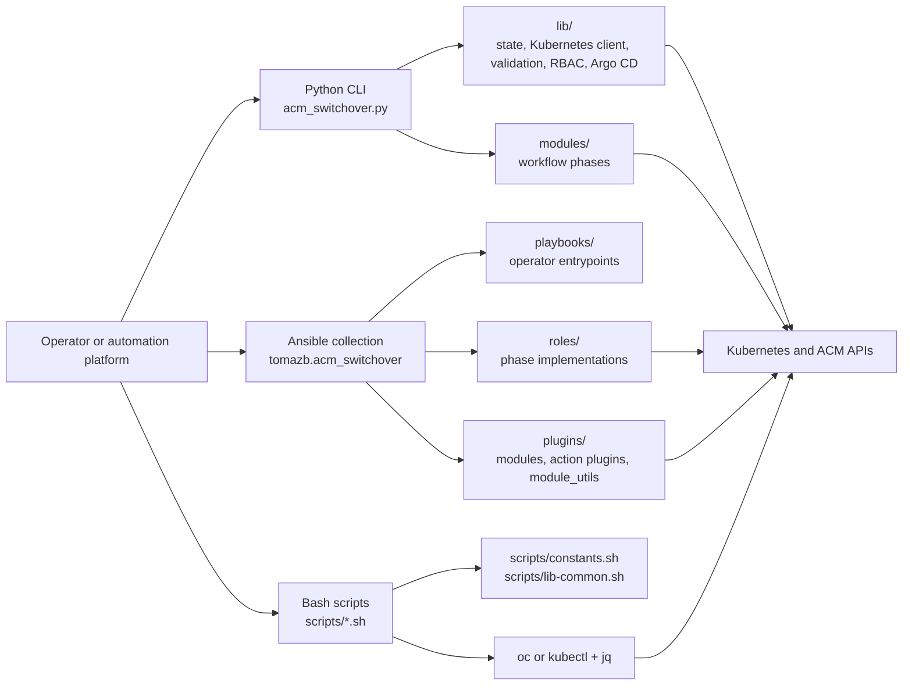

The Python CLI and Ansible collection are independent implementations. They do
not import from each other, but many operator-facing capabilities are
dual-supported and must remain aligned. The Bash scripts are a mixture of:

- read-only operational companions such as discovery, preflight, and postflight
  checks
- bootstrap or bridge utilities used during collection migration
- deprecated helpers retained for compatibility while collection roles replace
  them

## Repository Map

| Area | Responsibility |
| --- | --- |
| `acm_switchover.py` | Python entrypoint, CLI parsing, mode routing, state/client setup, phase orchestration, report writing |
| `lib/` | Shared Python support: state, Kubernetes API wrapper, validation, RBAC, Argo CD, GitOps detection, reports, polling |
| `modules/` | Python workflow phases: preflight, primary preparation, activation, post-activation, finalization, decommission |
| `ansible_collections/tomazb/acm_switchover/playbooks/` | Ansible operator entrypoints |
| `ansible_collections/tomazb/acm_switchover/roles/` | Ansible phase and support roles |
| `ansible_collections/tomazb/acm_switchover/plugins/` | Custom modules, action plugins, and reusable collection utilities |
| `scripts/` | Bash discovery, validation, RBAC, Argo CD, and kubeconfig helpers |
| `deploy/` | RBAC manifests, Kustomize overlays, Helm chart, ACM policies |
| `docs/` | Operator, deployer, developer, parity, and reference documentation |
| `tests/` | Python tests, parity tests, E2E-oriented tests, and release validation tests |
| `ansible_collections/.../tests/` | Collection unit, integration, and scenario tests |

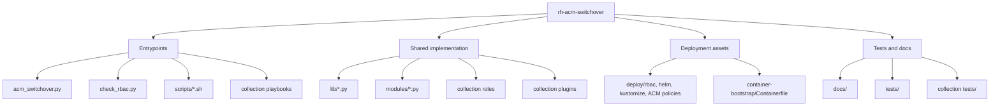

## Python CLI Deep Dive

The Python CLI is centered on `acm_switchover.py`. It owns process-level
concerns and delegates resource-specific behavior to `lib/` and `modules/`.

### Python Entry Point Responsibilities

`acm_switchover.py` performs these steps:

1. Parse CLI arguments.
2. Validate argument combinations and filesystem inputs with
   `InputValidator`.
3. Choose a runtime branch:
   - setup
   - decommission
   - Argo CD resume-only
   - restore-only
   - standard switchover
4. Initialize logging.
5. Initialize `StateManager` for resumable workflows.
6. Build `KubeClient` instances for primary and/or secondary hubs.
7. Run phase handlers in order.
8. Write machine-readable JSON report artifacts when requested.

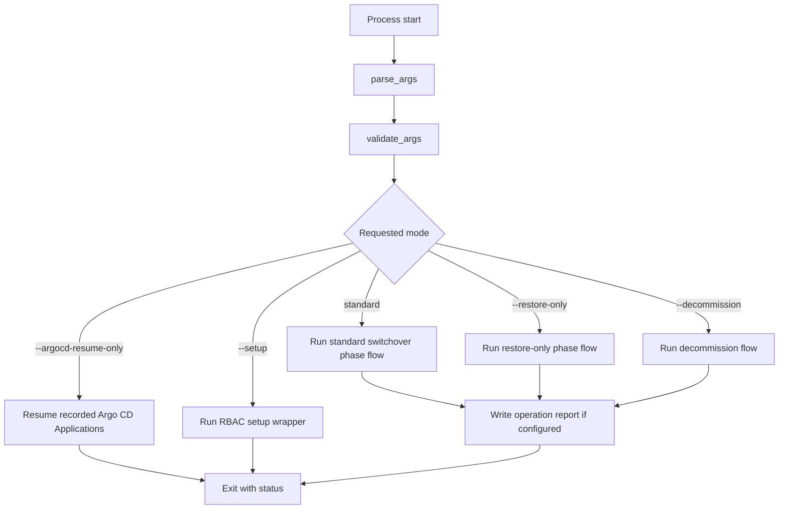

### Python Standard Switchover Flow

The normal flow moves through explicit phases stored in `StateManager`. A phase
handler runs only when the current state is allowed for that handler. This makes
failed or interrupted runs resumable.

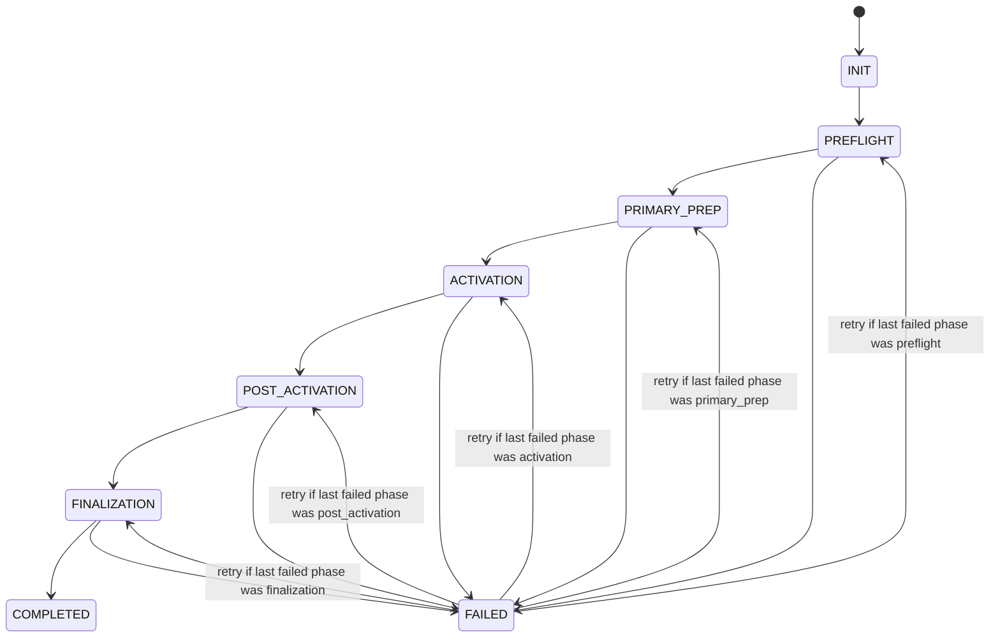

### Python Restore-Only Flow

Restore-only mode is a single-hub path for restoring managed clusters from S3
backups onto a new hub when the original primary hub is unavailable. It forces
the full restore method, skips primary preparation, and finalizes only the new
hub.

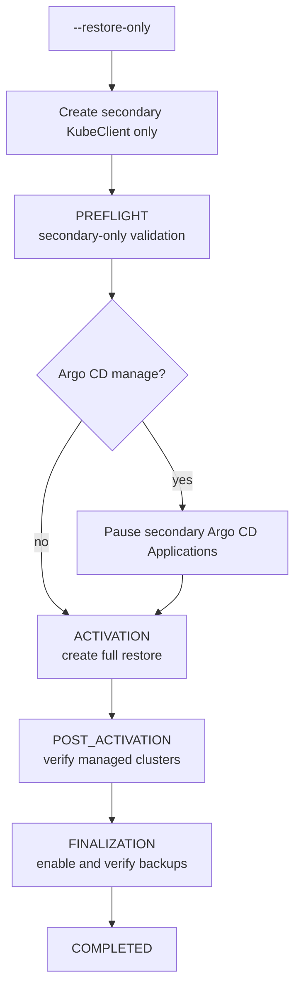

### StateManager and Idempotency

`lib/utils.py` defines:

- `Phase`: the canonical Python phase enum
- `StateManager`: JSON-backed state tracking
- `dry_run_skip`: a decorator used by mutating helpers
- logging and small utility helpers

`StateManager` persists:

- current phase
- completed step names
- discovered config
- Argo CD pause metadata
- error history
- retry baseline metadata

Critical state transitions flush immediately. Non-critical updates are batched
but saved when marked dirty. The manager also uses a process-lifetime lock file
to prevent two switchover processes from using the same state file at once.

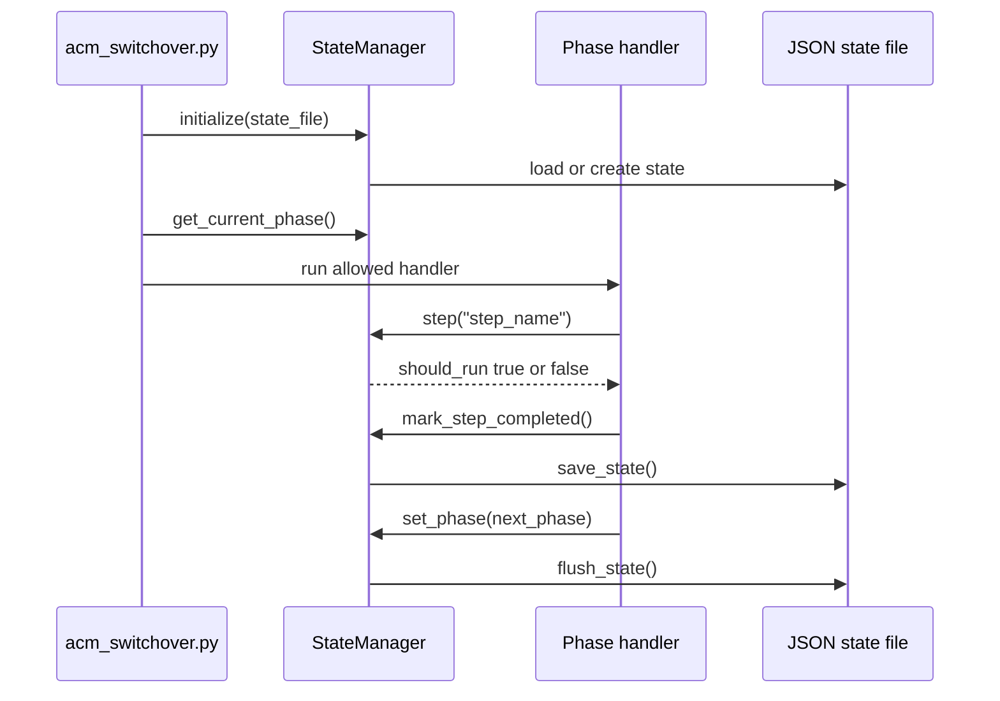

### KubeClient and Kubernetes API Access

`lib/kube_client.py` centralizes Python Kubernetes API interaction. It wraps the
Kubernetes Python client with:

- per-context configuration loading
- per-instance TLS hostname verification behavior
- a Tenacity retry decorator for retryable failures
- input validation for resource names and namespaces
- helpers for core resources, apps resources, and custom resources
- dry-run-aware mutating operations

The retry policy focuses on transient server, rate-limit, and network failures.
Not-found responses are converted to `None` for get-style helpers so workflow
modules can branch cleanly.

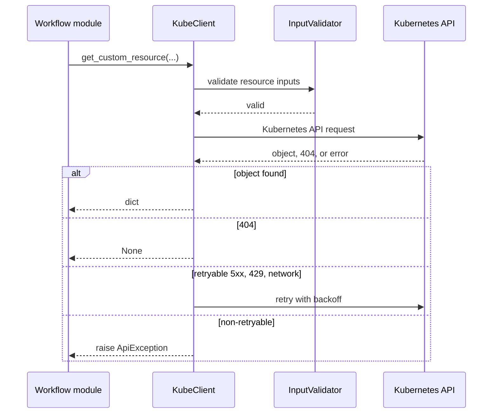

### Python Phase Modules

The `modules/` package holds phase-specific logic.

| Module | Main responsibility |
| --- | --- |
| `modules/preflight_coordinator.py` | Coordinates modular preflight validators and stores detected config |
| `modules/preflight/` | Validator classes for namespaces, versions, backups, passive sync, tooling, observability, and reporting |
| `modules/primary_prep.py` | Pauses backups, disables auto-import, handles observability preparation, and optionally pauses Argo CD |
| `modules/activation.py` | Promotes the secondary hub by patching passive restore or creating full/activation restore resources |
| `modules/post_activation.py` | Verifies managed clusters, klusterlet agents, and observability |
| `modules/finalization.py` | Enables backups on the new hub, verifies MCH health, handles old-hub disposition, and resets temporary config |
| `modules/decommission.py` | Removes ACM resources from the old hub as a separate teardown workflow |
| `modules/backup_schedule.py` | Shared BackupSchedule inspection and mutation helpers |

The modules use the same idempotent pattern: check whether a step was completed,
perform the operation only when needed, then mark the step complete.

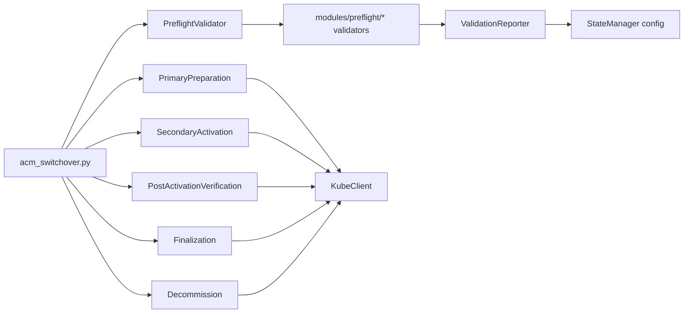

### Python Validation, RBAC, GitOps, and Reports

Several `lib/` modules support cross-cutting behavior:

- `lib/validation.py` validates CLI combinations, context names, paths, and
  operation-specific rules.
- `lib/rbac_validator.py` checks Kubernetes permissions needed for operator,
  validator, Argo CD, observability, and decommission workflows.
- `lib/argocd.py` discovers Argo CD installations, determines ACM-touching
  Applications, and implements pause/resume behavior.
- `lib/gitops_detector.py` records GitOps ownership markers so operators can
  see drift risks.
- `lib/report_artifacts.py` writes JSON reports with a shape aligned to the
  collection report contract.
- `lib/waiter.py` provides reusable polling primitives for asynchronous
  Kubernetes conditions.

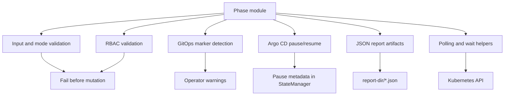

## Ansible Collection Deep Dive

The collection lives under
`ansible_collections/tomazb/acm_switchover/`. It is a production form factor,
not a wrapper around the Python CLI.

### Collection Layout

| Area | Responsibility |
| --- | --- |
| `galaxy.yml` | Collection metadata and dependency on `kubernetes.core` |
| `playbooks/` | Operator entrypoints for switchover, restore-only, preflight, decommission, discovery, RBAC bootstrap, and Argo CD resume |
| `roles/` | Phase implementations and support roles |
| `plugins/modules/` | Thin custom Ansible modules for operations that are awkward or unsafe in pure YAML |
| `plugins/module_utils/` | Reusable collection-side Python helpers for validation, constants, artifacts, checkpointing, Argo CD, and GitOps |
| `plugins/action/` | Controller-side action plugins, primarily checkpoint handling |
| `tests/` | Collection-focused unit, integration, and scenario coverage |

### Playbook-to-Role Orchestration

`playbooks/switchover.yml` is the main collection equivalent of the standard
Python switchover path. It includes roles in phase order and uses a rescue block
to optionally resume Argo CD Applications on failure.

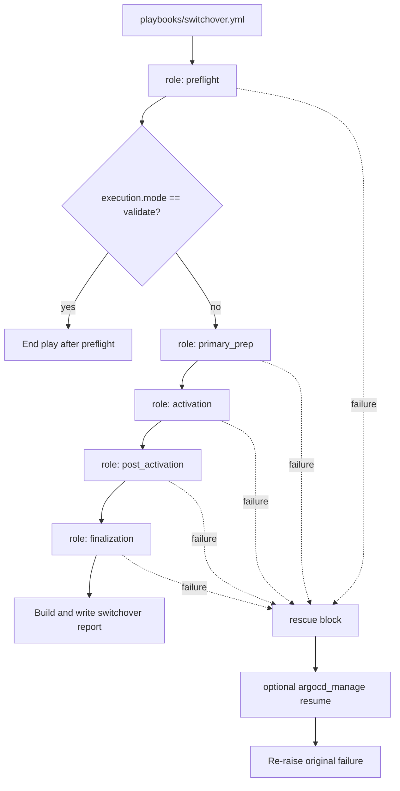

`playbooks/restore_only.yml` pins operation flags to restore-only semantics and
skips `primary_prep`.

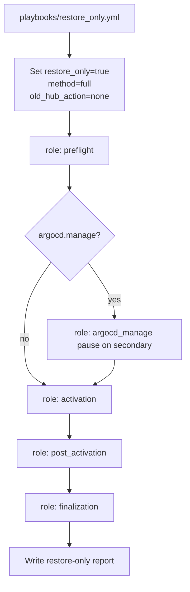

### Collection Variable Model

Collection behavior is driven by namespaced variables.

| Variable | Purpose |
| --- | --- |
| `acm_switchover_hubs` | Hub connection details, usually `primary` and `secondary` with `kubeconfig` and `context` |
| `acm_switchover_operation` | Operation mode and choices such as `method`, `restore_only`, `old_hub_action`, `activation_method`, `min_managed_clusters` |
| `acm_switchover_features` | Feature flags such as RBAC validation, observability checks, auto-import strategy management, and Argo CD management |
| `acm_switchover_execution` | Runtime behavior such as `mode`, `report_dir`, `run_id`, and checkpoint settings |

The collection validates the operation and feature model through
`plugins/module_utils/validation.py` and role-level input validation tasks.

### Role Internal Pattern

Most phase roles follow a consistent structure:

1. Enter the checkpointed phase if checkpointing is enabled.
2. Skip the role if the checkpoint says the phase already passed.
3. Discover required Kubernetes resources.
4. Include focused task files for sub-steps.
5. Publish a phase result fact.
6. Mark checkpoint pass or fail.

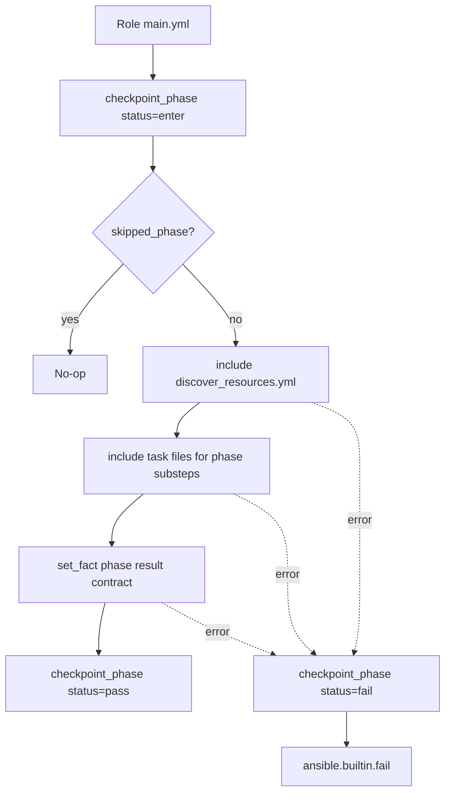

### Major Collection Roles

| Role | Purpose |
| --- | --- |
| `preflight` | Validates inputs, GitOps risk, kubeconfig reachability, versions, namespaces, RBAC, backups, restores, and cluster backups |
| `primary_prep` | Pauses Argo CD when enabled, pauses BackupSchedule, manages auto-import markers/strategy, scales observability |
| `activation` | Verifies passive sync when needed, manages auto-import strategy, activates or creates restore resources, waits for completion, applies immediate-import annotations |
| `post_activation` | Verifies managed clusters, klusterlet state, optional remediation, auto-import cleanup, and observability |
| `finalization` | Cleans restore resources, enables backups, repairs BackupSchedule collision risk, verifies backups/MCH, resets auto-import strategy, handles old hub |
| `decommission` | Performs old-hub teardown as a separate workflow |
| `argocd_manage` | Discovers, pauses, and resumes ACM-touching Argo CD Applications |
| `discovery` | Classifies hub resources and emits guidance |
| `rbac_bootstrap` | Applies RBAC resources and generates/validates service-account kubeconfigs |

### Custom Plugins and Modules

The collection uses custom Python only where YAML alone would be too verbose,
unsafe, or hard to test.

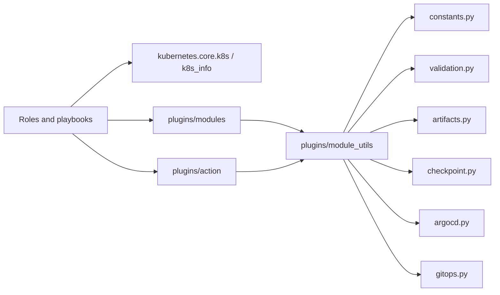

Important custom components include:

- `checkpoint_phase`: controller-side checkpoint action plugin
- `acm_report_artifact`: validates and writes JSON report files
- `acm_preflight_report`: builds preflight report payloads
- `acm_restore_info`: normalizes restore analysis
- `acm_cluster_verify` and `acm_managedcluster_status`: verify managed cluster
  readiness
- `acm_rbac_validate` and `acm_rbac_bootstrap`: collection RBAC validation and
  bootstrap helpers
- `acm_input_validate` and `acm_safe_path_validate`: validation modules used by
  roles and playbooks
- `acm_argocd_filter`: filters ACM-touching Argo CD Applications

### Ansible Checkpoint Lifecycle

The collection does not use Python `StateManager`. It uses a file-backed
checkpoint action plugin.

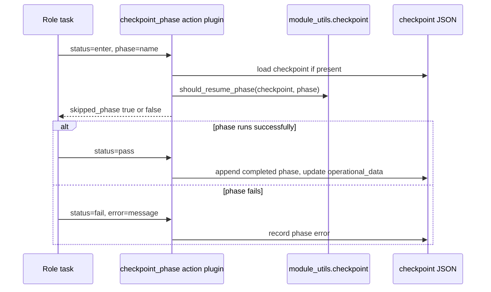

### Collection Report Artifacts

Playbooks build report contracts in `always` blocks so reports can be written
even when a workflow fails. `acm_report_artifact` validates the destination path
and writes stable JSON.

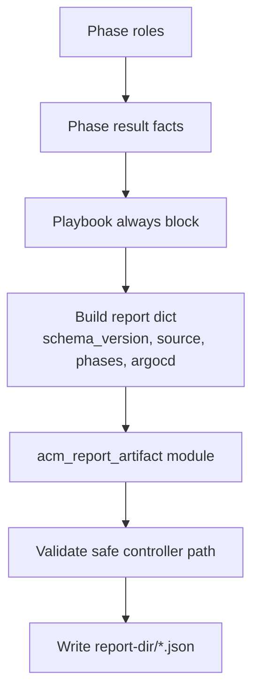

## Bash Script Deep Dive

Bash scripts live under `scripts/`. They are not the main switchover
orchestrator, but they remain important for discovery, validation, RBAC setup,
and migration support.

### Script Categories

| Script | Category | Notes |
| --- | --- | --- |
| `discover-hub.sh` | Read-only operational companion | Discovers ACM hubs from kubeconfig contexts and proposes checks |
| `preflight-check.sh` | Read-only operational companion | Validates prerequisites before switchover |
| `postflight-check.sh` | Read-only operational companion | Verifies state after switchover |
| `setup-rbac.sh` | Deprecated mutating bridge | Applies RBAC and generates kubeconfigs; collection RBAC bootstrap is preferred |
| `argocd-manage.sh` | Deprecated mutating bridge | Pauses/resumes Argo CD Application auto-sync using a state file; collection Argo CD workflows are preferred |
| `generate-sa-kubeconfig.sh` | Support helper | Generates kubeconfig from a service account |
| `generate-merged-kubeconfig.sh` | Support helper | Merges kubeconfigs for multi-hub operations |
| `install-completions.sh` | Support helper | Installs shell completions |
| `constants.sh` | Shared library | Version, resource names, namespaces, exit codes |
| `lib-common.sh` | Shared library | Common output, checks, CLI detection, cluster helpers, GitOps helpers |

### Shared Bash Library Model

Most scripts source shared constants and helper functions.

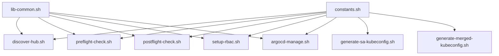

`lib-common.sh` provides:

- colored output and section headers
- pass/fail/warn counters
- Bash version guard
- `oc` or `kubectl` detection
- `jq` detection
- BackupSchedule, ManagedCluster, restore, and observability helpers
- GitOps marker detection/collection helpers
- summary output patterns

### Discovery and Validation Flow

The read-only scripts use `oc` or `kubectl` plus `jq` to inspect cluster state.
They do not mutate cluster resources.

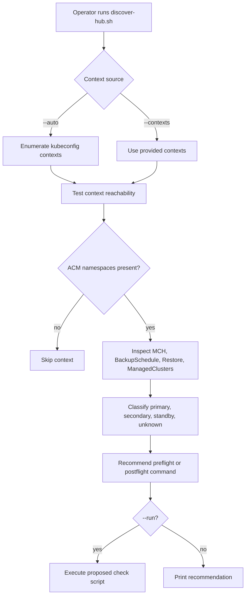

`preflight-check.sh` validates before mutation:

- required tools
- contexts
- namespaces
- ACM versions
- backup and restore prerequisites
- BackupSchedule state
- passive sync state for passive method
- ClusterDeployment protection
- GitOps marker warnings

`postflight-check.sh` validates after switchover:

- managed cluster availability
- backup state on the new hub
- old hub state
- observability health when present
- GitOps marker warnings

### RBAC Bootstrap Script Flow

`setup-rbac.sh` is deprecated in favor of the collection RBAC bootstrap playbook,
but it still shows the original shell workflow for access setup.

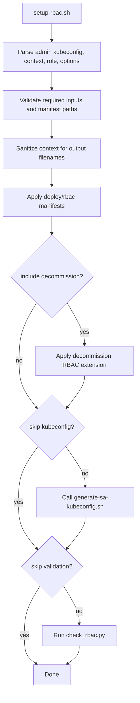

### Argo CD Management Script

`argocd-manage.sh` predates the collection Argo CD role. It discovers
Applications that touch ACM resources, patches automated sync out of
`spec.syncPolicy`, records original sync policy in a state file, and can later
resume from that state file.

The collection implementation uses annotations and role-managed state instead,
so cross-tool resume compatibility is intentionally limited.

## Cross-Surface Parity and Behavior Mapping

The Python CLI and Ansible collection share operator-facing behavior but remain
separate codebases. The authoritative parity and mapping docs are:

- `docs/ansible-collection/parity-matrix.md`
- `docs/ansible-collection/behavior-map.md`
- `ansible_collections/tomazb/acm_switchover/docs/coexistence.md`
- `ansible_collections/tomazb/acm_switchover/docs/cli-migration-map.md`

This walkthrough summarizes the high-level mapping.

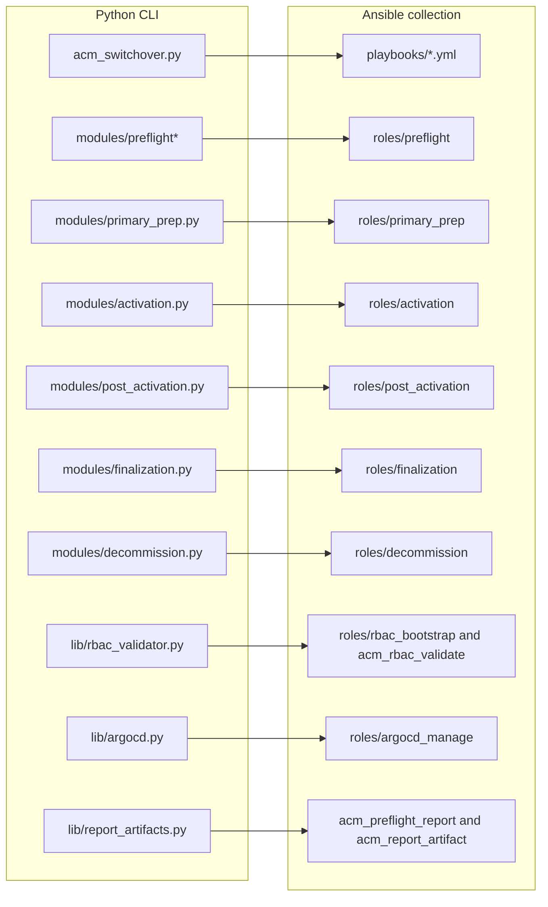

### Shared Concepts Across Surfaces

| Concept | Python implementation | Ansible implementation | Bash relationship |
| --- | --- | --- | --- |
| Phase order | `acm_switchover.py` phase handlers | `playbooks/switchover.yml` role order | preflight/postflight scripts bookend the workflow |
| Resume/idempotency | `StateManager` phase and step state | `checkpoint_phase` completed phases | some mutating scripts use state files |
| Kubernetes API access | `KubeClient` | `kubernetes.core` plus custom modules | `oc` or `kubectl` |
| Preflight validation | `PreflightValidator` and `modules/preflight/` | `roles/preflight` tasks and modules | `preflight-check.sh` read-only checks |
| Activation | `SecondaryActivation` | `roles/activation` | no full Bash orchestrator |
| Argo CD management | `lib/argocd.py` and coordinator | `roles/argocd_manage` | deprecated `argocd-manage.sh` |
| RBAC validation/bootstrap | `check_rbac.py`, `lib/rbac_validator.py`, setup wrapper | `roles/rbac_bootstrap`, `acm_rbac_validate` | deprecated `setup-rbac.sh`, kubeconfig helpers |
| Reports | `lib/report_artifacts.py` | report modules and playbook `always` blocks | terminal summaries only |

## State, Checkpoints, and Artifacts

Python and Ansible both support resumability, but they use different storage
models because their runtimes differ.

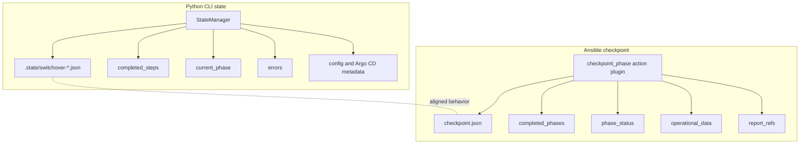

### Dry-Run and Validate-Only Behavior

Python:

- `--dry-run` lets phase code execute while mutating helpers skip writes or log
  intended mutations.
- dry-run captures and restores a state snapshot so rehearsal does not advance
  persistent state.
- `--validate-only` runs preflight and restores runtime checkpoint state so it
  does not mutate phase/error progression.

Ansible:

- dry-run behavior is represented through execution variables and check-mode
  support where modules implement it.
- phase checkpoint writes are skipped in dry-run mode by `checkpoint_phase`.
- validate mode ends the play after preflight.

### Report Artifacts

Both Python and Ansible can write machine-readable JSON reports. The shared
intent is stable automation output for preflight, switchover, restore-only, and
decommission workflows.

```mermaid
flowchart LR
    Python[Python operation] --> PyReport[build_operation_report]
    PyReport --> PyWrite[write_json_report_artifact]
    PyWrite --> JSON[report-dir/*.json]

    Ansible[Ansible operation] --> Facts[phase result facts]
    Facts --> Contract[playbook report contract]
    Contract --> AcmReport[acm_report_artifact]
    AcmReport --> JSON
```

## Testing and Safety Nets

The repository uses tests to protect individual implementations and
cross-surface contracts.

```mermaid
flowchart TD
    Tests[Tests] --> Root[tests/]
    Tests --> Collection[collection tests/]
    Tests --> Release[tests/release/]

    Root --> PyUnit[Python unit/integration tests]
    Root --> Parity[Parity and static contract tests]
    Root --> E2E[E2E-oriented tests]

    Collection --> ColUnit[Collection unit tests]
    Collection --> ColIntegration[Collection integration fixtures]
    Collection --> ColScenario[Collection scenario tests]

    Release --> Checks[Release checks]
    Release --> Scenarios[Release scenarios]
    Release --> Reports[Release reporting]

    Parity --> Behavior[Python/Ansible alignment]
    ColUnit --> Plugins[Plugin and module behavior]
    PyUnit --> Modules[CLI, lib, and phase modules]
```

Important safety patterns include:

- mocked `KubeClient` behavior in Python tests
- collection tests that exercise modules and task logic without live clusters
- parity tests for shared constants and Argo CD behavior
- release validation tests for report redaction and certification workflows
- E2E-oriented tests separated from the default run

## Recommended Reading Paths

### New Contributor

1. `README.md`
2. `docs/README.md`
3. `docs/development/architecture.md`
4. this walkthrough
5. `docs/ansible-collection/behavior-map.md`
6. relevant tests for the code area being changed

### Operator

1. `docs/operations/quickref.md`
2. `docs/operations/usage.md`
3. `docs/ACM_SWITCHOVER_RUNBOOK_TLDR.md`
4. `docs/deployment/rbac-deployment.md`
5. `scripts/README.md` if using Bash helpers

### Python Maintainer

1. `acm_switchover.py`
2. `lib/utils.py`
3. `lib/kube_client.py`
4. `lib/validation.py`
5. target phase module under `modules/`
6. matching tests under `tests/`

### Ansible Maintainer

1. target playbook under `ansible_collections/tomazb/acm_switchover/playbooks/`
2. target role under `roles/`
3. shared utilities under `plugins/module_utils/`
4. custom module or action plugin, if used
5. matching tests under `ansible_collections/tomazb/acm_switchover/tests/`

### Bash Script Maintainer

1. `scripts/README.md`
2. `scripts/constants.sh`
3. `scripts/lib-common.sh`
4. target script under `scripts/`
5. parity or migration docs if changing dual-supported behavior

## Maintenance Guidance

- Keep this walkthrough descriptive, not normative. Normative behavior belongs
  in the runbook, parity matrix, behavior map, and migration docs.
- Do not duplicate large parity tables here; link to the authoritative docs.
- If code behavior changes significantly, update this walkthrough together with
  `docs/development/architecture.md` when the architectural model changes.
- If a dual-supported behavior changes, review Python, Ansible, docs, and tests
  together according to the parity contract.
- Do not edit protected runbook or skill files unless explicitly approved.
