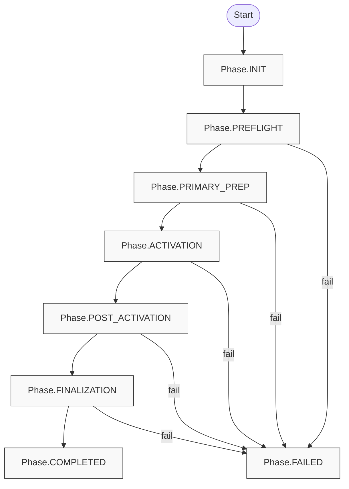
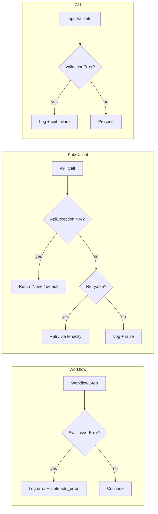

# Engineering Principles Compliance Report

## Scope

Reviewed core entry points and workflow modules for ACM switchover behavior, constants usage, and error handling:

- `acm_switchover.py`
- `lib/utils.py`
- `lib/kube_client.py`
- `lib/constants.py`
- `lib/exceptions.py`
- `lib/validation.py`
- `modules/preflight_coordinator.py`
- `modules/preflight_validators.py`
- `modules/primary_prep.py`
- `modules/activation.py`
- `modules/post_activation.py`
- `modules/finalization.py`
- `modules/decommission.py`
- `modules/backup_schedule.py`

## Principle Ratings

- **DRY**: Strong. Core namespaces, resource names, and timeouts are centralized in `lib/constants.py`, with shared helpers like `BackupScheduleManager` and `wait_for_condition` reducing duplication.
- **KISS**: Mixed. Phase orchestration is straightforward, but several workflow modules contain long, multi-responsibility methods that mix orchestration and low-level details.
- **YAGNI**: Mixed. A deprecated compatibility layer exists in `modules/preflight_validators.py`; ensure its value is still needed and expiration plan is documented.
- **Fail-fast + clear errors**: Strong. The error hierarchy (`lib/exceptions.py`) and logging provide actionable messages, with explicit failures for missing resources.
- **Explicit over implicit**: Strong. Phase flow is explicit and state transitions are deliberate; dry-run behavior is clear in most mutating operations.
- **Minimal/localized changes**: Strong. Modules are functionally scoped; state handling and workflow steps align with idempotency patterns.

## Strengths to Preserve

- **StateManager durability and explicit checkpoints** (`lib/utils.py`): `save_state()` for non-critical writes, `flush_state()` for critical events, with signal/exit handling for safety.
- **KubeClient validation and retry discipline** (`lib/kube_client.py`): `@api_call` wrapper, retryable error classification, and dry-run handling are clear and consistent.
- **Phase orchestration clarity** (`acm_switchover.py`): the phase table and handler functions are explicit, easy to follow, and aligned with state transitions.
- **Backup schedule hygiene** (`modules/backup_schedule.py`, `modules/finalization.py`): shared manager isolates enable/restore logic and reduces duplication.

## Findings (Evidence-Based)

Each item includes file, function, and principle impact.

1. **modules/preflight_validators.py**
   - **Function**: module-level re-export shim
   - **Principles**: YAGNI, KISS
   - **Impact**: Medium
   - **Finding**: Deprecated compatibility layer remains, but no lifespan or removal plan is documented.
   - **Proposed change**: Document deprecation timeline or remove shim when downstream usage is migrated.
   - **Benefit**: Reduces surface area and avoids maintaining redundant module indirection.

2. **modules/activation.py**
   - **Function**: `SecondaryActivation._activate_via_passive_sync`, `_verify_patch_applied`
   - **Principles**: KISS, Explicitness
   - **Impact**: Medium
   - **Finding**: Patch + verification workflow is long and mixes logging, patching, and verification logic in one method path.
   - **Proposed change**: Extract patch logging and spec readback verification into small helpers without changing behavior.
   - **Benefit**: Easier to scan and maintain while keeping idempotent behavior intact.

3. **modules/post_activation.py**
   - **Function**: `PostActivationVerification._verify_klusterlet_connections`
   - **Principles**: KISS, DRY
   - **Impact**: Medium
   - **Finding**: Large method handles discovery, concurrency, logging, and fix execution; similar patterns appear in nested helpers.
   - **Proposed change**: Split into smaller methods focused on discovery, verification, and remediation phases.
   - **Benefit**: Improves readability and reduces mental load without changing logic.

4. **modules/finalization.py**
   - **Function**: `Finalization._verify_old_hub_state`
   - **Principles**: KISS, DRY
   - **Impact**: Medium
   - **Finding**: Method combines multiple responsibilities (managed clusters, backup schedule, observability scale-down and waits).
   - **Proposed change**: Extract observability scale-down and pod wait logic into helpers that reuse constants and are easier to test.
   - **Benefit**: Improves maintainability and isolates optional logic.

5. **modules/post_activation.py**
   - **Function**: `PostActivationVerification._restart_observatorium_api`
   - **Principles**: DRY
   - **Impact**: Low
   - **Finding**: The deployment name is hardcoded despite existing `OBSERVATORIUM_API_DEPLOYMENT` constant.
   - **Proposed change**: Replace string literal with constant.
   - **Benefit**: Keeps constants usage consistent and reduces typo risk.

6. **modules/primary_prep.py**
   - **Function**: `PrimaryPreparation._disable_auto_import`
   - **Principles**: DRY
   - **Impact**: Low
   - **Finding**: Annotation key is a hardcoded string.
   - **Proposed change**: Add a constant for disable-auto-import annotation key in `lib/constants.py` and use it across modules.
   - **Benefit**: Centralizes magic strings and reduces drift across modules.

7. **modules/post_activation.py**
   - **Function**: `PostActivationVerification._verify_disable_auto_import_cleared`
   - **Principles**: DRY
   - **Impact**: Low
   - **Finding**: Same disable-auto-import annotation key is hardcoded.
   - **Proposed change**: Use shared constant for annotation key.
   - **Benefit**: Aligns annotation use across modules.

## Prioritized Remediation Roadmap

1. **Low-risk constant cleanup**
   - Replace hardcoded observatorium deployment name and disable-auto-import annotation key with constants.
   - Files: `modules/post_activation.py`, `modules/primary_prep.py`, `lib/constants.py`.

2. **KISS refactors in complex workflow methods**
   - Extract helper methods in `modules/activation.py`, `modules/post_activation.py`, `modules/finalization.py` without changing behavior.
   - Keep each refactor scoped to one module per PR.

3. **YAGNI cleanup of deprecated shim**
   - Document a deprecation timeline or remove `modules/preflight_validators.py` if no longer needed.
   - Update import sites if removal is chosen.

## Mermaid Diagrams

### Phase Flow and State Integration

### Error Handling Touchpoints

