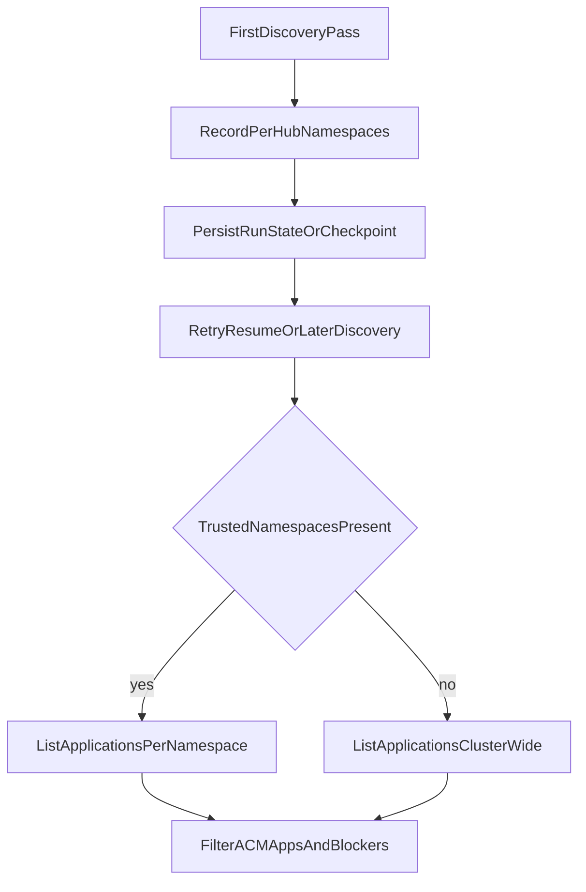

# PR24 Argo CD Discovery Scope Design

## Goal

Reduce unnecessary cluster-wide Argo CD `Application` listing only after a run has already learned a trustworthy namespace set, while preserving the existing safety guarantees for pause blockers, pause durability, and resume completeness across the Python CLI and the Ansible collection.

## Problem

`F41` is not about making the first Argo CD scan namespaced. The initial scan is where the workflow learns the full ACM-touching and blocker surface, so shrinking that scan based only on Argo CD operator instance namespaces is unsafe. The real gap is that later discovery still falls back to cluster-wide listing even after the run has already discovered the relevant namespaces.

The design must respect the existing Bash safety contract demonstrated by `tests/test_argocd_manage_script.py::test_pause_scans_cluster_wide_for_operator_watched_namespaces`: Argo CD can watch namespaces outside its own control-plane namespace.

## Scope

- Python CLI `lib/argocd.py`, `lib/argocd_coordinator.py`, and any advisory caller that re-lists `Application` resources after a prior discovery run.
- Ansible collection `roles/argocd_manage/` discovery plus the checkpoint handoff that already persists `argocd_run_id`.
- Targeted tests for Python, collection contracts, and collection integration coverage.

## Non-Goals

- No new operator-facing CLI flag or collection variable.
- No instance-namespace-only optimization based on `argocd_instances`.
- No change to Python `argocd_paused_apps` entry shape.
- No change to the collection's run-id marker semantics or resume safety checks.

## Safety Invariants

1. The first discovery pass for a hub remains cluster-wide unless the operator already provided an explicit namespace scope through an existing supported interface.
2. Trusted namespace hints come only from the current run's own recorded discovery state, not from Argo CD operator instance namespaces.
3. Python crash recovery must retain enough namespace information to rediscover every namespace seen during the original scan, not only the namespaces of apps that had already been patched before a crash.
4. Collection resume and retry paths must not lose paused applications because discovery became narrower than the namespace set proven by the original pause run.
5. When no trusted namespace set exists, behavior stays cluster-wide and fail-closed.

## Trusted Hint Definition

A namespace set is trustworthy only when it was captured from a prior successful cluster-wide discovery for the same run and persisted in workflow state/checkpoint data.

Trustworthy:
- Python top-level state recorded during the current Argo CD pause run.
- Collection checkpoint `operational_data` recorded during the current Argo CD pause run.
- Existing explicit collection namespace input (`acm_switchover_argocd.namespace`) because the operator supplied it intentionally.

Not trustworthy on its own:
- `detect_argocd_installation().argocd_instances`
- Argo CD install type alone
- The namespace of the Argo CD control plane

## Design

### Python

Add a separate top-level state key for discovery namespaces, keyed by hub, for example:

```python
{
    "primary": ["argocd", "team-gitops"],
    "secondary": ["openshift-gitops"],
}
```

Rules:

- During the first cluster-wide discovery in `ArgoCDPauseCoordinator.pause_hubs()`, record the full deduplicated namespace set observed in the returned `Application` list for each hub before per-app pause processing begins.
- On later discovery calls in the same run, use that recorded per-hub namespace set to call `list_argocd_applications(client, namespaces=[...])`.
- If the recorded namespace list is empty or missing for a hub, keep the current cluster-wide listing behavior.
- Clearing/resetting Argo CD pause state must also clear the new discovery namespace state so stale hints cannot leak into later runs.

This keeps the durable pause contract intact because the optimization depends on a namespace set captured before any per-app patch work starts.

### Ansible Collection

Add a matching checkpointed namespace handoff, keyed by hub, in `operational_data`, alongside the already persisted `argocd_run_id`.

Rules:

- `discover.yml` still performs cluster-wide discovery by default on the first pass.
- After discovery, the role records the deduplicated namespace set of the discovered `Application` resources for the current hub.
- Phase/playbook checkpoint writes persist that per-hub namespace set so a later re-entry or standalone resume can reuse it.
- Before including `argocd_manage` on a resumed or retried path, roles/playbooks rehydrate that namespace map into the role input.
- `discover.yml` uses namespaced `k8s_info` loops only when a trusted namespace list is present for the current hub; otherwise it keeps the existing cluster-wide `default(omit)` behavior.

Because `kubernetes.core.k8s_info` accepts a single namespace per call, the collection aggregates results from one call per trusted namespace and then continues through the existing filter/blocker pipeline.

## Data Flow



## Test Design

### Python

- `tests/test_argocd.py`
  - covers namespace-set normalization and safe fallback behavior.
- `tests/test_argocd_coordinator.py`
  - proves the first pass stays cluster-wide.
  - proves later passes use the recorded per-hub namespace set.
  - proves state clearing removes the namespace hint state.
- `tests/test_primary_prep.py` or `tests/test_main.py`
  - only if a higher-level advisory caller also adopts the same hint reuse.

### Collection

- `tests/unit/test_argocd_discovery_safety.py`
  - proves the discovery pipeline can aggregate namespaced reads without changing blocker handling.
- `tests/unit/test_argocd_manage_role_contracts.py`
  - proves trusted namespace input triggers per-namespace discovery and default behavior stays cluster-wide.
- `tests/unit/test_argocd_hub_parameterization.py`
  - updates the `default(omit)` contract so it remains the default path, not the only path.
- `tests/integration/test_argocd_manage_role.py`
  - proves retry/resume paths still discover and resume the expected apps when namespaced hints are rehydrated from checkpoint/runtime data.

## Documentation Impact

- Update `thermos-resolution-plan.md` for `PR23` merge status and `PR24` restart status.
- No parity-matrix status change is needed because this is a parity-preserving hardening change, not a support-boundary change.
- Update operator-facing docs only if the final implementation exposes any observable checkpoint/report field that operators are expected to inspect directly.

## Acceptance Criteria

- Both implementations keep the first discovery pass cluster-wide unless a supported explicit namespace override already exists.
- Both implementations reuse a persisted per-hub namespace set for later same-run discovery when it is available.
- Python `argocd_paused_apps` entries keep their existing schema.
- Collection resume still restores every app paused by the recorded run id.
- The watched-namespace safety case remains covered by tests and is not regressed by the optimization.
