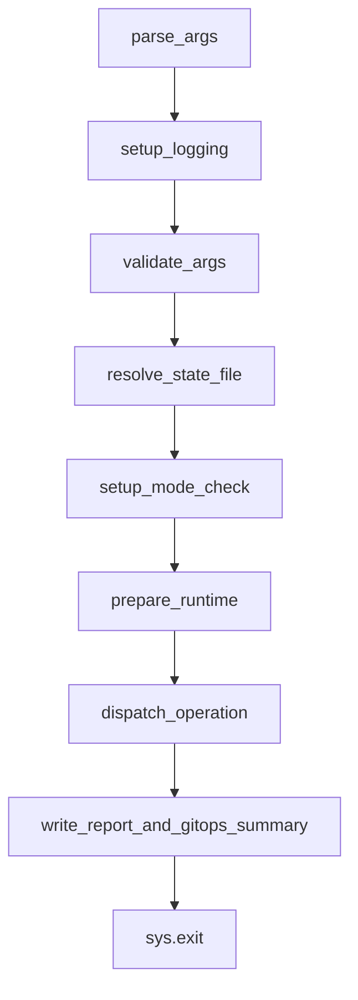

# PR27 Orchestrator Decomposition Design

## Goal

Start `F44` with a small, behavior-preserving decomposition of `acm_switchover.py`
that reduces entrypoint/runtime orchestration complexity without changing phase
semantics, Argo CD behavior, hub-identity safety, or the Python/collection parity
contract.

## Problem

`acm_switchover.py` still concentrates too many responsibilities in one file even
after `lib/workflow.py` extracted the generic phase-flow engine. The largest
remaining orchestration hotspot is `main()`, which still owns:

- state-file resolution and resume-only disambiguation
- reset-state deletion handling
- `StateManager` construction and fatal bootstrap exits
- context binding and hub-identity binding decisions
- Kubernetes client initialization
- operation dispatch and process exit handling
- final report writing and GitOps report emission

That crowding makes the entrypoint hard to review and hard to evolve safely,
especially now that `F39` through `F43` hardened resume, Argo CD, and runtime
parity paths.

## Scope

This design covers the first PR27 slice only:

- `acm_switchover.py`
- `lib/workflow.py`
- the main-entry test surface in:
  - `tests/test_main.py`
  - `tests/test_main_phase_flow.py`
  - `tests/test_main_argocd_resume.py`
  - `tests/main_test_helpers.py`
- tracker alignment in `thermos-resolution-plan.md`

## Non-Goals

- No behavior changes to switchover, restore-only, Argo CD resume-only, or
  resume-on-failure paths
- No phase-handler extraction in this first slice
- No collection-side refactor work
- No report-schema, checkpoint-schema, or parity-policy changes
- No large cleanup across unrelated modules such as `modules/post_activation.py`
  or `modules/finalization.py`

## Constraints

1. Preserve the `F43` guardrail intent from
   `docs/superpowers/specs/2026-06-06-pr26-runtime-parity-depth-design.md`:
   this slice must stay narrow and must not become a broad refactor.
2. Preserve the current `acm_switchover` symbol surface for the first
   implementation slice where tests patch or import module-level functions such
   as `_resolve_state_file`, `_initialize_clients`, `_fail_phase`,
   `_run_phase_preflight`, and `_attempt_argocd_resume_on_failure`.
3. Keep the phase engine in `lib/workflow.py` and do not reopen the generic
   resume/completed-state logic that PR12 and PR26 already stabilized.
4. Keep parity-sensitive behavior unchanged unless a later approved slice
   intentionally widens scope.

## Relationship To PR12

PR12 already extracted the generic phase-flow engine into `lib/workflow.py`.
PR27 is not reopening that work. It starts the next seam: the runtime/bootstrap
logic that still surrounds `main()` and related state/client helpers in
`acm_switchover.py`.

## Current Shape

Today the file splits into a few clear clusters:

- CLI surface: `parse_args()`, `validate_args()`
- workflow runners: `run_switchover()`, `run_restore_only()`,
  `_execute_operation()`
- phase handlers: `_run_phase_*()`
- phase failure hooks: `_fail_phase()`, `_fail_unexpected_phase_state()`,
  `_attempt_argocd_resume_on_failure()`
- Argo CD CLI helpers: `_prepare_argocd_resume_clients()`,
  `_run_argocd_resume_only()`
- runtime bootstrap: `main()`, `_resolve_state_file()`,
  `_initialize_clients()`, `_collect_hub_identities()`, and related context/state
  helpers
- reporting helpers: `_write_python_report()` and related functions

`lib/workflow.py` already owns the generic phase-flow contracts and reusable
state-policy helpers:

```62:76:lib/workflow.py
@dataclass(frozen=True)
class FailedStateConfig:
    resumable_phases: Tuple[Phase, ...]
    operation_noun: str


_CANONICAL_RESUME_START_PHASES = {
    Phase.PREFLIGHT: "preflight",
    Phase.PRIMARY_PREP: "primary_prep",
    # Legacy secondary-verify resumes continue through activation.
    Phase.SECONDARY_VERIFY: "activation",
    Phase.ACTIVATION: "activation",
    Phase.POST_ACTIVATION: "post_activation",
    Phase.FINALIZATION: "finalization",
}
```

The next seam should therefore target the runtime/bootstrap cluster rather than
re-splitting phase logic that already has a home.

## Approaches Considered

### Approach 1: Extract runtime/bootstrap orchestration

Move the state-path, `StateManager`, client-init, and hub-binding helpers out of
`acm_switchover.py` into a focused runtime module, then reduce `main()` to a
thin coordinator.

Pros:

- Best match for the orchestrator-first goal
- Shrinks the largest remaining entrypoint hotspot
- Keeps phase semantics and phase handlers unchanged
- Aligns with the tests that already separate entrypoint/bootstrap behavior from
  phase-flow behavior

Cons:

- Touches the hub-identity path, which is safety-sensitive
- Requires careful symbol-preservation so current test patch paths keep working

### Approach 2: Extract switchover/restore-only runner internals

Move `_run_switchover_impl()`, `_run_restore_only_impl()`, and their `phase_flow`
definitions into a new orchestration module while leaving `main()` mostly as-is.

Pros:

- Builds directly on `lib/workflow.py`
- Groups operation-specific phase tables together

Cons:

- Moves closer to phase semantics than this first slice needs
- Leaves `main()` crowded
- Pulls failure hooks and operation completion messaging into the first refactor

### Approach 3: Extract CLI surface first

Move `parse_args()` and `validate_args()` into a dedicated CLI module and leave
runtime/bootstrap in place.

Pros:

- Mechanically safe
- Easy to test in isolation

Cons:

- Does not meaningfully reduce orchestrator/runtime complexity
- Defers the hardest part of the file rather than addressing it

## Recommendation

Use Approach 1.

The first implementation slice should extract runtime/bootstrap orchestration
into a new helper module while keeping the rest of `acm_switchover.py` as the
stable coordination surface. This gives the largest readability win without
touching phase semantics or Argo CD behavior in the first move.

## Proposed Design

### New module

Create `lib/runtime_bootstrap.py` as the first new home for entrypoint/runtime
preparation.

The initial target functions are:

- `_sanitize_context_identifier()`
- `_get_default_state_dir()`
- `_build_default_state_file()`
- `_find_resume_state_candidates()`
- `_resolve_state_file()`
- `_initialize_clients()`
- `_collect_hub_identities()`
- `_stored_hub_identities()`
- `_state_contexts()`
- `_client_context_name()`

These are not `main()`-only helpers. Some of them are also consumed by
`_prepare_argocd_resume_clients()` for Argo CD resume-only hub binding. The
first slice therefore needs to treat them as shared runtime helpers, not as
isolated entrypoint helpers that can move without considering resume behavior.

Also introduce a small `RuntimeContext` dataclass that carries the prepared
runtime objects needed by `main()`, for example:

- resolved `state_file`
- constructed `StateManager`
- `primary` and `secondary` clients
- `should_bind_state`
- `should_record_state_errors`

The first slice should also make the safety boundary explicit: the move is not
just the bottom helper functions. The runtime/bootstrap extraction should keep
the following logic together under one clear runtime-preparation path, whether
that path is a `prepare_runtime()` helper or an equivalent thin coordinator:

- state-file resolution and resume-only disambiguation
- `--reset-state` deletion handling
- `StateManager` construction and fatal bootstrap exit policy
- `should_bind_state` / `should_record_state_errors`
- `ensure_contexts()` binding
- client initialization
- `ensure_hub_identities(..., persist=...)` policy

Avoid a partial extraction that moves only leaf helpers while leaving the
hub-identity-sensitive decision glue fragmented across `main()`.

### `main()` after slice 1

After the extraction, `main()` should still live in `acm_switchover.py`, but it
should read more like a coordinator than a bootstrap script:



Preserve the current ordering unless an intentional behavior change is approved:
state-file resolution happens before the early `--setup` branch today, and the
first implementation slice must not silently reorder that path.

The first slice should preserve this separation:

- `main()` stays as the module entrypoint
- `_execute_operation()` stays in `acm_switchover.py`
- `_run_switchover_impl()` and `_run_restore_only_impl()` stay in place
- `_run_phase_*()` handlers stay in place
- `_run_argocd_resume_only()` and `_attempt_argocd_resume_on_failure()` stay in
  place

### Compatibility rule for slice 1

Even if the implementations move into `lib/runtime_bootstrap.py`, the first
slice should keep the existing `acm_switchover` module-level names available.

That can be done either by:

- re-exporting imported helpers from `acm_switchover.py`, or
- keeping thin wrapper functions in `acm_switchover.py`

The important rule is behavioral and test compatibility, not the exact
mechanism. The current tests still patch `acm_switchover.*` symbols directly, so
the first slice must not force a broad test rewrite just to move code.

## Test Strategy

The first implementation slice should verify the runtime/bootstrap extraction
without broadening the scope into unrelated modules.

Primary verification:

- `python -m pytest tests/test_main.py tests/test_main_phase_flow.py tests/test_main_argocd_resume.py tests/test_state_dir_env_var.py -q`
- `python -m pytest tests/release/scenarios/test_runtime_parity.py -q`
- `python -m pytest tests/test_documentation_guardrails.py -q`
- `git diff --check`

Before merge of the eventual implementation PR, broaden verification to the
relevant strict suite expected by the tracker and repository guidance.

Key regressions to avoid:

- breaking resume-only state-file disambiguation
- changing context/hub binding behavior in `main()`
- breaking `resume_summary` persistence through the phase engine
- changing `_execute_operation()` mode routing
- breaking existing `acm_switchover` patch/import paths in tests

## Acceptance Criteria

1. A reviewed implementation plan can decompose the runtime/bootstrap cluster
   without changing switchover, restore-only, Argo CD, or hub-identity behavior.
2. `main()` becomes the first targeted orchestration seam; phase handlers and
   phase semantics remain out of scope for the first implementation slice.
3. The first slice preserves the current `acm_switchover` symbol surface relied
   on by the existing test suite.
4. The design remains narrow enough for a single follow-up implementation plan
   and does not expand into a broad multi-module refactor.
5. `thermos-resolution-plan.md` records `PR 26` as merged and `PR 27` as the
   planned orchestrator-first `F44` slice before implementation planning begins.

## Next Step After Review

Once this spec is reviewed and approved, the next step is a separate
implementation plan for the first runtime/bootstrap extraction slice. That plan
should stay spec-driven and should not begin until this design is accepted.
