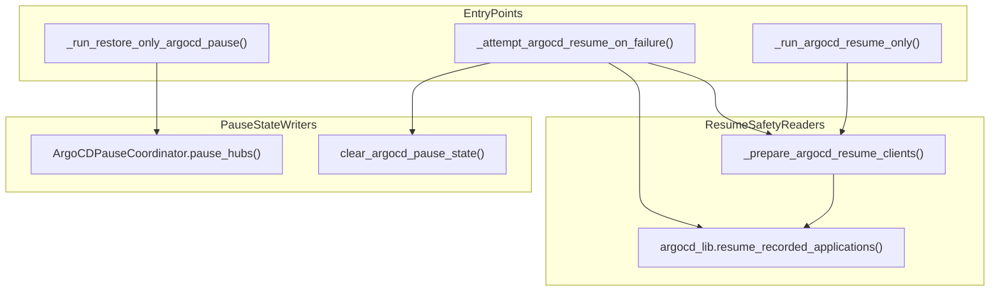

# PR30 Argo CD Resume Safety Design

## Goal

Extract the fail-closed Argo CD resume orchestration from
`acm_switchover.py` into a focused helper module while preserving the
current wrong-hub protections, legacy-state fail-closed behavior,
resume-only versus resume-on-failure differences, and the existing
`acm_switchover.*` wrapper surface used by the test suite.

## Problem

After `PR 29` moved the runner and dispatch seam into
`lib/operation_runners.py`, the remaining Argo CD-specific helpers in
`acm_switchover.py` still mix two different concerns:

- the restore-only pause writer `_run_restore_only_argocd_pause()`
- the resume-safety reader path formed by
  `_prepare_argocd_resume_clients()`, `_run_argocd_resume_only()`, and
  `_attempt_argocd_resume_on_failure()`

Those functions all touch the same durable Argo CD pause state, but they
do not carry the same risk profile. `_run_restore_only_argocd_pause()`
is a thin phase wrapper around `ArgoCDPauseCoordinator.pause_hubs()`,
while the other three helpers own the fail-closed context, hub identity,
legacy-state, and `--force` semantics that guard against wrong-hub resume.

`PR 28` and the tracker row for `PR 30` describe this slice as the Argo CD
**resume safety** extraction, but the `PR 29` design note loosely deferred
`_run_restore_only_argocd_pause()` to the later Argo CD slice. `PR 30`
needs an explicit boundary before implementation starts so the work stays
small and the repo stops implying two different scopes.

## Scope

This design covers the `PR 30` Argo CD resume-safety slice only:

- `acm_switchover.py`
- `lib/argocd_resume.py`
- `tests/test_main_argocd_resume.py`
- `tests/test_main.py`
- `tests/main_test_helpers.py`
- a new direct unit suite at `tests/test_argocd_resume_helpers.py`
- `thermos-resolution-plan.md`

## Non-Goals

- No extraction of `_run_restore_only_argocd_pause()` in this slice
- No changes to `lib/argocd_coordinator.py`
- No changes to `modules/primary_prep.py`
- No CLI outcome/report extraction; that remains `PR 31`
- No behavior changes to pause-state persistence, resume success/failure
  semantics, or exit behavior
- No collection-side changes

## Constraints

1. Preserve the `PR 29` seam. `operation_runners` must continue to inject
   `_attempt_argocd_resume_on_failure()` and
   `_run_restore_only_argocd_pause()` through the existing
   `acm_switchover.*` wrappers.
2. Preserve the current `acm_switchover.*` patch/import surface for:
   - `_prepare_argocd_resume_clients()`
   - `_run_argocd_resume_only()`
   - `_attempt_argocd_resume_on_failure()`
3. Keep `_run_restore_only_argocd_pause()` in `acm_switchover.py`. `PR 30`
   is the resume-safety extraction, not a generic pause/resume cleanup pass.
4. Preserve all current fail-closed semantics:
   - reversed primary/secondary context swap handling
   - context mismatch failure unless `--force`
   - legacy state without `hub_identities` failure unless `--force`
   - missing live client for a recorded hub role failure
   - `state.ensure_hub_identities(..., persist=False)` before resume
5. Preserve the intentional asymmetry between the two resume entrypoints:
   - `_run_argocd_resume_only()` may load a missing primary client from the
     recorded state
   - `_attempt_argocd_resume_on_failure()` must not do that
6. Preserve durable pause-state cleanup behavior:
   - resume-on-failure success clears `pause_argocd_apps` plus Argo CD pause
     state and rewinds the retry phase
   - `--argocd-resume-only` does not clear durable state in this slice

## Relationship To PR28 And PR29

`PR 28` deliberately split the remaining `F44` backlog into three seams:

1. operation runners and dispatch
2. Argo CD resume safety
3. CLI outcome/report orchestration

`PR 29` completed seam 1 and left `_run_restore_only_argocd_pause()` in
place so the runner extraction would not mix generic orchestration with
Argo CD-specific safety behavior.

`PR 30` should therefore extract the actual resume-safety trio only:

- `_prepare_argocd_resume_clients()`
- `_run_argocd_resume_only()`
- `_attempt_argocd_resume_on_failure()`

If `_run_restore_only_argocd_pause()` moves later, that should be treated
as a separate follow-up seam rather than being folded into this slice.

## Current Shape

The remaining Argo CD helpers in `acm_switchover.py` currently look like
this:

That shape already shows the boundary: one pause writer wrapper and one
resume reader cluster that shares the same validation logic.

## Approaches Considered

### Approach 1: Extract Only The Resume-Safety Trio

Create `lib/argocd_resume.py` and move the real implementations of
`_prepare_argocd_resume_clients()`, `_run_argocd_resume_only()`, and
`_attempt_argocd_resume_on_failure()` there, while keeping thin
compatibility wrappers in `acm_switchover.py`.

Pros:

- Matches the `PR 28` and tracker-defined `PR 30` seam
- Keeps the wrong-hub and legacy-state fail-closed logic isolated
- Minimizes review scope and avoids reopening `PR 29` runner hooks
- Leaves `ArgoCDPauseCoordinator` and restore-only pause behavior untouched

Cons:

- `_run_restore_only_argocd_pause()` remains in `acm_switchover.py`
- The Argo CD pause/resume state contract still spans multiple modules

### Approach 2: Extract All Four Argo CD Helpers Together

Treat `_run_restore_only_argocd_pause()` as part of the same Argo CD slice
and move it together with the resume trio.

Pros:

- Removes more Argo CD glue from `acm_switchover.py`
- Puts restore-only pause and resume entrypoints under one file

Cons:

- Conflicts with the documented `PR 30` boundary
- Reopens `PR 29` runner-hook wiring for little safety benefit
- Mixes thin pause orchestration with the safety-critical resume logic
- Still does not unify the switchover pause path in `modules/primary_prep.py`

### Approach 3: Extract The Resume Trio Now And Reserve Pause For A Tiny Follow-Up

Treat `PR 30` as Approach 1 and leave a possible future micro-slice for
`_run_restore_only_argocd_pause()` if reducing `acm_switchover.py` further
still matters after `PR 31`.

Pros:

- Keeps `PR 30` tightly scoped
- Leaves room for a later pause-entry cleanup if it is still worth doing

Cons:

- Introduces one more possible follow-up slice
- The pause helper remains in place for now

## Recommendation

Use Approach 1.

`PR 30` should extract only the resume-safety trio into
`lib/argocd_resume.py` and leave `_run_restore_only_argocd_pause()` in
`acm_switchover.py`. That keeps the slice aligned with the tracker,
isolates the wrong-hub and legacy-state protections, and avoids turning a
reviewable safety refactor into a broader Argo CD cleanup.

## Proposed Design

### New Module

Create `lib/argocd_resume.py`.

This module should own:

- the client-resolution and hub-identity validation logic now in
  `_prepare_argocd_resume_clients()`
- the standalone `--argocd-resume-only` orchestration now in
  `_run_argocd_resume_only()`
- the best-effort resume-on-failure cleanup now in
  `_attempt_argocd_resume_on_failure()`

The extracted module should use the existing lower-level library seams
directly:

- `lib.runtime_bootstrap` for stored/live context and identity helpers
- `lib.argocd` for `resume_recorded_applications()`
- `lib.argocd_coordinator.clear_argocd_pause_state`
- `lib.kube_client.KubeClient` for optional primary-client reconstruction

No new abstraction layer is needed beyond the module boundary itself.
`PR 30` should stay simple and explicit rather than introducing a second
hook-dataclass pattern where the code already has stable lower-level
imports.

### `acm_switchover.py` After PR30

Keep these module-level names in `acm_switchover.py`:

- `_prepare_argocd_resume_clients()`
- `_run_argocd_resume_only()`
- `_attempt_argocd_resume_on_failure()`
- `_run_restore_only_argocd_pause()`

But reduce the first three to thin compatibility wrappers that delegate
into `lib.argocd_resume`.

That preserves:

- existing unit tests that patch or import `acm_switchover.*`
- `operation_runners` hook injection through `_attempt_argocd_resume_on_failure()`
- the current CLI entrypoint surface

### What Must Stay In `acm_switchover.py`

These helpers stay in the main file in this slice:

- `_run_restore_only_argocd_pause()`
- `_run_phase_*()`
- `_fail_phase()`
- `_fail_unexpected_phase_state()`
- report/outcome helpers and `main()`

`_run_restore_only_argocd_pause()` remains the restore-only writer for
pause state and continues to call `ArgoCDPauseCoordinator.pause_hubs()`
exactly as it does now.

### Behavior That Must Not Change

The extracted resume module must preserve all current behavior for:

- stored-versus-current context comparison
- reversed primary/secondary mapping detection and client swapping
- loading the recorded primary client only for `--argocd-resume-only`
- failing closed when `hub_identities` are missing from recorded pause state
- honoring `--force` for legacy-state or context-mismatch overrides
- rejecting resume-only requests for dry-run-generated pause state
- preserving durable pause state when resume-on-failure only partially
  accounts for recorded Applications
- clearing durable pause state and rewinding retry phase only when
  resume-on-failure fully succeeds
- using `Phase.PREFLIGHT` as the restore-only retry rewind target and
  `Phase.PRIMARY_PREP` as the switchover retry rewind target

### Test Strategy

Add a new direct unit suite:

- `tests/test_argocd_resume_helpers.py`

That file should directly test the extracted module for:

- context match, reversal, mismatch, and `--force` override handling
- primary-client reconstruction from stored state
- missing `hub_identities` and missing live-client failure modes
- resume-only dry-run rejection and missing-state rejection
- resume-on-failure cleanup versus partial-failure preservation

Keep the existing regression surface in place:

- `tests/test_main_argocd_resume.py` remains the wrapper-level and
  end-to-end state-contract regression suite
- `tests/test_main.py` keeps the compatibility coverage for the
  `acm_switchover.*` wrappers
- `tests/test_operation_runners.py` and `tests/test_main_phase_flow.py`
  continue to verify that `_attempt_argocd_resume_on_failure()` remains the
  runner hook exposed by `acm_switchover`
- `tests/test_argocd_coordinator.py` remains unchanged because the pause
  writer seam is explicitly out of scope

The important rule is layered verification:

- direct tests for `lib.argocd_resume.py`
- compatibility tests for the old `acm_switchover` surface
- unchanged pause/coordinator tests proving the writer contract did not move

## Acceptance Criteria

1. `lib/argocd_resume.py` becomes the owner of the resume-safety trio:
   `prepare_argocd_resume_clients()`, `run_argocd_resume_only()`, and
   `attempt_argocd_resume_on_failure()`.
2. `acm_switchover.py` keeps thin compatibility wrappers for the existing
   `_prepare_argocd_resume_clients()`, `_run_argocd_resume_only()`, and
   `_attempt_argocd_resume_on_failure()` names.
3. `_run_restore_only_argocd_pause()` remains in `acm_switchover.py` and
   `PR 30` documentation explicitly records that it is out of scope.
4. Existing wrong-hub, legacy-state, `--force`, and retry-rewind semantics
   remain behavior-preserving.
5. The extracted module has direct unit coverage, and the existing resume
   regression surface still passes through the `acm_switchover` wrappers.

## Next Step After Review

Once this design is accepted, the next step is the `PR 30` implementation
plan: create `lib/argocd_resume.py`, keep thin wrapper compatibility in
`acm_switchover.py`, add direct tests for the new module, and update the
Thermos tracker row so the `PR 30` scope is no longer ambiguous.
