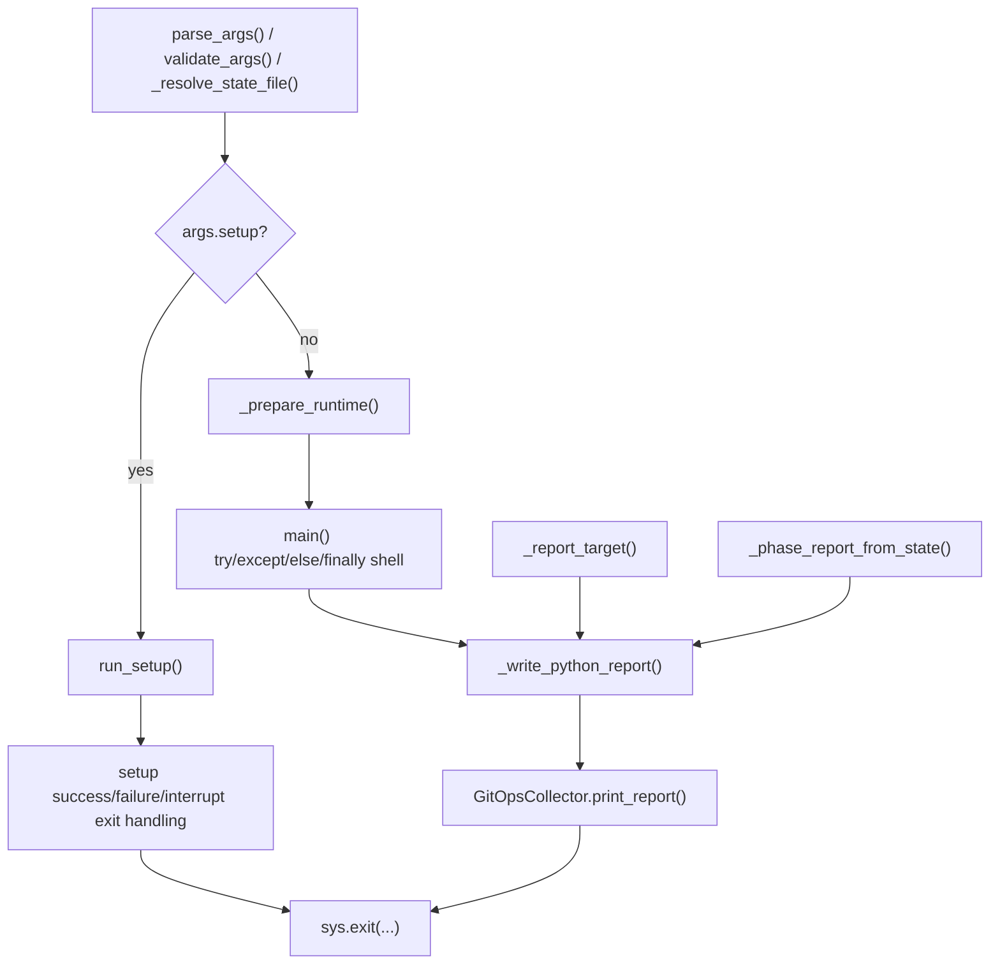

# PR31 CLI Outcome/Report Orchestration Design

## Goal

Extract the remaining CLI outcome/report orchestration seam from
`acm_switchover.py` into a focused helper module while preserving current exit
codes, error-recording behavior, report artifact shape, GitOps summary
emission, and the existing `acm_switchover.*` wrapper surface used by tests.

## Problem

After `PR 29` moved runner/dispatch logic into `lib/operation_runners.py` and
`PR 30` moved Argo CD resume safety into `lib/argocd_resume.py`,
`acm_switchover.py` still owns one large entrypoint concern that is no longer
about workflow execution itself:

- report target selection in `_report_target()`
- durable-state phase summarization in `_phase_report_from_state()`
- Python report writing in `_write_python_report()`
- setup-mode outcome handling around `run_setup()`
- the top-level success/failure/interrupt/report shell in `main()`

Those pieces all answer the same question: "how does this CLI invocation finish
and what does it emit?" They are now separate from runtime/bootstrap,
runner/dispatch, phase execution, and Argo CD resume safety, but they still sit
in the main orchestrator file.

That keeps the last entrypoint shell larger than it needs to be and makes it
harder to review completion behavior in isolation from the underlying
operations.

## Scope

This design covers the `PR 31` CLI outcome/report slice only:

- `acm_switchover.py`
- `lib/cli_outcomes.py`
- `tests/test_main.py`
- a new direct unit suite at `tests/test_cli_outcomes.py`
- `thermos-resolution-plan.md`

## Non-Goals

- No runtime/bootstrap changes in `lib/runtime_bootstrap.py`
- No runner/dispatch changes in `lib/operation_runners.py`
- No Argo CD resume-safety changes in `lib/argocd_resume.py`
- No phase-handler extraction
- No changes to the report artifact schema or filenames
- No new setup-mode report artifact behavior
- No collection-side changes

## Constraints

1. Preserve the `PR 27` seam. `main()` must continue to own argument parsing,
   validation, state-file resolution, logging setup, and runtime preparation.
2. Preserve the `PR 29` and `PR 30` seams. `PR 31` must not reopen operation
   dispatch, phase execution, or Argo CD resume-safety behavior.
3. Preserve the current `acm_switchover.*` patch/import surface for:
   - `_report_target()`
   - `_phase_report_from_state()`
   - `_write_python_report()`
4. Preserve current setup-mode ordering. `args.setup` must still short-circuit
   before state/bootstrap and client construction.
5. Preserve current setup-mode semantics:
   - success exits with `EXIT_SUCCESS`
   - failure exits with `EXIT_FAILURE`
   - `KeyboardInterrupt` exits with `EXIT_INTERRUPT`
   - unexpected exceptions still log via `exc_info=args.verbose`
   - setup mode still does **not** write Python report artifacts
   - setup mode still does **not** print the GitOps summary
6. Preserve current runtime-operation semantics:
   - `KeyboardInterrupt` logs the resume hint and exits `EXIT_INTERRUPT`
   - `SwitchoverError` and generic exceptions exit `EXIT_FAILURE`
   - `state.add_error()` runs only when `should_record_state_errors`
   - interrupts do not add state errors
   - success/failure messaging stays distinct for generic operations versus
     `--argocd-resume-only`
7. Preserve finalization order for the non-setup path:
   - `_write_python_report(...)`
   - `GitOpsCollector.get_instance().print_report()`
8. Preserve current report status mapping:
   - `EXIT_SUCCESS` writes `status="pass"`
   - every non-success exit writes `status="fail"`
9. Keep report writing best-effort. Report write failures must still log an
   error without replacing the already-chosen process exit code.

## Relationship To PR28, PR29, And PR30

`PR 28` deliberately split the remaining `F44` maintainability backlog into
three implementation seams:

1. operation runners and dispatch
2. Argo CD resume safety
3. CLI outcome/report orchestration

`PR 29` completed seam 1 by moving runner/dispatch logic to
`lib/operation_runners.py`.

`PR 30` completed seam 2 by moving resume-safety helpers to
`lib/argocd_resume.py`.

`PR 31` is therefore the last planned follow-up seam from that map. It should
finish the decomposition by moving the completion/report shell out of
`acm_switchover.py` without reopening the already-stabilized runtime,
runner, or Argo CD paths.

The approved scope expansion for this slice is narrow and intentional:
`run_setup()` itself stays where it is, but the setup-mode **outcome handling**
is allowed into `PR 31` because it belongs to the same "how does the CLI
finish?" seam as the normal `main()` completion shell.

## Current Shape

Today the remaining CLI outcome/report seam looks like this:

That shape is now cohesive enough to treat as one last helper-module seam.

## Approaches Considered

### Approach 1: Extract Only The Report Helper Trio

Move `_report_target()`, `_phase_report_from_state()`, and
`_write_python_report()` into a new module but leave setup outcome handling and
the `main()` completion shell in `acm_switchover.py`.

Pros:

- Smallest code movement
- Lowest immediate refactor surface

Cons:

- Leaves the most important outcome logic in `main()`
- Keeps setup and normal-operation completion handling split across two entrypoint
  shells
- Does not fully complete the `PR 28` seam

### Approach 2: Unified CLI Outcome Module

Create `lib/cli_outcomes.py` and move the report helper trio plus setup-mode and
runtime-operation outcome orchestration there, while keeping thin compatibility
wrappers in `acm_switchover.py`.

Pros:

- Completes the last `PR 28` seam cleanly
- Gives completion/report behavior a focused direct-test home
- Keeps runtime/bootstrap, runner, and Argo CD logic out of scope
- Lets setup-mode outcome handling move with the same responsibility boundary

Cons:

- Requires explicit hook injection so patched `acm_switchover` symbols still
  reach the extracted orchestration
- Slightly broader than the original PR28 wording, so the spec must be explicit
  about preserving setup-mode behavior

### Approach 3: Broader Entrypoint Extraction

Move most of `main()` into a larger entrypoint module, including runtime
preparation and/or argument-resolution helpers.

Pros:

- Produces the smallest possible `acm_switchover.py`

Cons:

- Reopens the `PR 27` runtime/bootstrap seam
- Mixes entrypoint setup with completion/report concerns
- Too broad for a Thermos follow-up slice

## Recommendation

Use Approach 2.

`PR 31` should create `lib/cli_outcomes.py` as the final CLI
outcome/report helper module. It should own report target selection, phase
summarization, report writing, setup-mode outcome handling, and the
success/failure/interrupt/report shell for non-setup operations.

`acm_switchover.py` should keep the real CLI entrypoint and thin compatibility
wrappers, but stop owning the detailed completion/report logic directly.

## Proposed Design

### New Module

Create `lib/cli_outcomes.py`.

This module should own:

- the extracted implementation behind `_report_target()`
- the extracted implementation behind `_phase_report_from_state()`
- the extracted implementation behind `_write_python_report()`
- a setup-mode outcome helper that runs `run_setup()` and returns the final
  exit code for setup mode
- a runtime-operation outcome helper that runs the already-prepared operation
  path and returns the final exit code after applying current exception,
  error-recording, report-writing, and GitOps-summary rules

Recommended compatibility hook object:

- `CliOperationHooks`

Recommended contents of `CliOperationHooks`:

- `bind_runtime_hub_identities`
- `run_argocd_resume_only`
- `execute_operation`
- `write_python_report`
- `gitops_reporter_factory`

The purpose of the hook object is not abstraction for its own sake. It is the
explicit compatibility seam that lets `acm_switchover.py` keep its patchable
module-level symbols while the extracted module receives the concrete callables
it must invoke.

### `acm_switchover.py` After PR31

Keep these module-level names in `acm_switchover.py`:

- `_report_target()`
- `_phase_report_from_state()`
- `_write_python_report()`
- `run_setup()`
- `main()`

But reduce the first three to thin compatibility wrappers that delegate into
`lib.cli_outcomes`.

`main()` should keep:

- argument parsing
- logging setup
- argument validation
- state-file resolution
- the early `args.setup` gate
- the early `--argocd-resume-only` state-file existence guard
- runtime preparation via `_prepare_runtime()`
- the final `sys.exit(...)`

`main()` should delegate the detailed completion shell:

- setup mode should call the new setup outcome helper with `run_setup`
- the non-setup path should call the new runtime-operation outcome helper with a
  `CliOperationHooks` instance built from current module-level symbols

### What Must Stay In `acm_switchover.py`

These helpers stay in the main file in this slice:

- `parse_args()`
- `validate_args()`
- `_resolve_state_file()`
- `_prepare_runtime()`
- `_bind_runtime_hub_identities()`
- `run_setup()` as the actual setup executor

These other seams also stay where they already live:

- runtime/bootstrap helpers in `lib/runtime_bootstrap.py`
- runner/dispatch helpers in `lib/operation_runners.py`
- Argo CD resume helpers in `lib/argocd_resume.py`

### Behavior That Must Not Change

The extracted module must preserve all current behavior for:

- report target selection:
  - `validate_only -> ("preflight", "preflight-report.json")`
  - `decommission -> ("decommission", "decommission-report.json")`
  - `restore_only -> ("restore", "restore-only-report.json")`
  - default -> `("switchover", "switchover-report.json")`
- durable-state phase summarization, including failed-phase mapping from
  `Phase.FAILED`
- report writing as a no-op when `report_dir` is unset or `state` is `None`
- report writing via `build_operation_report(...)` and
  `write_json_report_artifact(...)`
- setup-mode operator messaging and exit codes
- runtime-operation operator messaging and exit codes
- state error recording only when `should_record_state_errors`
- `status="pass"` versus `status="fail"` selection based on the final exit code
- finalization order: write report first, then print the GitOps summary
- setup-mode asymmetry: no Python report artifact and no GitOps summary there

### Setup-Mode Boundary

`run_setup()` should remain the underlying implementation that:

- validates required files
- builds the `setup-rbac.sh` command
- invokes `subprocess.run(...)`
- returns `True` or `False`

What moves in `PR 31` is only the top-level setup completion shell that
currently decides:

- how `KeyboardInterrupt` is reported
- how unexpected exceptions are logged
- how success/failure messages are emitted
- which process exit code to use

That keeps the approved scope expansion narrow and behavior-preserving.

### Runtime-Operation Boundary

The non-setup helper in `lib/cli_outcomes.py` should own the current
`try`/`except`/`else`/`finally` shell around:

- `_bind_runtime_hub_identities(...)`
- `_run_argocd_resume_only(...)`
- `_execute_operation(...)`
- `_write_python_report(...)`
- `GitOpsCollector.get_instance().print_report()`

The helper should receive the already-prepared `state`, `primary`, `secondary`,
`should_bind_state`, and `should_record_state_errors` values from `main()`.
`PR 31` is not a runtime/bootstrap refactor, so `_prepare_runtime()` stays in
`acm_switchover.py`.

### Test Strategy

Add a new direct unit suite:

- `tests/test_cli_outcomes.py`

This suite should directly cover:

- report target mapping
- phase summarization from state snapshots
- report writer no-op behavior when `report_dir` or `state` is missing
- report writer success path and write-failure logging path
- setup-mode success/failure/interrupt/exception exit handling
- runtime-operation success/failure/interrupt/exception exit handling
- `state.add_error()` calls versus non-calls
- finalization order and `pass`/`fail` status selection

Keep `tests/test_main.py` as the entrypoint/wrapper contract suite.

`PR 31` should update that file to focus on:

- thin delegation for `_report_target()`, `_phase_report_from_state()`, and
  `_write_python_report()`
- setup-branch delegation to the extracted setup outcome helper
- non-setup delegation to the extracted runtime-operation helper after
  `_prepare_runtime()`
- preservation of early guards that still belong to `main()`

Existing report artifact schema tests in `tests/test_report_artifacts.py` remain
the authority for schema compatibility; `PR 31` should reuse that contract
rather than restating it in shallow new tests.

## Acceptance Criteria

1. `lib/cli_outcomes.py` exists and owns the real CLI outcome/report logic for
   this slice.
2. `acm_switchover.py` keeps thin wrappers for `_report_target()`,
   `_phase_report_from_state()`, and `_write_python_report()`.
3. `main()` still owns parse/validate/resolve/setup/runtime-prep ordering, but
   delegates setup and runtime completion shells into `lib.cli_outcomes`.
4. Setup-mode behavior is unchanged, including the continued absence of report
   artifact writing and GitOps summary emission there.
5. Non-setup exit codes, error-recording rules, report status mapping, and
   finalization order are unchanged.
6. Direct tests cover the extracted module, and wrapper/entrypoint tests cover
   the compatibility surface.
7. No runner, phase-handler, runtime/bootstrap, Argo CD resume, collection, or
   report-schema changes are introduced by this slice.

## Next Step After Review

Once this spec is reviewed, the next step is to write the `PR 31`
implementation plan, update the tracker with the approved readiness wording,
clean up the merged `PR 30` worktree, and create the fresh
`refactor/thermos-31-cli-report-orchestration` worktree from the current
`ansible` base.
