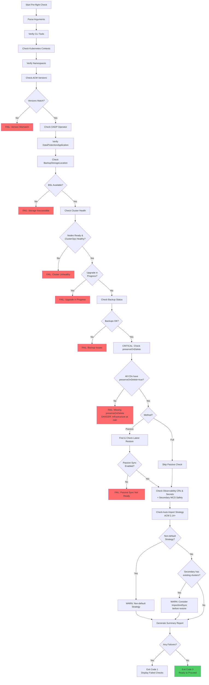
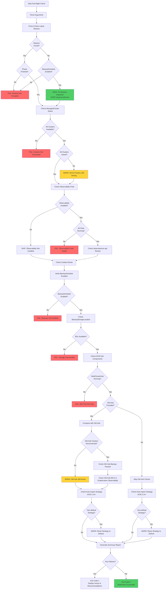
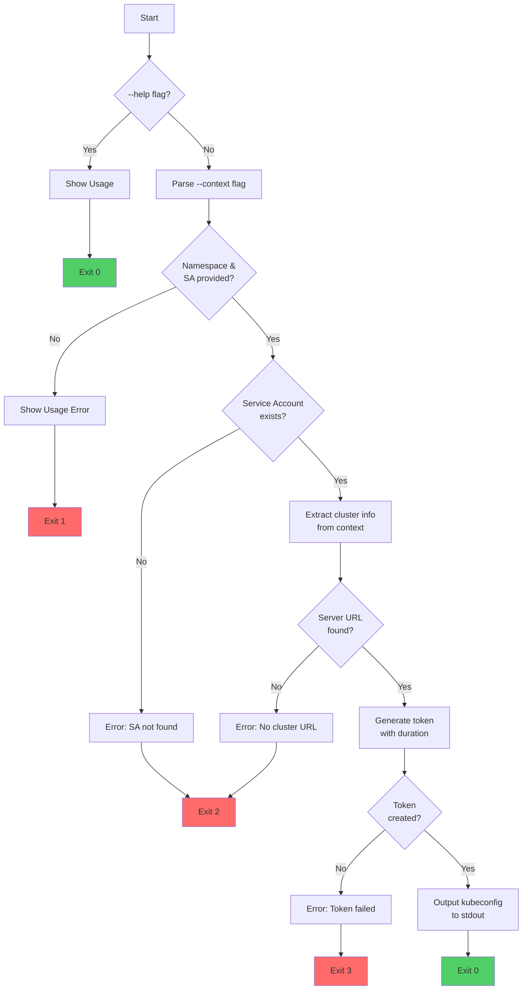
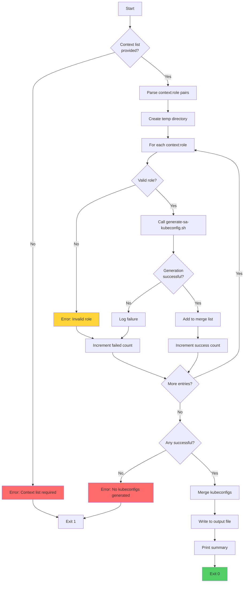
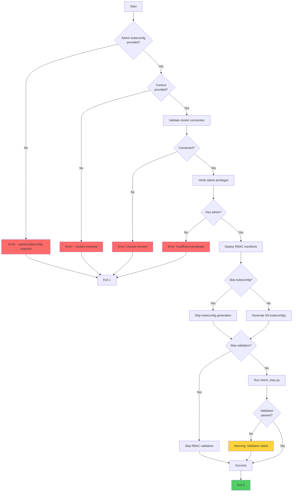
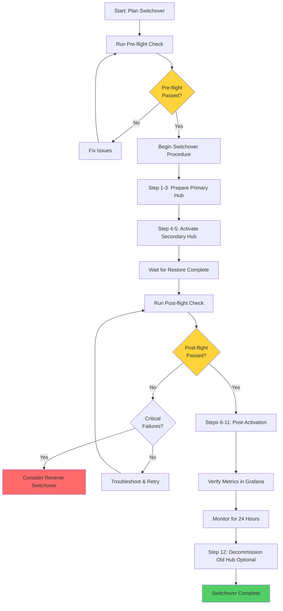

# Automation Scripts

This directory contains automated validation scripts for ACM hub switchover operations.

## Overview

These scripts automate the validation process before and after switchover, ensuring safety and operational readiness.

| Script | Purpose | When to Use |
|--------|---------|-------------|
| [`discover-hub.sh`](discover-hub.sh) | Auto-discover ACM hubs and propose checks | When unsure which hub is primary/secondary |
| [`preflight-check.sh`](preflight-check.sh) | Validate prerequisites before switchover | Before starting switchover procedure |
| [`postflight-check.sh`](postflight-check.sh) | Verify switchover completed successfully | After switchover activation completes |
| [`argocd-manage.sh`](argocd-manage.sh) | Pause or resume Argo CD auto-sync for ACM-touching Applications | When GitOps (Argo CD) manages ACM resources; use with a state file for reversible pause/resume |
| [`setup-rbac.sh`](setup-rbac.sh) | Deploy RBAC and generate kubeconfigs | Initial setup of switchover access |
| [`generate-sa-kubeconfig.sh`](generate-sa-kubeconfig.sh) | Generate kubeconfig from service account | For service account authentication |
| [`generate-merged-kubeconfig.sh`](generate-merged-kubeconfig.sh) | Merge kubeconfigs for multi-hub ops | Setting up multi-hub access |
| [`lib-common.sh`](lib-common.sh) | Shared helper functions and utilities | Sourced by other scripts |
| [`constants.sh`](constants.sh) | Shared configuration constants | Sourced by other scripts |

## Version Tracking

All scripts display their version number in the output header for troubleshooting purposes:

```
╔════════════════════════════════════════════════════════════╗
║   ACM Switchover Pre-flight Validation                    ║
╚════════════════════════════════════════════════════════════╝
preflight-check.sh v1.5.3 (2026-01-29)
```

The version is defined in `constants.sh` and follows [Semantic Versioning](https://semver.org/):
- **MAJOR**: Breaking changes to script behavior or output format
- **MINOR**: New features, new checks, significant improvements
- **PATCH**: Bug fixes, minor improvements

When reporting issues, always include the script version from the output.

## Idempotency & Safety

**Scripts are fully idempotent and safe to run multiple times:**

- ✅ **Read-only operations** - Only perform `oc get`, `oc describe`, and similar read operations
- ✅ **No state modifications** - Never modify cluster resources or configuration
- ✅ **No side effects** - Can be run repeatedly without affecting cluster state
- ✅ **Safe in production** - No risk of accidental changes or disruptions

**You can safely:**
- Run pre-flight checks multiple times before switchover
- Re-run post-flight verification to monitor stabilization
- Use scripts for ongoing health monitoring
- Run in parallel with other operations (read-only)

---

## Hub Discovery Script

**File:** `discover-hub.sh`

### Purpose

Auto-discovers Kubernetes contexts from your kubeconfig, detects which clusters are ACM hubs, determines their roles (primary/secondary/standby), and proposes the appropriate preflight or postflight check command based on the detected state.

**Key Features:**
- **Context deduplication**: Automatically detects when multiple kubeconfig contexts point to the same cluster (by API server URL) and groups them together
- **API server display**: Shows the API server URL for each discovered hub
- **Canonical context selection**: Uses the shortest context name when multiple contexts exist for the same cluster
- **RBAC validation hints**: Suggests `check_rbac.py` commands to validate permissions before switchover

### Usage

```bash
# Auto-discover all ACM hubs from kubeconfig contexts
./scripts/discover-hub.sh --auto

# Check specific contexts only
./scripts/discover-hub.sh --contexts hub1,hub2

# Discover and immediately run the proposed check
./scripts/discover-hub.sh --auto --run
```

**Options:**

- `--auto` - Auto-discover ACM hubs from all kubeconfig contexts (required unless `--contexts` is used)
- `--contexts <ctx1,ctx2,...>` - Comma-separated list of specific contexts to check
- `--verbose, -v` - Show detailed cluster status for each hub
- `--run` - Execute the proposed check command immediately
- `--timeout <seconds>` - Connection timeout per context (default: 5)
- `--help` - Show help message

### What It Detects

The script analyzes each context to determine hub role based on:

| Indicator | Primary Hub | Secondary Hub | Standby |
|-----------|-------------|---------------|---------|
| BackupSchedule | Active (not paused) | Paused or none | Collision state |
| Restore resource | None or finished | Passive-sync enabled | Finished |
| ManagedClusters | Available=True | Available=Unknown | - |

### Klusterlet Verification

When **both hubs report clusters as available** (which can happen immediately after switchover before lease timeouts), the script verifies the actual klusterlet connections by checking the `hub-kubeconfig-secret` on each managed cluster:

```
  Both hubs report available clusters - verifying klusterlet connections...
    ✓ prod1 → primary-hub
    ✓ prod2 → primary-hub
    ✓ prod3 → primary-hub

  ● primary-hub
    Clusters: 3/3 (reported), 3 (actual klusterlet connections)
```

This resolves ambiguity during the transition period when the old hub hasn't yet detected that clusters have disconnected.

### Example Output

```
╔════════════════════════════════════════════════════════════╗
║   ACM Hub Discovery                                        ║
╚════════════════════════════════════════════════════════════╝
discover-hub.sh v1.5.3 (2026-01-29)

━━━━━━━━━━━━━━━━━━━━━━━━━━━━━━━━━━━━━━━━━━━━━━━━━━━━━━━━━━━━
Analyzing Contexts
━━━━━━━━━━━━━━━━━━━━━━━━━━━━━━━━━━━━━━━━━━━━━━━━━━━━━━━━━━━━
  Checking mgmt1... ACM hub detected (ACM 2.12.7)
  Checking mgmt2... ACM hub detected (ACM 2.12.7)
  Checking open-cluster-management/api-mgmt1-htz1-all-it-tech:6443/system:admin... ACM hub detected (ACM 2.12.7)
  Checking prod1... not an ACM hub (skipped) (OCP: 4.16.54, channel: eus-4.16)

━━━━━━━━━━━━━━━━━━━━━━━━━━━━━━━━━━━━━━━━━━━━━━━━━━━━━━━━━━━━
Discovered ACM Hubs
━━━━━━━━━━━━━━━━━━━━━━━━━━━━━━━━━━━━━━━━━━━━━━━━━━━━━━━━━━━━

  ● mgmt1
    API Server: https://api.mgmt1.htz1.all-it.tech:6443
    Contexts:   mgmt1, open-cluster-management/api-mgmt1-htz1-all-it-tech:6443/system:admin
    Role:       primary
    ACM:        2.12.7
    OCP:        4.16.54 (channel: stable-4.16)
    Clusters:   3/3
    State:      Active primary hub (BackupSchedule running, 3/3 clusters available)

  ● mgmt2
    API Server: https://api.mgmt2.htz1.all-it.tech:6443
    Role:       secondary
    ACM:        2.12.7
    OCP:        4.16.54 (channel: stable-4.16)
    Clusters:   0/3
    State:      Secondary hub in passive-sync mode (ready for switchover)

━━━━━━━━━━━━━━━━━━━━━━━━━━━━━━━━━━━━━━━━━━━━━━━━━━━━━━━━━━━━
Recommended Action
━━━━━━━━━━━━━━━━━━━━━━━━━━━━━━━━━━━━━━━━━━━━━━━━━━━━━━━━━━━━

  Scenario: Pre-Switchover
  Primary hub (mgmt1) and secondary hub (mgmt2) detected.
  Run preflight checks before initiating switchover.

  Proposed command:
    ./scripts/preflight-check.sh --primary-context mgmt1 --secondary-context mgmt2 --method passive

  Tip: Validate RBAC permissions before switchover:
    python check_rbac.py --context mgmt1 --role operator
    python check_rbac.py --context mgmt2 --role operator
```

**Note:** When multiple contexts point to the same cluster (like `mgmt1` and `open-cluster-management/api-mgmt1...`), they are grouped together and the shortest context name is used in proposed commands.

### Exit Codes

- `0` - Discovery completed successfully and proposed a check
- `1` - No ACM hubs found or unable to determine roles
- `2` - Invalid arguments

---

## Pre-flight Validation Script

**File:** `preflight-check.sh`

### Purpose

Automates all prerequisite checks before starting an ACM switchover to catch configuration issues early and prevent failures mid-process.

### Usage

```bash
./scripts/preflight-check.sh \
  --primary-context <primary-hub-context> \
  --secondary-context <secondary-hub-context> \
  --method passive
```

**Options:**
- `--primary-context` - Kubernetes context for primary hub (required)
- `--secondary-context` - Kubernetes context for secondary hub (required)
- `--method` - Switchover method: `passive` or `full` (required)
- `--argocd-check` - Run Argo CD discovery and report ACM-touching Applications (optional)
- `--help` - Show help message

### What It Checks

1. **CLI Tools** - Verifies `oc`/`kubectl` and `jq` are installed (jq is required)
2. **Kubernetes Contexts** - Confirms contexts exist and are accessible
3. **Namespace Access** - Validates required namespaces on both hubs
4. **ACM Versions** - Ensures versions match between hubs
   - Also gathers managed cluster counts and displays a **Hub Summary**
5. **OADP Operator** - Checks OADP is installed and Velero pods running
6. **DataProtectionApplication** - Verifies DPA is configured and reconciled
7. **BackupStorageLocation** - Validates BSL is in "Available" phase (storage accessible)
8. **Cluster Health** - Comprehensive cluster health validation per runbook requirements:
   - Verifies all nodes are in Ready state (optimized: uses single JSON API call per hub)
   - Checks ClusterOperators are healthy (Available=True, Degraded=False) with cached JSON output
   - Validates no cluster upgrade is in progress (ClusterVersion Progressing=False)
   - Displays current cluster version
9. **Backup Status** - Confirms latest backup completed, no in-progress backups
   - Warns if multiple BackupSchedules are detected (checks first one only)
10. **ClusterDeployment Safety** - **CRITICAL:** Verifies `preserveOnDelete=true` on ALL ClusterDeployments
11. **Passive Sync** (Method 1 only) - Validates passive restore is running and up-to-date (dynamically finds latest restore)
12. **Observability** - If observability is installed on the primary:
  - Confirms required CRs/secrets exist
  - **Fails if the secondary hub has an active MCO** unless **Thanos compactor** and **observatorium-api** are scaled to `0`
  - **Warns** if the secondary has observability pods but no MCO CR (likely incomplete decommission)
13. **Secondary Hub Managed Clusters** - Checks for pre-existing clusters on secondary:
    - Shows available/total count (e.g., "0/8 available")
    - Warns if clusters exist in Unknown state (may need cleanup)
14. **Auto-Import Strategy** (ACM 2.14+ only) - Validates `autoImportStrategy` configuration:
    - Skipped for ACM versions < 2.14
    - Warns if non-default strategy is set on either hub
    - For secondary hubs with existing clusters and ImportOnly: advises immediate-import annotations (preferred)
    - Mentions temporary `ImportAndSync` only for planned switchback scenarios
    - Links to Red Hat documentation for guidance

### Example Output

```
╔════════════════════════════════════════════════════════════╗
║   ACM Switchover Pre-flight Validation                     ║
╚════════════════════════════════════════════════════════════╝
preflight-check.sh v1.5.3 (2026-01-29)

Primary Hub:    primary-hub
Secondary Hub:  secondary-hub
Method:         passive

━━━━━━━━━━━━━━━━━━━━━━━━━━━━━━━━━━━━━━━━━━━━━━━━━━━━━━━━━━━━
1. Checking CLI Tools
━━━━━━━━━━━━━━━━━━━━━━━━━━━━━━━━━━━━━━━━━━━━━━━━━━━━━━━━━━━━
✓ OpenShift CLI (oc) is installed
✓ jq is installed

[... additional checks ...]

━━━━━━━━━━━━━━━━━━━━━━━━━━━━━━━━━━━━━━━━━━━━━━━━━━━━━━━━━━━━
4. Checking ACM Versions
━━━━━━━━━━━━━━━━━━━━━━━━━━━━━━━━━━━━━━━━━━━━━━━━━━━━━━━━━━━━
✓ Primary hub ACM version: 2.11.0
✓ Secondary hub ACM version: 2.11.0
✓ ACM versions match between hubs

━━━━━━━━━━━━━━━━━━━━━━━━━━━━━━━━━━━━━━━━━━━━━━━━━━━━━━━━━━━━
Hub Summary
━━━━━━━━━━━━━━━━━━━━━━━━━━━━━━━━━━━━━━━━━━━━━━━━━━━━━━━━━━━━

  ● primary-hub
    Role:     primary
    Version:  2.11.0
    Clusters: 5/5 (available/total)
    State:    Active primary hub (BackupSchedule running)

  ● secondary-hub
    Role:     secondary
    Version:  2.11.0
    Clusters: 0/0 (available/total)
    State:    Secondary hub (clean, ready for restore)

[... additional checks ...]

╔════════════════════════════════════════════════════════════╗
║   Validation Summary                                       ║
╚════════════════════════════════════════════════════════════╝

Total Checks:    30
Passed:          30
Failed:          0
Warnings:        0

━━━━━━━━━━━━━━━━━━━━━━━━━━━━━━━━━━━━━━━━━━━━━━━━━━━━━━━━━━━━
✓ ALL CRITICAL CHECKS PASSED
━━━━━━━━━━━━━━━━━━━━━━━━━━━━━━━━━━━━━━━━━━━━━━━━━━━━━━━━━━━━

You are ready to proceed with the switchover.
```

### Exit Codes

- `0` - All checks passed
- `1` - One or more critical checks failed
- `2` - Invalid arguments

### Workflow Diagram



---

## Post-flight Validation Script

**File:** `postflight-check.sh`

### Purpose

Verifies that the ACM switchover completed successfully by validating all critical components on the new hub and optionally comparing with the old hub.

### Usage

```bash
# Basic validation (new hub only)
./scripts/postflight-check.sh --new-hub-context <new-hub-context>

# With old hub comparison
./scripts/postflight-check.sh \
  --new-hub-context <new-hub-context> \
  --old-hub-context <old-hub-context>
```

**Options:**
- `--new-hub-context` - Kubernetes context for new active hub (required)
- `--old-hub-context` - Kubernetes context for old primary hub (optional, for comparison)
- `--help` - Show help message

### What It Checks

0. **CLI Tools** - Verifies `oc`/`kubectl` and `jq` are installed
1. **Restore Status** - Confirms restore completed successfully (Phase: Finished) - Dynamically finds latest restore
2. **ManagedCluster Status** - Verifies all clusters are Available and Joined
3. **Observability Components** - Checks all observability pods are running (Grafana, Observatorium, Thanos)
4. **Metrics Collection** - Validates Grafana route and observatorium-api status
5. **Backup Configuration** - Ensures BackupSchedule is enabled and creating backups
   - Validates latest backup status, age, and scans recent Velero logs for errors
5b. **BackupStorageLocation** - Verifies BSL is in "Available" phase (storage accessible for backups)
6. **ACM Hub Components** - Verifies MultiClusterHub and ACM pods are healthy
7. **Old Hub Comparison** (if `--old-hub-context` provided) - Checks old hub clusters are disconnected and that the old hub is not still acting as an active observability hub:
  - Passes if **MCO is absent**, or if **Thanos compactor** and **observatorium-api** are scaled to `0`
8. **Auto-Import Status** - Verifies no lingering disable-auto-import annotations
9. **Auto-Import Strategy** (ACM 2.14+) - Ensures `autoImportStrategy` is reset to default post-switchover:
    - Warns if non-default strategy remains configured
    - Provides command to reset to default `ImportOnly`
    - Also checks old hub if provided

### Example Output

```
╔════════════════════════════════════════════════════════════╗
║   ACM Switchover Post-flight Verification                 ║
╚════════════════════════════════════════════════════════════╝

New Hub:        new-hub
Old Hub:        old-hub (for comparison)

━━━━━━━━━━━━━━━━━━━━━━━━━━━━━━━━━━━━━━━━━━━━━━━━━━━━━━━━━━━━
0. Checking CLI Tools
━━━━━━━━━━━━━━━━━━━━━━━━━━━━━━━━━━━━━━━━━━━━━━━━━━━━━━━━━━━━
✓ OpenShift CLI (oc) is installed
✓ jq is installed

━━━━━━━━━━━━━━━━━━━━━━━━━━━━━━━━━━━━━━━━━━━━━━━━━━━━━━━━━━━━
1. Checking Restore Status
━━━━━━━━━━━━━━━━━━━━━━━━━━━━━━━━━━━━━━━━━━━━━━━━━━━━━━━━━━━━
✓ Latest restore 'restore-acm-passive-sync' completed successfully (Phase: Finished, Created: 2025-12-03T10:15:30Z)
       (Identified as passive sync restore via spec.syncRestoreWithNewBackups=true)

━━━━━━━━━━━━━━━━━━━━━━━━━━━━━━━━━━━━━━━━━━━━━━━━━━━━━━━━━━━━
2. Checking ManagedCluster Status
━━━━━━━━━━━━━━━━━━━━━━━━━━━━━━━━━━━━━━━━━━━━━━━━━━━━━━━━━━━━
✓ Found 5 managed cluster(s) (excluding local-cluster)
✓ All 5 cluster(s) show Available=True
✓ All 5 cluster(s) show Joined=True
✓ No clusters stuck in Pending Import

[... additional checks ...]

╔════════════════════════════════════════════════════════════╗
║   Verification Summary                                     ║
╚════════════════════════════════════════════════════════════╝

Total Checks:    25
Passed:          25
Failed:          0
Warnings:        0

━━━━━━━━━━━━━━━━━━━━━━━━━━━━━━━━━━━━━━━━━━━━━━━━━━━━━━━━━━━━
✓ SWITCHOVER VERIFICATION PASSED
━━━━━━━━━━━━━━━━━━━━━━━━━━━━━━━━━━━━━━━━━━━━━━━━━━━━━━━━━━━━

The ACM switchover appears to have completed successfully.

Recommended next steps:
  1. Verify Grafana dashboards show recent metrics (wait 5-10 minutes)
  2. Test cluster management operations (create/update policies, etc.)
  3. Monitor for 24 hours before decommissioning old hub
  4. Inform stakeholders that switchover is complete
```

### Exit Codes

- `0` - All checks passed
- `1` - One or more critical checks failed
- `2` - Invalid arguments

### Workflow Diagram



---

## Service Account kubeconfig Generator

**File:** `generate-sa-kubeconfig.sh`

### Purpose

Generates a kubeconfig file that can be used to authenticate as a specific Kubernetes service account. The generated kubeconfig uses a short-lived token (48 hours by default) created via `kubectl create token`, providing secure temporary access without storing permanent credentials.

### Usage

```bash
# Generate kubeconfig for a service account
./scripts/generate-sa-kubeconfig.sh [OPTIONS] <namespace> <service-account-name>

# Examples:
# Default 48-hour token from current context
./scripts/generate-sa-kubeconfig.sh acm-switchover acm-switchover-operator > operator-kubeconfig.yaml

# Specify explicit cluster context with custom user name (prevents collisions)
./scripts/generate-sa-kubeconfig.sh --context prod-hub --user prod-operator \
  acm-switchover acm-switchover-operator > operator-kubeconfig.yaml

# Custom token duration (72 hours for long operations)
./scripts/generate-sa-kubeconfig.sh --token-duration 72h \
  acm-switchover acm-switchover-operator > operator-kubeconfig.yaml

# Full example with all options
./scripts/generate-sa-kubeconfig.sh \
  --context staging-hub \
  --user staging-operator \
  --token-duration 8h \
  acm-switchover acm-switchover-operator > operator-kubeconfig.yaml

# With the generated kubeconfig
export KUBECONFIG=operator-kubeconfig.yaml
oc get managedclusters
```

**Options:**

| Option | Description | Default |
|--------|-------------|---------|
| `--context <context>` | Kubernetes context to use | Current context |
| `--user <name>` | Custom user name in kubeconfig | `<context>-<sa-name>` |
| `--token-duration <dur>` | Token lifetime (e.g., `8h`, `48h`, `72h`) | `48h` |

**Arguments:**

- `<namespace>` - Kubernetes namespace where the service account exists (required)
- `<service-account-name>` - Name of the service account (required)

> **Tip**: Always use `--user` with unique names when generating kubeconfigs for multiple
> clusters to prevent credential collisions when merging.

### What It Does

1. Validates that the service account exists in the specified (or current) namespace
2. Creates a short-lived token via `kubectl create token` with the specified duration
3. Extracts cluster information from the specified (or current) kubeconfig context
4. Generates a new kubeconfig file using the service account token with unique user name
5. Outputs the kubeconfig to stdout (redirect to file as needed)

### Prerequisites

- `kubectl` configured with cluster access
- Service account must exist in the target namespace
- User must have permission to create tokens for the service account

### Use Cases

- **Temporary access for automation**: Service account with limited token lifetime
- **CI/CD pipelines**: Generate tokens on-the-fly without storing credentials
- **Audit trails**: Short-lived tokens provide better security than permanent credentials
- **Multi-cluster access**: Different kubeconfigs for different service accounts

### Exit Codes

- `0` - kubeconfig generated successfully
- `1` - Missing required arguments
- `2` - Service account not found
- `3` - Token creation failed

### Workflow Diagram



---

## RBAC Bootstrap Script

**File:** `setup-rbac.sh`

### Purpose

Automates the complete RBAC setup for the ACM switchover tool. This script deploys RBAC manifests (namespace, service accounts, roles, bindings), generates SA kubeconfigs with unique user names, and validates permissions - all in one command.

### Usage

```bash
./scripts/setup-rbac.sh --admin-kubeconfig <path> --context <context> [OPTIONS]
```

**Options:**

| Option | Description | Default |
|--------|-------------|---------|
| `--admin-kubeconfig <path>` | **Required.** Path to kubeconfig with cluster-admin privileges | - |
| `--context <context>` | **Required.** Kubernetes context to deploy RBAC to | - |
| `--role <role>` | Role to deploy: `operator`, `validator`, `both` | `both` |
| `--token-duration <dur>` | Token validity duration | `48h` |
| `--output-dir <dir>` | Output directory for kubeconfigs | `./kubeconfigs` |
| `--skip-kubeconfig` | Skip kubeconfig generation | - |
| `--skip-validation` | Skip RBAC validation after deployment | - |
| `--dry-run` | Show what would be deployed without changes | - |

**Examples:**

```bash
# Full setup for operator role
./scripts/setup-rbac.sh \
  --admin-kubeconfig ~/.kube/admin.yaml \
  --context prod-hub \
  --role operator

# Setup both roles with custom token duration
./scripts/setup-rbac.sh \
  --admin-kubeconfig ~/.kube/admin.yaml \
  --context prod-hub \
  --token-duration 72h

# Dry-run to preview changes
./scripts/setup-rbac.sh \
  --admin-kubeconfig ~/.kube/admin.yaml \
  --context prod-hub \
  --dry-run
```

### What It Does

1. **Validates** cluster connection and admin privileges
2. **Deploys** RBAC namespace and service accounts
3. **Deploys** ClusterRoles and ClusterRoleBindings
4. **Deploys** namespace-scoped Roles and RoleBindings (handles missing namespaces gracefully)
5. **Generates** kubeconfigs with unique user names (using `generate-sa-kubeconfig.sh`)
6. **Validates** permissions using `check_rbac.py`

### Exit Codes

- `0` - Setup completed successfully
- `1` - Validation or deployment failed

---

## Merged Kubeconfig Generator

**File:** `generate-merged-kubeconfig.sh`

### Purpose

Generates and merges kubeconfigs for multiple clusters/contexts into a single file. This simplifies multi-hub operations by providing a single kubeconfig with all necessary contexts and unique user names to prevent credential collisions.

### Usage

```bash
./scripts/generate-merged-kubeconfig.sh [OPTIONS] <context:role>[,<context:role>...]
```

**Options:**

| Option | Description | Default |
|--------|-------------|---------|
| `--admin-kubeconfig <path>` | Admin kubeconfig for token generation | Current kubeconfig |
| `--output <file>` | Output merged kubeconfig file | `./merged-kubeconfig.yaml` |
| `--token-duration <dur>` | Token validity duration | `48h` |
| `--namespace <ns>` | Namespace where SAs exist | `acm-switchover` |
| `--managed-cluster` | Flag for managed cluster contexts | - |

**Context List Format:**

Comma-separated list of `context:role` pairs where:
- `context` is the Kubernetes context name
- `role` is either `operator` or `validator`

**Examples:**

```bash
# Generate merged kubeconfig for two hubs with operator role
./scripts/generate-merged-kubeconfig.sh hub1:operator,hub2:operator

# Specify custom output file and token duration
./scripts/generate-merged-kubeconfig.sh \
  --output ~/switchover-kubeconfig.yaml \
  --token-duration 72h \
  hub1:operator,hub2:operator

# Include managed clusters for klusterlet validation
./scripts/generate-merged-kubeconfig.sh \
  --output ~/full-kubeconfig.yaml \
  hub1:operator,hub2:operator,managed1:operator

# Using explicit admin kubeconfig
./scripts/generate-merged-kubeconfig.sh \
  --admin-kubeconfig ~/.kube/admin.yaml \
  --output ~/switchover.yaml \
  hub1:operator,hub2:validator
```

### What It Does

1. Parses the context:role list
2. For each entry, calls `generate-sa-kubeconfig.sh` with a unique user name (`<context>-<role>`)
3. Merges all individual kubeconfigs using `kubectl config view --flatten`
4. Outputs the merged kubeconfig to the specified file

### Workflow Diagram



### Exit Codes

- `0` - Merged kubeconfig generated successfully
- `1` - One or more kubeconfigs failed to generate

### Workflow Diagram



---

## Argo CD Management Script

**File:** `argocd-manage.sh`

### Purpose

Pause or resume auto-sync on Argo CD Applications that touch ACM namespaces/kinds, so GitOps does not revert switchover steps. Uses a JSON state file to record original sync policies and restore them safely.

### Usage

```bash
# Pause ACM-touching Applications on a hub (store state for later resume)
./scripts/argocd-manage.sh --context <kubecontext> --mode pause --state-file .state/argocd-pause.json

# Resume auto-sync using saved state (only after Git/desired state updated for target hub)
./scripts/argocd-manage.sh --context <kubecontext> --mode resume --state-file .state/argocd-pause.json

# Dry-run to see which apps would be paused
./scripts/argocd-manage.sh --context <kubecontext> --mode pause --state-file .state/argocd-pause.json --dry-run
```

**Options:** `--context`, `--mode pause|resume`, `--state-file` (required for pause/resume), `--target acm` (default), `--dry-run`, `--help`.

Note: GitOps marker detection is heuristic. The generic label `app.kubernetes.io/instance` is flagged as `UNRELIABLE` when present and should not be treated as a definitive GitOps signal.

### Recommended sequence with GitOps

1. Run preflight with Argo CD check: `./scripts/preflight-check.sh --primary-context <p> --secondary-context <s> --method passive --argocd-check`
2. Pause ACM-touching Applications on primary (and optionally secondary): `./scripts/argocd-manage.sh --context <p> --mode pause --state-file .state/argocd-pause.json` (repeat for secondary if desired)
3. Run switchover (Python tool or manual runbook steps)
4. After updating Git/desired state for the new hub, resume: `./scripts/argocd-manage.sh --context <new-hub> --mode resume --state-file .state/argocd-pause.json`

The Python tool can perform pause/resume during switchover when using `--argocd-manage` and optionally `--argocd-resume-after-switchover` or `--argocd-resume-only`; see [usage.md](../docs/operations/usage.md).

---

## Complete Switchover Workflow

This diagram shows how the validation and switchover scripts fit into the overall process:



> **Note**: RBAC setup (`setup-rbac.sh`) and kubeconfig generation are **one-time prerequisites** 
> done during initial deployment, not part of the operational switchover workflow. 
> See [RBAC Deployment Guide](../docs/deployment/rbac-deployment.md) for setup instructions.

---

## Best Practices

### Before Switchover

1. **Always run pre-flight check** in both test and production environments
2. **Save pre-flight output** for audit trail and troubleshooting
3. **Fix all failures** before proceeding - warnings should be reviewed
4. **Verify preserveOnDelete** is set on ALL ClusterDeployments (critical!)

### After Switchover

1. **Run post-flight check immediately** after activation completes
2. **Wait 5-10 minutes** if clusters show as "Unknown" - they may still be connecting
3. **Check Grafana metrics** manually after 10-15 minutes
4. **Keep old hub accessible** for at least 24 hours in case reverse switchover is needed
5. **Save post-flight output** for documentation and compliance

### Troubleshooting

If pre-flight check fails:
- Review the specific failed checks in the output
- Most common issue: `preserveOnDelete` not set on ClusterDeployments
- Fix issues and re-run the script until all checks pass

If post-flight check fails:
- Check if restore is still in progress (wait and retry)
- Verify observatorium-api pods were restarted (Step 7 in runbook)
- Review the troubleshooting section in the runbook
- Consider reverse switchover (swap contexts) if critical failures persist

---

## Integration with CI/CD

Both scripts can be integrated into automation pipelines:

```bash
# Example: Pre-flight check in CI/CD
if ! ./scripts/preflight-check.sh \
    --primary-context "$PRIMARY_CTX" \
    --secondary-context "$SECONDARY_CTX" \
    --method passive; then
    echo "Pre-flight validation failed. Aborting switchover."
    exit 1
fi

# Example: Post-flight check in CI/CD
if ! ./scripts/postflight-check.sh \
    --new-hub-context "$NEW_HUB_CTX" \
    --old-hub-context "$OLD_HUB_CTX"; then
    echo "Post-flight validation failed. Review and consider reverse switchover."
    exit 1
fi
```

---

## Shared Library

**File:** `lib-common.sh`

### Purpose

Provides shared helper functions and utilities used by both `preflight-check.sh` and `postflight-check.sh`. This library eliminates code duplication and ensures consistent behavior across scripts.

### Contents

| Component | Description |
|-----------|-------------|
| **Version Variables** | `SCRIPT_VERSION`, `SCRIPT_VERSION_DATE` for version tracking |
| **Color Variables** | `RED`, `GREEN`, `YELLOW`, `BLUE`, `NC` for formatted output |
| **Counter Variables** | `TOTAL_CHECKS`, `PASSED_CHECKS`, `FAILED_CHECKS`, `WARNING_CHECKS` |
| **Message Arrays** | `FAILED_MESSAGES`, `WARNING_MESSAGES` for summary reporting |
| **`print_script_version`** | Print version line (e.g., `preflight-check.sh v1.5.0 (2026-01-28)`) |
| **`check_pass`** | Record a passing check with green checkmark |
| **`check_fail`** | Record a failing check with red X, adds to failed messages |
| **`check_warn`** | Record a warning with yellow triangle, adds to warning messages |
| **`section_header`** | Print a formatted section header |
| **`detect_cluster_cli`** | Detect `oc`/`kubectl` and `jq`, set up aliases |
| **`get_auto_import_strategy`** | Get autoImportStrategy value from a hub (returns "default" if not configured) |
| **`is_acm_214_or_higher`** | Check if ACM version is 2.14+ (returns 0/1) |
| **`get_total_mc_count`** | Get total managed cluster count (excluding local-cluster) |
| **`get_available_mc_count`** | Get count of available/connected managed clusters |
| **`get_backup_schedule_state`** | Get BackupSchedule state (running/paused/none) |
| **`print_hub_summary`** | Print a hub summary card with role, version, clusters, state |
| **`print_summary`** | Print validation summary with mode-specific messaging |

### Usage

The library is automatically sourced by both scripts. To use in a new script:

```bash
#!/bin/bash
set -euo pipefail

SCRIPT_DIR="$(cd "$(dirname "${BASH_SOURCE[0]}")" && pwd)"
source "${SCRIPT_DIR}/constants.sh"
source "${SCRIPT_DIR}/lib-common.sh"

# Use helper functions
section_header "1. My Check"
detect_cluster_cli

if some_check; then
    check_pass "Check passed"
else
    check_fail "Check failed"
fi

# Print summary and exit with appropriate code
if print_summary "preflight"; then
    exit $EXIT_SUCCESS
else
    exit $EXIT_FAILURE
fi
```

---

## Script Maintenance

### Adding New Checks

To add a new validation check:

1. Add a new section using `section_header "N. Check Name"`
2. Implement the check logic
3. Use `check_pass`, `check_fail`, or `check_warn` for results
4. Update the script documentation above
5. Test in a non-production environment first

### Adding New Helper Functions

To add a new shared helper function:

1. Add the function to `lib-common.sh`
2. Add corresponding tests to `tests/test_lib_common.sh`
3. Add Python tests to `tests/test_scripts.py`
4. Update this documentation

### Version Compatibility

These scripts are compatible with:
- ACM 2.11+
- OpenShift 4.12+
- OADP 1.2+

---

## Support

For issues or questions:
- Review the [ACM Switchover Runbook](../docs/ACM_SWITCHOVER_RUNBOOK.md)
- Check the [Troubleshooting section](../docs/ACM_SWITCHOVER_RUNBOOK.md#troubleshooting-common-issues)
- Consult the [Architecture documentation](../docs/development/architecture.md)

---

**Last Updated:** 2025-12-11
