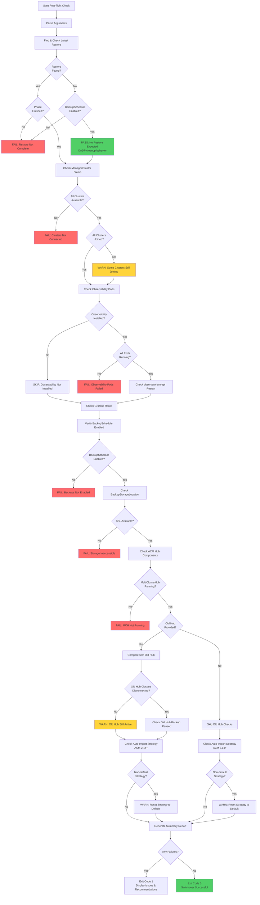

# Automation Scripts

This directory contains automated validation scripts for ACM hub switchover operations.

## Overview

These scripts automate the validation process before and after switchover, ensuring safety and operational readiness.

| Script | Purpose | When to Use |
|--------|---------|-------------|
| [`discover-hub.sh`](discover-hub.sh) | Auto-discover ACM hubs and propose checks | When unsure which hub is primary/secondary |
| [`preflight-check.sh`](preflight-check.sh) | Validate prerequisites before switchover | Before starting switchover procedure |
| [`postflight-check.sh`](postflight-check.sh) | Verify switchover completed successfully | After switchover activation completes |
| [`lib-common.sh`](lib-common.sh) | Shared helper functions and utilities | Sourced by other scripts |
| [`constants.sh`](constants.sh) | Shared configuration constants | Sourced by other scripts |

## Idempotency & Safety

**Scripts are fully idempotent and safe to run multiple times:**

- ✅ **Read-only operations** - Only perform `oc get`, `oc describe`, and similar read operations
- ✅ **No state modifications** - Never modify cluster resources or configuration
- ✅ **No side effects** - Can be run repeatedly without affecting cluster state
- ✅ **Safe in production** - No risk of accidental changes or disruptions

**You can safely:**
- Run pre-flight checks multiple times before switchover
- Re-run post-flight verification to monitor stabilization
- Use scripts for ongoing health monitoring
- Run in parallel with other operations (read-only)

---

## Hub Discovery Script

**File:** `discover-hub.sh`

### Purpose

Auto-discovers Kubernetes contexts from your kubeconfig, detects which clusters are ACM hubs, determines their roles (primary/secondary/standby), and proposes the appropriate preflight or postflight check command based on the detected state.

### Usage

```bash
# Auto-discover all ACM hubs from kubeconfig contexts
./scripts/discover-hub.sh --auto

# Check specific contexts only
./scripts/discover-hub.sh --contexts hub1,hub2

# Discover and immediately run the proposed check
./scripts/discover-hub.sh --auto --run
```

**Options:**

- `--auto` - Auto-discover ACM hubs from all kubeconfig contexts (required unless `--contexts` is used)
- `--contexts <ctx1,ctx2,...>` - Comma-separated list of specific contexts to check
- `--verbose, -v` - Show detailed cluster status for each hub
- `--run` - Execute the proposed check command immediately
- `--timeout <seconds>` - Connection timeout per context (default: 5)
- `--help` - Show help message

### What It Detects

The script analyzes each context to determine hub role based on:

| Indicator | Primary Hub | Secondary Hub | Standby |
|-----------|-------------|---------------|---------|
| BackupSchedule | Active (not paused) | Paused or none | Collision state |
| Restore resource | None or finished | Passive-sync enabled | Finished |
| ManagedClusters | Available=True | Available=Unknown | - |

### Klusterlet Verification

When **both hubs report clusters as available** (which can happen immediately after switchover before lease timeouts), the script verifies the actual klusterlet connections by checking the `hub-kubeconfig-secret` on each managed cluster:

```
  Both hubs report available clusters - verifying klusterlet connections...
    ✓ prod1 → primary-hub
    ✓ prod2 → primary-hub
    ✓ prod3 → primary-hub

  ● primary-hub
    Clusters: 3/3 (reported), 3 (actual klusterlet connections)
```

This resolves ambiguity during the transition period when the old hub hasn't yet detected that clusters have disconnected.

### Example Output

```
╔════════════════════════════════════════════════════════════╗
║   ACM Hub Discovery                                        ║
╚════════════════════════════════════════════════════════════╝

━━━━━━━━━━━━━━━━━━━━━━━━━━━━━━━━━━━━━━━━━━━━━━━━━━━━━━━━━━━━
Analyzing Contexts
━━━━━━━━━━━━━━━━━━━━━━━━━━━━━━━━━━━━━━━━━━━━━━━━━━━━━━━━━━━━
  Checking primary-hub... ACM hub detected (version 2.11.0)
  Checking secondary-hub... ACM hub detected (version 2.11.0)

━━━━━━━━━━━━━━━━━━━━━━━━━━━━━━━━━━━━━━━━━━━━━━━━━━━━━━━━━━━━
Discovered ACM Hubs
━━━━━━━━━━━━━━━━━━━━━━━━━━━━━━━━━━━━━━━━━━━━━━━━━━━━━━━━━━━━

  ● primary-hub
    Role:     primary
    Clusters: 5/5
    State:    Active primary hub (BackupSchedule running, 5/5 clusters available)

  ● secondary-hub
    Role:     secondary
    Clusters: 0/5
    State:    Secondary hub in passive-sync mode (ready for switchover)

━━━━━━━━━━━━━━━━━━━━━━━━━━━━━━━━━━━━━━━━━━━━━━━━━━━━━━━━━━━━
Recommended Action
━━━━━━━━━━━━━━━━━━━━━━━━━━━━━━━━━━━━━━━━━━━━━━━━━━━━━━━━━━━━

  Scenario: Pre-Switchover
  Primary hub (primary-hub) and secondary hub (secondary-hub) detected.
  Run preflight checks before initiating switchover.

  Proposed command:
    ./scripts/preflight-check.sh --primary-context primary-hub --secondary-context secondary-hub --method passive
```

### Exit Codes

- `0` - Discovery completed successfully and proposed a check
- `1` - No ACM hubs found or unable to determine roles
- `2` - Invalid arguments

---

## Pre-flight Validation Script

**File:** `preflight-check.sh`

### Purpose

Automates all prerequisite checks before starting an ACM switchover to catch configuration issues early and prevent failures mid-process.

### Usage

```bash
./scripts/preflight-check.sh \
  --primary-context <primary-hub-context> \
  --secondary-context <secondary-hub-context> \
  --method passive
```

**Options:**
- `--primary-context` - Kubernetes context for primary hub (required)
- `--secondary-context` - Kubernetes context for secondary hub (required)
- `--method` - Switchover method: `passive` or `full` (required)
- `--help` - Show help message

### What It Checks

1. **CLI Tools** - Verifies `oc`/`kubectl` and `jq` are installed
2. **Kubernetes Contexts** - Confirms contexts exist and are accessible
3. **Namespace Access** - Validates required namespaces on both hubs
4. **ACM Versions** - Ensures versions match between hubs
5. **OADP Operator** - Checks OADP is installed and Velero pods running
6. **DataProtectionApplication** - Verifies DPA is configured and reconciled
7. **BackupStorageLocation** - Validates BSL is in "Available" phase (storage accessible)
8. **Cluster Health** - Comprehensive cluster health validation per runbook requirements:
   - Verifies all nodes are in Ready state
   - Checks ClusterOperators are healthy (Available=True, Degraded=False)
   - Validates no cluster upgrade is in progress (ClusterVersion Progressing=False)
   - Displays current cluster version
9. **Backup Status** - Confirms latest backup completed, no in-progress backups
10. **ClusterDeployment Safety** - **CRITICAL:** Verifies `preserveOnDelete=true` on ALL ClusterDeployments
11. **Passive Sync** (Method 1 only) - Validates passive restore is running and up-to-date (dynamically finds latest restore)
12. **Observability** - Detects if observability is installed (optional) - Checks for CRs and secrets
13. **Auto-Import Strategy** (ACM 2.14+) - Validates `autoImportStrategy` configuration:
    - Warns if non-default strategy is set on either hub
    - For secondary hubs with existing clusters: advises temporary `ImportAndSync` before restore
    - Links to Red Hat documentation for guidance

### Example Output

```
╔════════════════════════════════════════════════════════════╗
║   ACM Switchover Pre-flight Validation                    ║
╚════════════════════════════════════════════════════════════╝

Primary Hub:    primary-hub
Secondary Hub:  secondary-hub
Method:         passive

━━━━━━━━━━━━━━━━━━━━━━━━━━━━━━━━━━━━━━━━━━━━━━━━━━━━━━━━━━━━
1. Checking CLI Tools
━━━━━━━━━━━━━━━━━━━━━━━━━━━━━━━━━━━━━━━━━━━━━━━━━━━━━━━━━━━━
✓ OpenShift CLI (oc) is installed
✓ jq is installed

[... additional checks ...]

╔════════════════════════════════════════════════════════════╗
║   Validation Summary                                       ║
╚════════════════════════════════════════════════════════════╝

Total Checks:    28
Passed:          28
Failed:          0
Warnings:        0

━━━━━━━━━━━━━━━━━━━━━━━━━━━━━━━━━━━━━━━━━━━━━━━━━━━━━━━━━━━━
✓ ALL CRITICAL CHECKS PASSED
━━━━━━━━━━━━━━━━━━━━━━━━━━━━━━━━━━━━━━━━━━━━━━━━━━━━━━━━━━━━

You are ready to proceed with the switchover.
```

### Exit Codes

- `0` - All checks passed
- `1` - One or more critical checks failed
- `2` - Invalid arguments

### Workflow Diagram


---

## Post-flight Validation Script

**File:** `postflight-check.sh`

### Purpose

Verifies that the ACM switchover completed successfully by validating all critical components on the new hub and optionally comparing with the old hub.

### Usage

```bash
# Basic validation (new hub only)
./scripts/postflight-check.sh --new-hub-context <new-hub-context>

# With old hub comparison
./scripts/postflight-check.sh \
  --new-hub-context <new-hub-context> \
  --old-hub-context <old-hub-context>
```

**Options:**
- `--new-hub-context` - Kubernetes context for new active hub (required)
- `--old-hub-context` - Kubernetes context for old primary hub (optional, for comparison)
- `--help` - Show help message

### What It Checks

0. **CLI Tools** - Verifies `oc`/`kubectl` and `jq` are installed
1. **Restore Status** - Confirms restore completed successfully (Phase: Finished) - Dynamically finds latest restore
2. **ManagedCluster Status** - Verifies all clusters are Available and Joined
3. **Observability Components** - Checks all observability pods are running (Grafana, Observatorium, Thanos)
4. **Metrics Collection** - Validates Grafana route and observatorium-api status
5. **Backup Configuration** - Ensures BackupSchedule is enabled and creating backups
5b. **BackupStorageLocation** - Verifies BSL is in "Available" phase (storage accessible for backups)
6. **ACM Hub Components** - Verifies MultiClusterHub and ACM pods are healthy
7. **Old Hub Comparison** (if `--old-hub-context` provided) - Checks old hub clusters are disconnected
8. **Auto-Import Status** - Verifies no lingering disable-auto-import annotations
9. **Auto-Import Strategy** (ACM 2.14+) - Ensures `autoImportStrategy` is reset to default post-switchover:
    - Warns if non-default strategy remains configured
    - Provides command to reset to default `ImportOnly`
    - Also checks old hub if provided

### Example Output

```
╔════════════════════════════════════════════════════════════╗
║   ACM Switchover Post-flight Verification                 ║
╚════════════════════════════════════════════════════════════╝

New Hub:        new-hub
Old Hub:        old-hub (for comparison)

━━━━━━━━━━━━━━━━━━━━━━━━━━━━━━━━━━━━━━━━━━━━━━━━━━━━━━━━━━━━
0. Checking CLI Tools
━━━━━━━━━━━━━━━━━━━━━━━━━━━━━━━━━━━━━━━━━━━━━━━━━━━━━━━━━━━━
✓ OpenShift CLI (oc) is installed
✓ jq is installed

━━━━━━━━━━━━━━━━━━━━━━━━━━━━━━━━━━━━━━━━━━━━━━━━━━━━━━━━━━━━
1. Checking Restore Status
━━━━━━━━━━━━━━━━━━━━━━━━━━━━━━━━━━━━━━━━━━━━━━━━━━━━━━━━━━━━
✓ Latest restore 'restore-acm-passive-sync' completed successfully (Phase: Finished, Created: 2025-12-03T10:15:30Z)
       (Identified as passive sync restore via spec.syncRestoreWithNewBackups=true)

━━━━━━━━━━━━━━━━━━━━━━━━━━━━━━━━━━━━━━━━━━━━━━━━━━━━━━━━━━━━
2. Checking ManagedCluster Status
━━━━━━━━━━━━━━━━━━━━━━━━━━━━━━━━━━━━━━━━━━━━━━━━━━━━━━━━━━━━
✓ Found 5 managed cluster(s) (excluding local-cluster)
✓ All 5 cluster(s) show Available=True
✓ All 5 cluster(s) show Joined=True
✓ No clusters stuck in Pending Import

[... additional checks ...]

╔════════════════════════════════════════════════════════════╗
║   Verification Summary                                     ║
╚════════════════════════════════════════════════════════════╝

Total Checks:    25
Passed:          25
Failed:          0
Warnings:        0

━━━━━━━━━━━━━━━━━━━━━━━━━━━━━━━━━━━━━━━━━━━━━━━━━━━━━━━━━━━━
✓ SWITCHOVER VERIFICATION PASSED
━━━━━━━━━━━━━━━━━━━━━━━━━━━━━━━━━━━━━━━━━━━━━━━━━━━━━━━━━━━━

The ACM switchover appears to have completed successfully.

Recommended next steps:
  1. Verify Grafana dashboards show recent metrics (wait 5-10 minutes)
  2. Test cluster management operations (create/update policies, etc.)
  3. Monitor for 24 hours before decommissioning old hub
  4. Inform stakeholders that switchover is complete
```

### Exit Codes

- `0` - All checks passed
- `1` - One or more critical checks failed
- `2` - Invalid arguments

### Workflow Diagram



---

## Complete Switchover Workflow

This diagram shows how both scripts fit into the overall switchover process:


---

## Best Practices

### Before Switchover

1. **Always run pre-flight check** in both test and production environments
2. **Save pre-flight output** for audit trail and troubleshooting
3. **Fix all failures** before proceeding - warnings should be reviewed
4. **Verify preserveOnDelete** is set on ALL ClusterDeployments (critical!)

### After Switchover

1. **Run post-flight check immediately** after activation completes
2. **Wait 5-10 minutes** if clusters show as "Unknown" - they may still be connecting
3. **Check Grafana metrics** manually after 10-15 minutes
4. **Keep old hub accessible** for at least 24 hours in case reverse switchover is needed
5. **Save post-flight output** for documentation and compliance

### Troubleshooting

If pre-flight check fails:
- Review the specific failed checks in the output
- Most common issue: `preserveOnDelete` not set on ClusterDeployments
- Fix issues and re-run the script until all checks pass

If post-flight check fails:
- Check if restore is still in progress (wait and retry)
- Verify observatorium-api pods were restarted (Step 7 in runbook)
- Review the troubleshooting section in the runbook
- Consider reverse switchover (swap contexts) if critical failures persist

---

## Integration with CI/CD

Both scripts can be integrated into automation pipelines:

```bash
# Example: Pre-flight check in CI/CD
if ! ./scripts/preflight-check.sh \
    --primary-context "$PRIMARY_CTX" \
    --secondary-context "$SECONDARY_CTX" \
    --method passive; then
    echo "Pre-flight validation failed. Aborting switchover."
    exit 1
fi

# Example: Post-flight check in CI/CD
if ! ./scripts/postflight-check.sh \
    --new-hub-context "$NEW_HUB_CTX" \
    --old-hub-context "$OLD_HUB_CTX"; then
    echo "Post-flight validation failed. Review and consider reverse switchover."
    exit 1
fi
```

---

## Shared Library

**File:** `lib-common.sh`

### Purpose

Provides shared helper functions and utilities used by both `preflight-check.sh` and `postflight-check.sh`. This library eliminates code duplication and ensures consistent behavior across scripts.

### Contents

| Component | Description |
|-----------|-------------|
| **Color Variables** | `RED`, `GREEN`, `YELLOW`, `BLUE`, `NC` for formatted output |
| **Counter Variables** | `TOTAL_CHECKS`, `PASSED_CHECKS`, `FAILED_CHECKS`, `WARNING_CHECKS` |
| **Message Arrays** | `FAILED_MESSAGES`, `WARNING_MESSAGES` for summary reporting |
| **`check_pass`** | Record a passing check with green checkmark |
| **`check_fail`** | Record a failing check with red X, adds to failed messages |
| **`check_warn`** | Record a warning with yellow triangle, adds to warning messages |
| **`section_header`** | Print a formatted section header |
| **`detect_cluster_cli`** | Detect `oc`/`kubectl` and `jq`, set up aliases |
| **`get_auto_import_strategy`** | Get autoImportStrategy value from a hub (returns "default" if not configured) |
| **`is_acm_214_or_higher`** | Check if ACM version is 2.14+ (returns 0/1) |
| **`print_summary`** | Print validation summary with mode-specific messaging |

### Usage

The library is automatically sourced by both scripts. To use in a new script:

```bash
#!/bin/bash
set -euo pipefail

SCRIPT_DIR="$(cd "$(dirname "${BASH_SOURCE[0]}")" && pwd)"
source "${SCRIPT_DIR}/constants.sh"
source "${SCRIPT_DIR}/lib-common.sh"

# Use helper functions
section_header "1. My Check"
detect_cluster_cli

if some_check; then
    check_pass "Check passed"
else
    check_fail "Check failed"
fi

# Print summary and exit with appropriate code
if print_summary "preflight"; then
    exit $EXIT_SUCCESS
else
    exit $EXIT_FAILURE
fi
```

---

## Script Maintenance

### Adding New Checks

To add a new validation check:

1. Add a new section using `section_header "N. Check Name"`
2. Implement the check logic
3. Use `check_pass`, `check_fail`, or `check_warn` for results
4. Update the script documentation above
5. Test in a non-production environment first

### Adding New Helper Functions

To add a new shared helper function:

1. Add the function to `lib-common.sh`
2. Add corresponding tests to `tests/test_lib_common.sh`
3. Add Python tests to `tests/test_scripts.py`
4. Update this documentation

### Version Compatibility

These scripts are compatible with:
- ACM 2.11+
- OpenShift 4.12+
- OADP 1.2+

---

## Support

For issues or questions:
- Review the [ACM Switchover Runbook](../docs/ACM_SWITCHOVER_RUNBOOK.md)
- Check the [Troubleshooting section](../docs/ACM_SWITCHOVER_RUNBOOK.md#troubleshooting-common-issues)
- Consult the [Architecture documentation](../docs/ARCHITECTURE.md)

---

**Last Updated:** 2025-12-02
